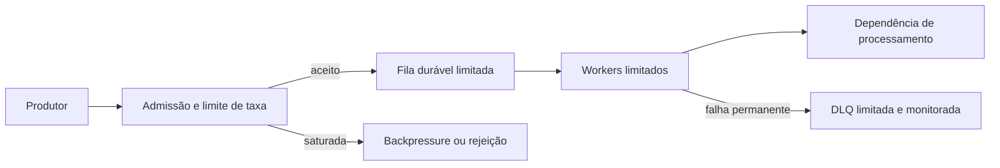

# A01 — Execução 1

**Prompt:** Desenhe em Java um serviço cujo produtor recebe 1.000 eventos/s e consumidor processa 100/s

**Agent:** `arquiteto-sistemas`
**Sessão:** independente 1
**Nota:** 2/2

## Saída bruta

## Requisitos e hipóteses

O fluxo recebe 1.000 eventos/s e processa 100/s. Portanto, chegam **900 eventos/s além da capacidade**. Se essa diferença for sustentada, nenhuma fila finita consegue evitar o acúmulo: o serviço precisa aumentar a capacidade de consumo, reduzir a produção ou rejeitar eventos.

Faltam duração do pico, tamanho máximo do evento, prazo de processamento e exigência de durabilidade. Para dimensionar inicialmente, assumo que os eventos precisam sobreviver a reinícios e que a origem pode ser pausada ou receber rejeição. Os limites abaixo são valores de partida para ensaio, não SLOs de produção.

## Capacidade inicial

| Item | Estimativa ou hipótese |
|---|---:|
| Entrada | 1.000 eventos/s |
| Processamento | 100 eventos/s |
| Déficit | 900 eventos/s |
| Acúmulo em 10 s | 9.000 eventos |
| Acúmulo em 1 min | 54.000 eventos |
| Fila sugerida para o primeiro ensaio | 10.000 eventos, com limite adicional em bytes |
| Política ao encher | Pausar a origem; se não houver suporte a pausa, rejeitar ou persistir em armazenamento durável com quota |
| Idade máxima | Definir conforme prazo de utilidade do evento; expirar ou encaminhar para tratamento explícito ao vencer |

O limite de 10.000 eventos absorve cerca de 11 segundos do déficit de 900 eventos/s. Não resolve sobrecarga sustentada. O limite em bytes depende do tamanho máximo aceito; rejeite eventos grandes antes de alocar ou gravar o payload completo.

## Componentes

Começaria com um serviço Java modular: admissão, persistência da fila e processamento. A fila deve ser durável se perder eventos for inaceitável. Se a origem conseguir pausar e repetir com segurança, a admissão pode aplicar backpressure; caso contrário, precisa rejeitar ou persistir o excedente até um limite acordado.



Os workers têm concorrência limitada e só confirmam a mensagem depois do processamento. Entregas repetidas são possíveis após falha ou timeout; o consumidor deve ser idempotente, por exemplo usando um identificador único do evento. Retry tem limite, backoff com jitter e orçamento de tempo. Eventos que esgotarem as tentativas vão para uma DLQ limitada, com alerta e procedimento de replay.

## Contrato de proteção

- **Fila cheia:** não aceitar silenciosamente. Se a origem oferecer pausa, reduzir ou suspender a publicação até haver espaço. Caso contrário, responder com rejeição conforme o protocolo, por exemplo `429` para quota da origem ou `503` para saturação do serviço. Usar `Retry-After` somente quando houver estimativa útil para retomar.
- **Fila:** limitar simultaneamente quantidade, bytes e idade; incluir a soma de todas as réplicas no orçamento do armazenamento.
- **Consumidores:** limitar concorrência pelo recurso downstream. Retry não pode manter conexões ou outros recursos ocupados durante o backoff.
- **Recuperação:** verificar que eventos confirmados persistem a reinícios e que, após a entrada cair abaixo de 100 eventos/s, o excedente é drenado sem exceder a capacidade downstream.
- **Escala:** adicionar consumidores só se a dependência de processamento suportar a vazão maior. Para aceitar continuamente 1.000 eventos/s sem acumular atraso, a capacidade agregada efetiva precisa ser ao menos 1.000 eventos/s, com margem medida para picos e falhas.

## Esboço Java da decisão

```java
record LimitesFila(long eventosMaximos, long bytesMaximos, Duration idadeMaxima) {}

interface Admissor {
    Resultado admitir(Evento evento);
}

sealed interface Resultado {
    record Aceito() implements Resultado {}
    record Rejeitado(String motivo, Duration retryApos) implements Resultado {}
}

interface Consumidor {
    void processar(Evento evento); // Deve ser idempotente.
}
```

A implementação concreta deve fazer a admissão antes de aceitar responsabilidade pelo evento, aplicar os limites em uma fila durável e confirmar a mensagem apenas após processamento bem-sucedido. Isso é um esboço de fronteiras, não dimensionamento de bibliotecas ou infraestrutura.

## Decisão arquitetural

**Status:** proposta.

**Contexto:** a taxa informada de entrada é dez vezes a capacidade de processamento. A duração do pico, o payload, o prazo do evento e a possibilidade de pausar a origem ainda precisam ser confirmados.

**Decisão:** usar fila durável limitada, consumidores com concorrência limitada e contrato explícito de backpressure ou rejeição. Manter o serviço como um único sistema modular até que requisitos de escala, isolamento ou operação justifiquem separar componentes.

**Alternativas:** fila apenas em memória, que perde eventos no reinício; aceitar tudo sem limite, que permite crescimento sem controle; descartar excedentes, que perde eventos sem garantia; escalar consumidores, que só funciona se o downstream suportar a capacidade necessária.

**Trade-offs:** a fila durável absorve picos finitos e permite retomada após falhas, ao custo de armazenamento, latência e operação de replay. Limites protegem o serviço, mas podem rejeitar eventos durante saturação. Backpressure preserva eventos quando a origem consegue pausar; sem esse recurso, é necessário negociar rejeição ou capacidade durável para excedentes.

**Gatilho de revisão:** confirmar os requisitos de perda, retenção, prazo, payload e duração do pico; então medir capacidade por worker e validar os limites sob carga.

## Sinais e validação

Medir taxa aceita e rejeitada, profundidade da fila em eventos e bytes, idade do evento mais antigo, vazão de consumo, retries, DLQ e falhas de dependências. Definir SLOs após medir a carga real e acordar se rejeições contam como falha para o contrato do produtor.

Ensaiar: entrada sustentada de 1.000 eventos/s, interrupção e recuperação do consumidor, fila cheia, evento inválido ou expirado, falha após processamento antes da confirmação e retomada do produtor. A aprovação deve demonstrar limites respeitados, ausência de confirmação prematura e drenagem previsível quando a chegada ficar abaixo da capacidade.

## Justificativa da nota

Calcula o déficit, quantifica backlog, declara hipóteses, limita fila por eventos/bytes/idade, explica persistência, backpressure/rejeição, escala sustentável e validação. Nota 2.
