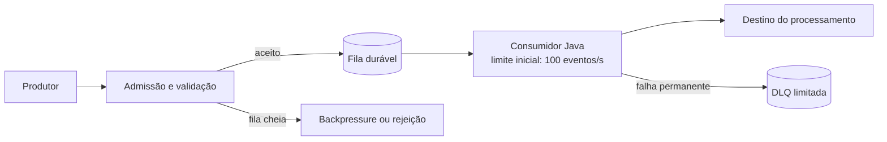

# A01 — Execução 2

**Prompt:** Desenhe em Java um serviço cujo produtor recebe 1.000 eventos/s e consumidor processa 100/s

**Agent:** `arquiteto-sistemas`
**Sessão:** independente 2
**Nota:** 2/2

## Saída bruta

## Requisitos e hipóteses

A taxa informada implica um déficit sustentado de **900 eventos/s**: chegam 1.000 eventos/s e o consumidor processa 100/s. Uma fila finita só absorve esse déficit por tempo limitado. Se a produção continuar nesse ritmo, o sistema precisa reduzir a origem, rejeitar eventos ou aumentar a capacidade de processamento.

Faltam duração do pico, tamanho máximo do evento, retenção, prazo máximo para processá-lo, garantia de entrega e SLOs. Para tornar o desenho verificável, assumo que os 1.000 eventos/s podem continuar indefinidamente, que perder eventos aceitos é inaceitável e que o produtor pode ser pausado ou receber rejeição. Essas hipóteses precisam ser confirmadas antes de definir limites de produção.

## Desenho proposto

Começaria com um serviço Java modular, uma fila durável e um consumidor limitado a 100 eventos/s. A fila desacopla produtor e consumidor e preserva eventos aceitos durante falhas curtas; ela não resolve o déficit sustentado.

A admissão deve impor limites por quantidade de eventos, bytes e idade do evento, além de validar o tamanho máximo antes de alocar ou persistir o payload. Quando atingir um limite, o serviço deve pausar o produtor por um mecanismo de créditos/acknowledgements, se o protocolo permitir. Caso contrário, deve rejeitar eventos ainda não aceitos com um resultado explícito e orientação de retry quando aplicável. Não deve confirmar a aceitação antes de persistir o evento.

Se a fila for apenas em memória, uma falha do processo pode perder eventos já aceitos. Como a hipótese exige preservar eventos aceitos, usaria fila durável. A escolha e a topologia concretas dependem dos requisitos de retenção, disponibilidade e operação; esses dados ainda não foram informados.

## Capacidade e limites

Com chegada de 1.000/s e saída de 100/s, o acúmulo é:

- **900 eventos/s** enquanto essas taxas se mantiverem.
- **54.000 eventos por minuto**.
- **3,24 milhões de eventos por hora**.

A capacidade necessária para armazenar esses eventos depende do tamanho máximo e da retenção: `eventos acumulados × bytes por evento`, mais índices e overhead da fila. Sem esses valores, não é possível escolher um limite de armazenamento ou afirmar por quanto tempo a fila sustentará a carga.

Definiria um limite operacional para a fila com base no orçamento de armazenamento e no prazo de utilidade dos eventos. Ao aproximar-se dele, a admissão deve acionar backpressure; ao atingir o limite, deve pausar o produtor ou rejeitar novas entradas. Não deixaria uma fila ilimitada crescer até esgotar memória ou disco.

Para processar todos os eventos sem acumular fila, a capacidade agregada de consumo precisa ser de pelo menos 1.000 eventos/s, com margem validada sob carga real. Se a capacidade permanecer em 100/s, o sistema não consegue aceitar continuamente 1.000/s sem acumular ou rejeitar 900/s.

## Proteção e recuperação

- Limitar concorrência e vazão do consumidor conforme a capacidade medida do destino; aumentar paralelismo só depois de verificar limites e efeitos colaterais no destino.
- Aplicar timeout e retry limitado, com backoff e jitter, em uma única camada. Não reter conexões ou outros recursos durante o backoff.
- Garantir idempotência no processamento para que uma redelivery não duplique efeitos.
- Direcionar eventos que excederem o limite de tentativas para uma DLQ com capacidade e política de retenção definidas. DLQ também precisa de limites e alertas.
- Descartar ou encaminhar eventos expirados conforme contrato, evitando processar trabalho que já passou do prazo útil.
- Na recuperação, drenar a fila somente na taxa segura para o destino. Medir tempo estimado de drenagem e não somar retries à capacidade nominal.

## Decisões e trade-offs

### ADR-001 — Aceitação com fila durável e admissão limitada

**Status:** Proposta

**Contexto:** A origem envia 1.000 eventos/s, enquanto o consumidor processa 100/s. O déficit sustentado torna inviável uma fila ilimitada e impede garantir aceitação contínua sem controle da origem ou aumento de capacidade.

**Decisão:** Persistir eventos aceitos em uma fila durável e limitar a admissão por eventos, bytes e idade. Quando a capacidade disponível acabar, aplicar backpressure ou rejeitar novas entradas, conforme o protocolo do produtor.

**Alternativas:** Fila em memória, que é mais simples, mas não preserva eventos em falhas do processo; aceitar tudo em uma fila sem limite, que posterga a falha até esgotar recursos; ampliar consumidores, o que exige comprovar capacidade do destino.

**Consequências:** Eventos confirmados podem sobreviver à reinicialização, desde que a fila durável e sua configuração atendam ao requisito de persistência. A origem precisará respeitar pausa/rejeição, ou haverá eventos que não poderão ser aceitos.

**Trade-offs:** Ganha-se controle de capacidade e preservação dos eventos aceitos, ao custo de operar armazenamento durável e implementar redelivery e idempotência. O limite concreto da fila permanece pendente até conhecer payload máximo, retenção, orçamento de armazenamento e prazo de processamento.

### ADR-002 — Não aumentar consumidores sem validar o destino

**Status:** Proposta

**Contexto:** Para eliminar o déficit mantendo a entrada em 1.000/s, é necessário processar ao menos essa taxa agregada. A capacidade do destino e o custo de processamento não foram informados.

**Decisão:** Manter 100 eventos/s como limite inicial informado e não escalar consumidores até medir a capacidade segura do processamento e de seus dependentes.

**Alternativas:** Aumentar imediatamente o paralelismo para tentar alcançar 1.000/s, com risco de saturar o destino; manter 100/s e rejeitar ou pausar o excedente.

**Consequências:** A fila crescerá enquanto a entrada superar 100/s. Será necessário ajustar a origem ou elevar a capacidade comprovada antes de aceitar a taxa continuamente.

**Trade-offs:** Evita transferir a sobrecarga para o destino, ao custo de não atender a toda a taxa de entrada com a capacidade atual. Se a origem não puder ser limitada, será necessário definir perda, retenção e prioridade de eventos.

## SLOs e observabilidade

Os alvos dependem do contrato de negócio e precisam ser definidos. Como indicadores mínimos, mediria:

- Taxa de eventos recebidos, aceitos, pausados e rejeitados.
- Profundidade da fila em eventos e bytes, idade do evento mais antigo e projeção de tempo até o limite.
- Vazão, concorrência, latência por evento e falhas do consumidor.
- Redeliveries, retries, eventos expirados e tamanho/idade da DLQ.
- Tempo de drenagem após recuperação.

Um SLO de processamento deve declarar a janela e o prazo: por exemplo, a proporção de eventos aceitos concluídos dentro do prazo acordado. Rejeições e pausas devem aparecer separadamente; não devem ser ocultadas como processamento bem-sucedido.

## Falhas a validar

| Falha | Proteção | Evidência necessária |
|---|---|---|
| Consumidor indisponível | Fila durável limitada; pausar ou rejeitar quando atingir limites | Simular interrupção e confirmar persistência, limite e recuperação |
| Destino lento ou indisponível | Timeout, retry limitado e limite de concorrência | Medir vazão segura, amplificação de retries e tempo de drenagem |
| Fila próxima do limite | Backpressure ou rejeição explícita | Testar comportamento na fronteira de eventos, bytes e idade |
| Redelivery após falha | Idempotência no efeito do processamento | Interromper após persistir e antes de confirmar; verificar duplicidade |
| Evento inválido ou falha permanente | Limite de tentativas e DLQ limitada | Verificar encaminhamento, retenção e alerta da DLQ |

Os ensaios devem usar o tamanho máximo esperado dos eventos e uma duração de carga acordada. Os limites e SLOs finais devem ser definidos com os responsáveis pelo produtor e pelo processamento, com base nessas medições.

## Justificativa da nota

Calcula déficit e acúmulo, separa pico de déficit sustentado, declara hipóteses, limita fila por eventos/bytes/idade, define backpressure/rejeição e persistência, condiciona escala à capacidade do destino e propõe evidências de teste. Nota 2.
