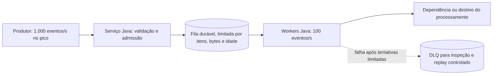

# A01 — Reteste execução 1

**Prompt literal:** “Desenhe em Java um serviço cujo produtor recebe 1.000 eventos/s e consumidor processa 100/s”

**Agent:** `arquiteto-sistemas`  
**Sessão:** reteste independente 1  
**Nota:** pendente de pontuação

**Arquivos do catálogo lidos:**
- `agents/arquiteto-sistemas.md`
- `skills/design-system-architecture/SKILL.md`
- `skills/design-system-architecture/references/capacidade-slos.md`
- `skills/design-system-architecture/references/estimativas-rapidas.md`
- `skills/design-system-architecture/references/nfr-checklist.md`

## Saída bruta

### Desenho e hipótese

Eu manteria o ingresso e o processamento desacoplados: o serviço Java valida/admite eventos e os publica em uma fila durável com limites; workers Java consomem a fila e confirmam cada evento somente depois de concluir o processamento. Uma fila limitada absorve um pico finito, mas não corrige déficit contínuo.

**Hipóteses para estimar a capacidade, não requisitos confirmados:** considero o pico de 1.000 eventos/s por 60 segundos; depois dele, a chegada cai para 50 eventos/s. A capacidade de processamento permanece em 100 eventos/s. Não foram informados tamanho dos eventos, ordenação, durabilidade exigida, prazo de validade nem limite de recuperação. A escolha de uma fila durável é uma proposta para não perder eventos aceitos; confirmar essa necessidade com o contrato do produtor.

### Déficit, backlog e buffer

Durante o pico, o déficit é `1.000 − 100 = 900 eventos/s`. Em 60 segundos, o backlog máximo estimado é:

`B = (1.000 − 100) × 60 = 54.000 eventos`.

Eu reservaria, como margem inicial de engenharia a validar, 20% acima desse backlog: capacidade mínima de `54.000 × 1,20 = 64.800 eventos`. O buffer não deve ser dimensionado só em memória sem conhecer o payload e o overhead. O limite em bytes deve ser calculado como `64.800 × (payload + overhead medido)`; para broker, somar índices, retenção e réplicas. Também limitar idade máxima da mensagem conforme o prazo em que o evento ainda é útil, que precisa ser definido pelo negócio.

Com 64.800 posições livres e déficit de 900/s, a fila chega ao limite em 72 segundos de pico contínuo. No cenário assumido de 60 segundos, sobram 10.800 posições; um pico mais longo ou outra carga concorrente pode esgotá-las.

### Drenagem depois do pico

Com a chegada pós-pico assumida de 50/s, a taxa líquida de drenagem é `100 − 50 = 50 eventos/s`. Portanto, os 54.000 eventos acumulados levam `54.000 ÷ 50 = 1.080 segundos`, ou **18 minutos**, para serem drenados, supondo processamento estável e sem novas falhas ou retries.

A taxa pós-pico muda o resultado: se a chegada voltar a 100/s, a capacidade atual não reduz o backlog e não há tempo finito de drenagem. Se a chegada parar, a drenagem a 100/s leva `54.000 ÷ 100 = 540 segundos`, ou **9 minutos**. Em geral, `tempo = B ÷ (μ − λpós-pico)`, somente quando `μ > λpós-pico`. Para um prazo de recuperação `D`, a capacidade necessária é `μ ≥ λpós-pico + B ÷ D`; `D` ainda precisa ser acordado.

### Déficit sustentado e proteção

Se 1.000 eventos/s forem uma taxa sustentada, em vez de um pico finito, o consumidor fica 900 eventos/s atrás indefinidamente. A fila apenas posterga a saturação. As opções são aumentar comprovadamente a capacidade de processamento acima da taxa de chegada (e acima dela pela margem necessária à drenagem), reduzir o custo por evento, fazer o produtor desacelerar/pausar por backpressure, ou rejeitar novas admissões de forma explícita quando o limite for atingido. Se o produtor não puder pausar e a rejeição não for aceitável, persistir excedente em armazenamento durável só é válido com limites e retenção definidos; não torna sustentável uma taxa de entrada maior que a de saída.

Definiria limites simultâneos por quantidade, bytes e idade. Ao atingir o limite, não aceitaria silenciosamente mais eventos: sinalizaria sobrecarga ao produtor (pausa/backpressure se o protocolo permitir; caso contrário rejeição visível, como 429/503 conforme o contrato) e contaria as rejeições. Retries seriam limitados e idempotentes; falhas permanentes iriam para DLQ com replay controlado. A fila e a DLQ não devem crescer sem limite.

### Evidências para fechar as hipóteses

Medir payload típico/máximo e overhead real; executar carga de 1.000 eventos/s durante 60 segundos e também além da duração assumida; verificar backlog, bytes, idade, perda/duplicidade e latência. Medir a capacidade sustentada dos workers e a drenagem com chegadas pós-pico de 50/s e 100/s. Validar com o produtor o comportamento de pausa/rejeição e com o negócio o prazo máximo de utilidade do evento e o prazo de recuperação. Esses números são estimativas de dimensionamento, não SLO de produção.
