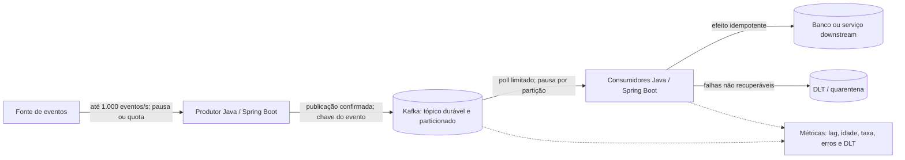

# A01 — Execução 1

**Prompt:** Desenhe em Java um serviço cujo produtor recebe 1.000 eventos/s e consumidor processa 100/s
**Agent:** `arquiteto-sistemas`
**Sessão:** independente 1
**Nota:** (pendente de pontuação)
**Arquivos do catálogo lidos:** `agents/arquiteto-sistemas.md`; `skills/design-system-architecture/SKILL.md`; `skills/design-system-architecture/references/capacidade-slos.md`; `skills/design-system-architecture/references/estimativas-rapidas.md`; `skills/design-system-architecture/references/nfr-checklist.md`; `skills/resiliencia-controle-fluxo-java/SKILL.md`; `skills/resiliencia-controle-fluxo-java/references/capacidade-e-limites.md`; `skills/resiliencia-controle-fluxo-java/references/backpressure-java.md`; `skills/mensageria-sqs-kafka/SKILL.md`; `skills/mensageria-sqs-kafka/references/controle-consumo-java.md`; `skills/monitoramento-java/SKILL.md`; `skills/monitoramento-java/references/slo-saturacao-java.md`; `skills/gerar-diagramas/references/exemplos-mermaid.md`

## Saída bruta

## Hipóteses

- Interpreto 1.000 eventos/s como taxa sustentada de entrada e 100 eventos/s como capacidade agregada sustentada do consumidor, não como pico nem taxa por instância.
- Os eventos não podem ser descartados e precisam sobreviver à reinicialização do serviço. A chave de particionamento, tamanho máximo do evento, retenção, SLO e capacidade do downstream ainda precisam ser definidos e medidos.
- O exemplo usa Java com Spring Boot e Kafka. Kafka é uma escolha inicial para absorver e reter um fluxo durável e permitir replay; se houver requisito diferente de ordenação, retenção ou operação, a escolha do broker deve ser reavaliada.

## Capacidade e consequência

A entrada excede o consumo em **900 eventos/s**. Portanto, o backlog cresce sem limite enquanto as taxas permanecerem assim: **54.000 eventos/min**, **3,24 milhões/hora** e **77,76 milhões/dia**. Um broker durável permite acumular esse déficit temporariamente, mas não o elimina.

O tamanho do evento e a retenção determinam o armazenamento necessário. Por exemplo, com evento de 1 KiB, o crescimento lógico é aproximadamente **3,24 GB/hora** ou **77,76 GB/dia**, antes de índices, metadados, replicação e overhead. Essa hipótese deve ser validada com o payload real e a configuração do broker.

Para estabilidade contínua, é necessário elevar a capacidade agregada de consumo para pelo menos a taxa média de entrada — com folga para picos e falhas — ou reduzir/limitar a entrada. Se 100/s for um limite rígido, o sistema precisa aplicar backpressure ao produtor, rejeitar o excedente com sinal explícito ou definir perda aceitável. Não há tamanho de fila finito que absorva indefinidamente 1.000/s com saída de 100/s.

## Desenho proposto

Separaria os workloads de publicação e consumo para dimensioná-los de forma independente. Podem compartilhar o mesmo código e modelo de domínio Java, com adapters Spring, mas rodam em deployments distintos: o produtor publica; os consumidores processam. Um tópico Kafka durável mantém o backlog fora da memória das JVMs.

O número de partições e consumidores deve ser calculado por ensaio de carga: partições limitam o paralelismo do grupo; consumidores adicionais só aumentam a vazão se o trabalho for paralelizável e o downstream suportar a pressão. Se a capacidade de 100/s for do downstream, escalar consumidores sem um limite agregado pode apenas saturá-lo.

## Contrato de fluxo e consumo

- **Entrada:** propagar pausa/quota para a fonte quando ela cooperar. Se não cooperar, manter o excedente no tópico dentro de limites de retenção e armazenamento definidos; ao atingir o limite, rejeitar ou interromper a admissão com resposta observável. Não copiar o backlog para uma fila ilimitada em memória.
- **Publicação:** aguardar confirmação do broker antes de considerar o evento aceito. Usar identificador estável do evento; se uma falha deixar incerto o resultado da publicação, aceitar reenvio com deduplicação no consumidor.
- **Consumo:** limitar registros por poll, trabalho em voo e bytes buscados. Manter a thread de poll ativa; pausar partições com trabalho pendente e retomar quando houver capacidade. Preservar ordem por chave se o domínio exigir isso.
- **Confirmação:** commitar somente offsets contíguos cujo efeito durável foi concluído. Para efeitos externos ao Kafka, persistir idempotência junto com o efeito, ou usar inbox/transação equivalente. Kafka não garante exatamente uma vez para um efeito externo.
- **Falhas:** repetir falhas transitórias com tentativas e espera limitadas. Depois do limite, publicar em DLT/quarentena; só avançar o offset após a publicação durável na quarentena. Replay ocorre em taxa limitada e com o downstream saudável.
- **Prazo e retenção:** definir idade máxima útil do evento e retenção do tópico com base no tempo de recuperação e replay exigido. Alertar antes de lag/idade chegar ao limite de retenção.

## SLI, SLO e operação

SLIs mínimos: eventos aceitos/publicados por segundo; eventos concluídos por segundo; lag por partição e idade do evento mais antigo; tempo de processamento; falhas, retries e entrada na DLT; trabalho em voo e saturação do downstream. A idade do backlog é sinal mais direto de atraso para o consumidor do que a contagem isolada.

Definir SLO de atraso e disponibilidade depois de conhecer a idade máxima aceitável e o contrato de entrada. Uma medida de atraso possível é a fração de eventos concluídos dentro do prazo acordado dividida pelo total de eventos elegíveis. Não atribuo um valor de SLO sem esses requisitos. Alertar sobre crescimento contínuo do lag, idade próxima do prazo/retention, saturação e crescimento da DLT. Escalonar consumidores pelo lag apenas com teto que respeite partições e limites do downstream.

## Decisões e evidências pendentes

1. **Broker durável particionado (Kafka).** Alternativa mais simples: fila local ou broker gerenciado mais simples. Kafka foi escolhido provisoriamente pela necessidade assumida de retenção, replay e paralelismo; o custo é operar/configurar partições, retenção e grupo de consumo. Rever se essas necessidades não existirem.
2. **Backlog no broker e limite no consumidor.** Aceita-se atraso temporário para evitar sobrecarga de memória e do downstream. A perda aceita é nenhuma dentro da retenção acordada; eventos além da retenção exigem política de recuperação e possível perda explícita. Validar tamanho de evento, crescimento de armazenamento, taxa máxima sustentável e drenagem após interrupção com testes de carga e falha.
3. **Capacidade ou admissão precisam mudar.** Medir se 100/s é limite rígido, por instância ou agregado, e se há paralelismo permitido. Se a chegada sustentada realmente for 1.000/s, comprovar consumo agregado acima disso com margem ou negociar limite de entrada; caso contrário, a arquitetura acumulará backlog até esgotar a retenção.

As hipóteses críticas são o tamanho e a criticidade dos eventos, duração dos picos, retenção, ordem necessária, taxa máxima do downstream e prazo de processamento aceitável. A equipe responsável pela implementação deve medi-las em ensaio representativo antes de fixar partições, armazenamento, limites e SLOs.
