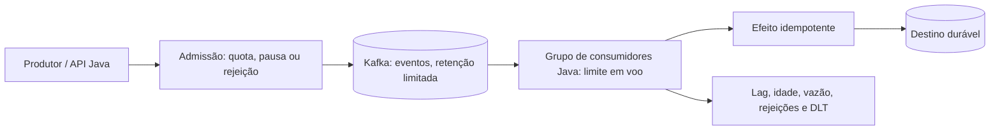

# A01 — Reteste execução 2

Prompt literal: “Desenhe em Java um serviço cujo produtor recebe 1.000 eventos/s e consumidor processa 100/s”

Agent `arquiteto-sistemas`

Sessão: reteste independente 2

Nota: pendente de pontuação

Arquivos do catálogo lidos:

- `agents/arquiteto-sistemas.md`
- `skills/design-system-architecture/SKILL.md`
- `skills/design-system-architecture/references/capacidade-slos.md`
- `skills/design-system-architecture/references/estimativas-rapidas.md`
- `skills/design-system-architecture/references/nfr-checklist.md`
- `skills/resiliencia-controle-fluxo-java/SKILL.md`
- `skills/resiliencia-controle-fluxo-java/references/capacidade-e-limites.md`
- `skills/resiliencia-controle-fluxo-java/references/backpressure-java.md`
- `skills/mensageria-sqs-kafka/SKILL.md`
- `skills/mensageria-sqs-kafka/references/controle-consumo-java.md`
- `skills/gerar-diagramas/references/exemplos-mermaid.md`

## Saída bruta

## Desenho proposto

Vou tratar 1.000 eventos/s como taxa de entrada durante um pico finito e 100 eventos/s como capacidade total atual de processamento. **Hipótese de cálculo, não requisito:** o pico dura 10 segundos. O tamanho do evento, a taxa depois do pico, a retenção necessária, a tolerância a perda/duplicata e o prazo máximo de processamento não foram informados; precisam ser definidos ou medidos antes de fechar armazenamento, SLO e configuração de produção.

Usaria uma aplicação Java com produtor/admissão, um tópico Kafka durável e consumidores em grupo. O tópico absorve o atraso finito sem manter o backlog na heap da JVM. Kafka é uma escolha inicial para o fluxo de eventos e o paralelismo por partições; a escolha deve ser revista se requisitos de ordenação, operação ou custo favorecerem outro broker. Aumentar partições só aumenta o paralelismo possível: não aumenta, por si só, a capacidade do downstream.

O domínio não depende do Kafka. O adapter de entrada valida limite de payload e identidade/quota, publica no tópico e não mantém fila ilimitada local. O adapter de consumo chama o caso de uso; idempotência persistida evita repetir efeitos quando houver reentrega. O offset só avança depois do efeito durável, ou depois de uma quarentena durável para falha permanente. O processamento preserva a ordem dentro da partição; a chave de partição deve refletir a chave de ordenação exigida pelo negócio, ainda não informada.

## Capacidade e backlog

| Item | Estimativa | Fonte / escopo |
|---|---:|---|
| Entrada no pico | 1.000 eventos/s | Dado do prompt; taxa agregada assumida |
| Processamento atual | 100 eventos/s | Dado do prompt; capacidade agregada assumida |
| Déficit durante o pico | 900 eventos/s | 1.000 − 100 |
| Duração usada no exemplo | 10 s | Hipótese explícita, a validar com perfil de carga |
| Backlog adicional ao fim do pico | 9.000 eventos | (1.000 − 100) × 10; pressupõe backlog inicial zero e taxas constantes |
| Armazenamento lógico mínimo do backlog | 9.000 × tamanho máximo aceito por evento | Tamanho não informado; somar índices, overhead, replicação e retenção do broker após medi-los |

Assim, o buffer precisa acomodar pelo menos os 9.000 eventos calculados **além de qualquer backlog que já exista** para esta hipótese de pico. Isso não fecha o tamanho em bytes: falta medir/definir o tamanho máximo do evento e incluir overhead do broker, fator de replicação e margem operacional validada por ensaio. Limitaria a fila por quantidade, bytes e idade; também imporia máximo de payload na admissão. Trabalho que ultrapassou sua idade útil deve seguir uma política explícita, como quarentena ou descarte autorizado pelo negócio, nunca desaparecer silenciosamente.

Um buffer de 9.000 itens não atende a picos maiores nem a falhas concomitantes. Se a duração real for `T` segundos, com déficit constante, o backlog adicional será `B = (1.000 − 100) × T = 900 × T` eventos. A capacidade efetiva do tópico precisa incluir backlog existente, bytes/evento, overhead, retenção e replicação. O limite de retenção/disco deve ser explícito; o broker não é armazenamento ilimitado.

## Drenagem depois do pico

O tempo de drenagem usa a taxa de entrada que continua durante a recuperação: `tempo = B ÷ (μ − λpós-pico)`, somente quando `μ > λpós-pico`.

- Se, após os 10 segundos assumidos, a origem parar (`λpós-pico = 0`) e o consumidor continuar em 100/s, os 9.000 eventos levam **90 segundos** para drenar.
- Se a entrada cair para 50/s, os mesmos 9.000 eventos drenam a 50/s líquidos e levam **180 segundos**.
- Se a entrada continuar em 100/s, não há progresso líquido do backlog com capacidade de 100/s. Se continuar em 1.000/s, o backlog cresce mais 900/s; não existe tempo finito de drenagem.
- Como cenário de capacidade, se o grupo for medido e escalado para 1.200/s enquanto a entrada volta a 1.000/s, a margem líquida é 200/s e o backlog de 9.000 leva **45 segundos** para drenar. Esses 1.200/s são um exemplo de cálculo, não um requisito de capacidade ou SLO.

Para um prazo de drenagem `D` acordado, a capacidade necessária é `μ ≥ λpós-pico + B/D`. Medir carga e tempo de processamento no downstream antes de transformar essa estimativa em configuração ou compromisso.

## Proteção e política para déficit

Um buffer resolve somente um pico finito. Para déficit sustentado (entrada maior que processamento), a política deve combinar:

1. **Regular ou pausar o produtor quando ele cooperar**, propagando demanda/pausa e mantendo a taxa admitida no limite que o destino suporta.
2. **Aumentar capacidade de consumo** (processamento mais barato e/ou consumidores/partições adicionais), mas só até o limite medido do downstream e do orçamento compartilhado de conexões. Não escolher quantidade de partições, instâncias ou tamanho de pool sem benchmark e orçamento do destino.
3. **Rejeitar cedo ou limitar a taxa** quando o backlog/idade ou a capacidade durável atingir o limite. Para uma API, devolver 429 com orientação de nova tentativa para quota do cliente, ou 503 para saturação/indisponibilidade, conforme o contrato; contar rejeições. Se a origem não puder ser pausada e perder o evento não for aceitável, persistir enquanto houver capacidade durável e então recusar, sem fingir aceitação.
4. **Evitar retry amplificador**: tentativas limitadas, backoff com jitter e uma camada dona; reentrega exige efeito idempotente. Falha permanente só pode ser confirmada após publicação durável em DLT/quarentena.

No consumidor Kafka, limitar o trabalho em voo ao que o downstream aguenta. A thread de consumo continua chamando `poll()`; pausa partições sem capacidade, processa no máximo um registro por partição em ordem e confirma somente o último offset concluído em sequência. Não enviar todo o lote para executor com fila ilimitada, não commitar um lote antes de o efeito terminar e não parar o `poll()` esperando workers. Ajustar `max.poll.records` ao tempo do lote, `max.poll.interval.ms` ao pior caso medido com margem e limites de fetch à memória disponível. Essas configurações dependem da latência e do tamanho dos eventos, que não foram fornecidos.

## Observabilidade e validação

Medir taxa de entrada e saída, lag por partição, idade da mensagem mais antiga, quantidade e bytes do backlog, trabalho em voo, tempo de processamento, tentativas, commits, rejeições e DLT. Alertar por crescimento contínuo do lag/idade e aproximação dos limites de bytes/retention; não usar apenas a contagem total como sinal de prazo.

Validar com ensaio que reproduza pelo menos a hipótese de 1.000/s por 10 s, seguido por cada taxa pós-pico relevante. Confirmar o backlog observado, memória/armazenamento, tempo de drenagem, limite de trabalho em voo, comportamento quando o broker chega ao limite, reentrega após falha e ausência de commit antes do efeito durável. O tamanho do evento, a taxa sustentada real, a idade máxima útil, retenção e prazo de recuperação continuam como hipóteses pendentes para o responsável pelo serviço.
