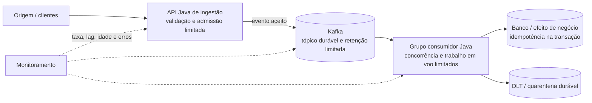

# A01 — Execução 2
**Prompt:** Desenhe em Java um serviço cujo produtor recebe 1.000 eventos/s e consumidor processa 100/s
**Agent:** `arquiteto-sistemas`
**Sessão:** independente 2
**Nota:** (pendente de pontuação)
**Arquivos do catálogo lidos:** `agents/arquiteto-sistemas.md`; `skills/design-system-architecture/SKILL.md`; `skills/design-system-architecture/references/capacidade-slos.md`; `skills/design-system-architecture/references/estimativas-rapidas.md`; `skills/design-system-architecture/references/nfr-checklist.md`; `skills/resiliencia-controle-fluxo-java/SKILL.md`; `skills/resiliencia-controle-fluxo-java/references/capacidade-e-limites.md`; `skills/resiliencia-controle-fluxo-java/references/backpressure-java.md`; `skills/resiliencia-controle-fluxo-java/references/isolamento-degradacao-java.md`; `skills/mensageria-sqs-kafka/SKILL.md`; `skills/mensageria-sqs-kafka/references/controle-consumo-java.md`

## Saída bruta

## Desenho

A vazão informada tem um déficit de **900 eventos/s**: chegam 1.000/s e são processados 100/s. Um broker pode absorver esse descompasso temporariamente, mas não resolvê-lo de forma permanente. Eu usaria Kafka para manter o backlog durável e desacoplar a ingestão do processamento, com um contrato explícito de retenção e atraso máximo.

### Hipóteses

- Os 1.000 eventos/s são uma taxa sustentada; não foi informado se há picos, nem sua duração.
- O processamento de 100/s é a capacidade agregada atual do grupo consumidor.
- Os eventos precisam ser preservados, podem ser processados ao menos uma vez e têm uma chave de negócio para ordenar eventos relacionados.
- Como tamanho não foi informado, uso **2 KiB por evento** apenas para estimar armazenamento. Retenção, latência aceitável, ordenação e perda tolerada precisam ser confirmadas antes de fechar o dimensionamento.
- A capacidade de 100/s é uma hipótese de planejamento, não uma medição ou SLO. Deve ser validada com a carga real e o downstream.

### Capacidade e consequência

| Medida | Estimativa | Natureza |
|---|---:|---|
| Entrada | 1.000 eventos/s; 86,4 milhões/dia | Informado, assumindo taxa constante |
| Saída atual | 100 eventos/s; 8,64 milhões/dia | Informado, assumindo capacidade constante |
| Crescimento do backlog | 900 eventos/s; 54.000/min; 3,24 milhões/hora | Derivado |
| Payload de backlog | ~1,8 MiB/s; ~155 GiB/dia | Derivado da hipótese de 2 KiB/evento; sem réplicas, índices e overhead |
| Concorrência para 100/s | `100 × tempo médio de processamento (s)` | Lei de Little; tempo de serviço ainda precisa ser medido |

Com a taxa informada, o backlog cresce sem limite enquanto a ingestão continuar. Por exemplo, uma retenção de 24 horas precisaria comportar pelo menos 77,76 milhões de eventos acumulados (cerca de 148 GiB de payload na hipótese de 2 KiB), além da replicação e do overhead. A retenção não é uma solução para déficit sustentado: quando ela acaba, o produtor precisa ser pausado ou limitado, o excedente rejeitado, ou a capacidade de processamento aumentada.

Para estabilizar sem backlog crescente, a capacidade efetiva dos consumidores precisa ser pelo menos 1.000/s; para recuperar backlog e absorver variações, precisa superar 1.000/s. Se cada instância realmente sustentar 100/s no downstream, 10 instâncias apenas acompanham a entrada e não deixam folga para drenagem. Um exemplo inicial seria 12 instâncias (capacidade nominal de 1.200/s) e pelo menos 12 partições, condicionado a teste de carga e ao limite do downstream. A escala não deve exceder a capacidade de banco ou dependências.

### Componentes



Começaria com dois módulos Java implantáveis separadamente — ingestão e consumo — porque a carga de entrada e a velocidade de processamento têm necessidades diferentes de escala e proteção. Se a operação e o volume forem pequenos, podem começar no mesmo repositório e compartilhar bibliotecas; o isolamento de implantação é justificado aqui pelo descompasso de taxas. A API de ingestão valida tamanho e esquema, autentica o chamador e publica o evento no Kafka. Se a aceitação do evento precisar ser atômica com uma transação de negócio local, o produtor grava o evento numa outbox na mesma transação e um relay publica no Kafka. Se não houver transação local, a outbox não é necessária.

### Exemplo Java ilustrativo

Configuração essencial do produtor Spring Kafka (propriedades ilustrativas; validar nomes e valores conforme a versão adotada):

```yaml
spring:
  kafka:
    producer:
      acks: all
      properties:
        enable.idempotence: true
        max.in.flight.requests.per.connection: 5
```

Publicar com chave estável preserva a ordem dos eventos daquela chave dentro da partição. O aceite da API só deve ser confirmado depois da confirmação durável do broker (ou da gravação durável na outbox, quando ela for usada). Idempotência do produtor reduz duplicatas na publicação, mas não torna idempotente um efeito externo do consumidor.

Exemplo conceitual do consumidor; o tratamento de offset, pausa, rebalance e falhas deve ficar numa implementação de consumo controlado ou na configuração equivalente do Spring Kafka, sem despachar registros indiscriminadamente para threads:

```java
@Component
final class EventoListener {
    private final ProcessarEvento casoDeUso;

    EventoListener(ProcessarEvento casoDeUso) {
        this.casoDeUso = casoDeUso;
    }

    @KafkaListener(topics = "eventos", groupId = "processadores")
    void receber(Evento evento) {
        casoDeUso.executarIdempotente(evento);
        // O retorno indica que o efeito durável terminou; o offset é confirmado depois.
    }
}
```

O comentário está em português. Em produção, desabilitaria commit automático e confirmaria apenas depois de o efeito durável. Se houver processamento assíncrono, usaria confirmação manual do trabalho concluído; em falha, não avançaria o offset daquele evento. No desenho com processamento paralelo, manteria no máximo um evento em processamento por partição e commits em sequência. A thread que chama `poll()` continua chamando-a durante pausas, e as partições sem capacidade ficam pausadas. A idempotência do efeito deve ser persistida junto com a alteração de negócio, por exemplo com uma restrição única sobre o identificador do evento na mesma transação.

### Proteção contra sobrecarga e falhas

- **Limite de ingestão:** configurar quota/admissão por cliente e global, com unidade de eventos/s e limite de burst explícito após medir picos. Quando o backlog ou a idade mais antiga se aproximar do limite operacional, reduzir a taxa na origem por pausa/quota. Se a origem não cooperar, rejeitar rapidamente com resposta de sobrecarga (`429` ou `503`, conforme o contrato), `Retry-After` e métrica; não usar buffer ilimitado na JVM.
- **Broker:** definir partições, RF, `min.insync.replicas` e retenção conforme RPO, disponibilidade e janela de recuperação desejados. Validar a configuração do Kafka e os limites de armazenamento no ambiente escolhido. A retenção deve cobrir incidentes e recuperação, com alarme antes do esgotamento.
- **Consumidor:** limitar registros por poll, trabalho em voo agregado e por instância. Dimensionar concorrência pela capacidade medida do banco/downstream, não apenas pelo número de partições. Pausar partições quando o limite for atingido; deixar o backlog no broker.
- **Falhas e duplicatas:** retry limitado e classificado para falhas transitórias; depois, publicar na DLT/quarentena de forma durável antes de confirmar o evento original. Se a publicação para a DLT falhar, manter o evento sem commit. Reprocessamento é at-least-once: exigir idempotência persistida e replay limitado em taxa.
- **Recuperação:** escalar consumidores gradualmente após o downstream estar saudável. Escalar pelo lag/idade só até o teto de partições e de capacidade compartilhada; mais consumidores podem sobrecarregar o banco.

| Falha | Efeito | Limite/proteção e recuperação | Sinal e evidência |
|---|---|---|---|
| Consumidor indisponível ou lento | Lag e idade crescem | Broker retém até o limite configurado; alertar antes da retenção acabar, restaurar consumidores e verificar folga para drenar | Lag e idade mais antiga; simular interrupção e medir drenagem |
| Banco/downstream saturado | Aumento de latência, falhas e retries | Limite de trabalho em voo; pausar partições; retry limitado; retomar em rampa após recuperação | Ativos, latência e erros do downstream; teste de saturação |
| Evento venenoso ou payload inválido | Reentrega repetida pode bloquear progresso | Classificar erro, tentativas limitadas e quarentena durável antes do commit; replay controlado | Contagem/idade da DLT; teste de falha na publicação da DLT |
| Broker indisponível | Ingestão não consegue confirmar publicação | Não confirmar aceite sem persistência durável; aplicar rejeição/backpressure na origem e retentar com orçamento | Erros de publicação e rejeições; teste de indisponibilidade |
| Duplicata ou rebalance | Efeito repetido possível | Idempotência persistida; commit somente do concluído; trabalho pendente será reprocessado | Duplicatas detectadas e commits; teste de reinício/rebalance |

### SLI/SLO propostos para validar

Não há dados para prometer um SLO. Eu definiria inicialmente estes SLIs e fecharia os alvos após conhecer a latência do negócio, os picos e a retenção:

- **Aceite:** eventos confirmados duravelmente ÷ eventos válidos oferecidos, medido na API, incluindo `429/503` como não aceitos; reportar também latência p95/p99 de aceite.
- **Processamento:** eventos concluídos dentro do prazo de negócio ÷ eventos elegíveis, medido da publicação até o efeito durável; escolher o prazo após a validação do requisito.
- **Backlog:** idade do evento mais antigo e lag por partição, acompanhados de taxa de entrada/saída, trabalho em voo e DLT. Idade informa melhor que contagem isolada se o atraso está violando o objetivo.

### Decisões e validação

1. **Kafka e backlog durável:** escolhido para reter e reproduzir o excedente. Um buffer em memória não sobrevive a falha e também não resolve o déficit sustentado. Custo aceito: operar o broker, particionamento, retenção e monitoramento. Revisar se o prazo de processamento for curto demais para qualquer backlog ou se volume/custo indicar outra estratégia.
2. **Escala separada e capacidade acima da entrada:** a configuração atual de 100/s não atende 1.000/s de forma estável. Medir throughput por instância e limite do downstream; então ajustar partições/instâncias para atingir mais de 1.000/s com margem. Se o downstream não puder aumentar, negociar uma taxa menor na origem ou uma janela de atraso explícita.
3. **Provas antes de produção:** ensaio sustentado a 1.000 eventos/s e ensaio de pico com duração acordada; medir tamanho real dos eventos, taxa útil por consumidor, lag e idade; interromper/reiniciar consumidores e broker; simular downstream lento, duplicatas, rebalance e indisponibilidade da DLT; provar que limites e retenção são respeitados e que o sistema drena o backlog sem exceder a capacidade do destino.

Pendências que mudam o dimensionamento: tamanho máximo e distribuição do payload, pico e duração, prazo máximo de processamento, retenção/RPO, ordenação exigida, capacidade e quotas do downstream e taxa máxima que a origem consegue aceitar após throttling. Cada hipótese deve ser substituída por medição ou contrato; 100 eventos/s é a única capacidade atualmente informada.
