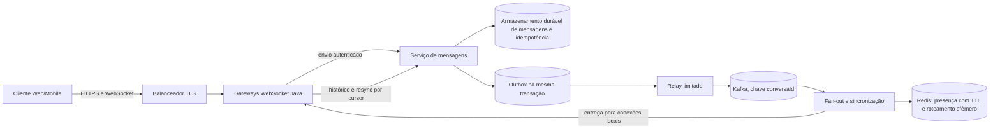

# Task 18 — Caso A10 execução 1

## Prompt literal

“Explique o design de um chat em 45 minutos com exemplos”

## Agent

`arquiteto-sistemas`

## Sessão independente

1

## Nota

Pendente

## Arquivos lidos

- `agents/arquiteto-sistemas.md`
- `skills/design-system-architecture/SKILL.md`
- `skills/design-system-architecture/references/entrevista-system-design.md`
- `skills/design-system-architecture/references/estudos-de-caso-java.md`
- `skills/design-system-architecture/references/capacidade-slos.md`
- `skills/design-system-architecture/references/estimativas-rapidas.md`
- `skills/design-system-architecture/references/consistencia-distribuida.md`
- `skills/design-system-architecture/references/protocolos-comunicacao.md`
- `skills/design-system-architecture/references/database-selection.md`
- `skills/design-system-architecture/references/system-design.md`
- `skills/resiliencia-controle-fluxo-java/SKILL.md`
- `skills/resiliencia-controle-fluxo-java/references/capacidade-e-limites.md`
- `skills/resiliencia-controle-fluxo-java/references/backpressure-java.md`
- `skills/resiliencia-controle-fluxo-java/references/isolamento-degradacao-java.md`
- `skills/mensageria-sqs-kafka/SKILL.md`
- `skills/mensageria-sqs-kafka/references/escolha-broker.md`
- `skills/mensageria-sqs-kafka/references/idempotencia-outbox-replay-java.md`
- `skills/gerar-diagramas/references/exemplos-mermaid.md`
- `skills/monitoramento-java/SKILL.md`
- `skills/monitoramento-java/references/slo-saturacao-java.md`
- `skills/arquitetura-limpa-java/SKILL.md`
- `skills/arquitetura-limpa-java/references/decomposicao-bounded-contexts.md`

## Saída bruta completa

# Design de um chat em 45 minutos

Vou tratar “chat” como mensagens 1:1 e em grupos, com histórico durável, entrega em tempo real a usuários online e presença básica. Como não há dados do produto, usarei números de exercício explícitos; eles servem para orientar o desenho e precisam ser substituídos por telemetria antes de virar capacidade ou SLO.

## 0–5 min — Requisitos e fronteiras

**Requisitos funcionais:**

1. Enviar e consultar mensagens em conversas 1:1 e em grupo.
2. Entregar mensagens a participantes conectados e permitir sincronização após reconexão.
3. Manter histórico paginado e presença aproximada (online/última atividade).
4. Evitar duplicação quando o cliente repetir um envio após timeout.

**Requisitos não funcionais propostos, como hipóteses:**

- Ordem garantida dentro de cada conversa; não há ordem global entre conversas.
- Para destinatários online, latência de envio até entrega p99 abaixo de 500 ms em carga nominal.
- Uma mensagem confirmada ao remetente não pode desaparecer; entrega ao destinatário é pelo menos uma vez, com deduplicação pelo identificador da mensagem.
- SLO inicial a validar: 99,9% de envios válidos aceitos em 30 dias. Rejeições 429/503 do próprio serviço contam como falha nesse SLI; erros de validação do cliente podem ser excluídos se isso for definido no contrato.
- Escopo inicial: texto e metadados. Anexos grandes, chamadas de voz/vídeo, busca textual e criptografia ponta a ponta ficam fora do primeiro desenho. Anexos, se entrarem, vão a object storage com autorização e metadados no chat.

A escolha mais importante é “confirmado” significar persistido. O servidor só responde sucesso ao remetente depois que a mensagem e o evento de publicação ficam duráveis na mesma transação local.

## 5–10 min — Capacidade de ordem de grandeza

Hipóteses do exercício inspiradas em um produto grande:

- 10 milhões de usuários ativos por dia, 50 mensagens por usuário/dia: 500 milhões de mensagens/dia, cerca de 5.800 mensagens/s em média.
- Pico de 30.000 mensagens/s por até 15 minutos, hipótese a validar com distribuição horária e campanhas/eventos.
- 1 milhão de conexões WebSocket simultâneas. Se um gateway sustentar 20 mil conexões com a latência e memória desejadas, são 50 gateways antes da folga operacional. Os 20 mil são hipótese de benchmark, não uma propriedade de Java ou um limite universal.
- A 1 KiB armazenado por mensagem, sem contar índices e réplicas, o volume bruto seria aproximadamente 500 GB/dia. Retenção, compressão, metadados e crescimento precisam ser decididos com produto e medidos; mídia não deve ser armazenada nas linhas de mensagem.
- Fan-out: uma mensagem de grupo com N membros pode gerar até N entregas. A média de membros esconde grupos muito grandes, então o tamanho máximo e a cauda da distribuição mudam o custo.

Não dimensionaria pools apenas pela média. Por exemplo, a Lei de Little dá cerca de 1.500 operações em voo a 30 mil envios/s e 50 ms médios de permanência (`L = λ × W`); p99 deve ser medido sob pico e não usado como média. Também somaria conexões de banco de todas as réplicas, jobs e ferramentas administrativas antes de autorizar autoscaling.

## 10–20 min — Desenho de alto nível

Começaria com módulos de domínio bem definidos e escalaria os componentes cujo recurso é diferente: conexões persistentes no gateway, gravação ordenada no serviço de mensagens e fan-out assíncrono. Isso evita transformar cada entidade em microsserviço.



Fluxo de envio:

1. Cliente envia `conversationId`, `clientMessageId` e corpo pelo WebSocket autenticado.
2. Gateway valida limite de tamanho e identidade; encaminha ao serviço de mensagens com deadline.
3. Serviço valida participação, deduplica por `(conversationId, senderId, clientMessageId)`, atribui sequência da conversa e grava mensagem + outbox atomicamente.
4. Depois do commit, confirma ao remetente com `messageId` e `sequence`.
5. Relay publica o evento no Kafka usando `conversationId` como chave. Consumidores fazem fan-out para os gateways que têm participantes conectados; a entrega pode se repetir, portanto o cliente deduplica pelo `messageId` ou avança o cursor de sequência.
6. Ao reconectar, cliente informa a última sequência vista; API busca as mensagens seguintes no armazenamento durável. A conexão WebSocket acelera a entrega, mas não é a fonte de verdade.

Presença é aproximada: heartbeat renova um TTL no Redis; expiração ou atraso pode mostrar um usuário online por alguns segundos a mais/menos. Ela não decide se a mensagem foi aceita.

## Dados e consistência por operação

| Operação | Garantia | Implementação inicial e limite |
|---|---|---|
| Aceitar envio | Durabilidade forte: mensagem e chave de idempotência confirmadas na mesma transação | Armazenamento com escrita condicional/transacional particionado por `conversationId`; não confirmar antes do commit |
| Sequenciar mensagens | Monotonicidade por conversa | Atribuir `sequence` na gravação sob coordenação por conversa. Concorrência na mesma conversa tem custo; grupos extremamente ativos são hot keys e precisam de limite ou desenho próprio |
| Publicar para fan-out | Pelo menos uma vez, sem perda entre commit e publicação | Outbox durável; consumidor idempotente. Não prometer exactly-once de ponta a ponta |
| Histórico e resync | Leitura consistente o bastante para recuperar um envio confirmado | Buscar por `(conversationId, sequence)`; manter o cursor do cliente. Réplicas de leitura só entram se o atraso for observado e compatível com a experiência |
| Presença | Eventual e descartável | Redis com TTL. Perder presença temporariamente não perde mensagens |

O armazenamento não fica decidido por rótulo “SQL/NoSQL”. Um banco relacional com partições e índices pode ser o primeiro passo se o benchmark suportar a taxa e a retenção. Para volume muito alto, um banco distribuído de chave/partição por conversa pode se adequar melhor ao append e à consulta por cursor, mas cobra em consultas flexíveis e operações entre partições. Em ambos, medir gravação, distribuição de conversas, leituras de histórico e custo de grupos quentes antes de escolher ou migrar.

## Exemplo Java: envio idempotente e durável

Pseudocódigo de aplicação: a interface mantém o contrato, enquanto o adapter de persistência implementa uma transação local que grava a mensagem e a outbox. A geração de sequência precisa ser atômica por conversa no armazenamento escolhido.

```java
public record EnviarMensagem(
        String conversationId,
        String senderId,
        String clientMessageId,
        String texto) {}

public interface EnviarMensagemUseCase {
    MensagemConfirmada executar(EnviarMensagem comando);
}

public final class EnviarMensagemService implements EnviarMensagemUseCase {
    private final TransacaoMensagens transacao;

    @Override
    public MensagemConfirmada executar(EnviarMensagem comando) {
        return transacao.emTransacao(() -> {
            var anterior = transacao.buscarPorChaveDoCliente(
                    comando.conversationId(), comando.senderId(), comando.clientMessageId());
            if (anterior.isPresent()) return anterior.get();

            long sequencia = transacao.proximaSequencia(comando.conversationId());
            var mensagem = MensagemConfirmada.criar(comando, sequencia);
            transacao.salvarMensagem(mensagem);
            transacao.salvarEventoOutbox(EventoMensagem.criada(mensagem));
            return mensagem;
        });
    }
}
```

A restrição única da chave do cliente deve resolver corridas entre dois retries simultâneos: se houver conflito, a aplicação relê e devolve o resultado já criado. A transação não inclui chamada ao Kafka. O relay pode publicar e cair antes de marcar o evento; por isso o consumidor deve deduplicar `eventId` e a entrega continua sendo pelo menos uma vez.

## Exemplo Java: cliente lento sem buffer infinito

Cada conexão tem fila de saída limitada. Se o cliente não acompanhar, fecho a conexão para preservar o gateway; na reconexão ele recupera o intervalo pelo cursor durável.

```java
final class SessaoWebSocket {
    private final FilaLimitada<EventoMensagem> saida = new FilaLimitada<>(256);

    boolean entregar(EventoMensagem evento) {
        if (saida.oferecer(evento) == FilaLimitada.Admissao.ACEITO) return true;
        fecharComPolitica("cliente lento; recuperar pelo cursor ao reconectar");
        return false;
    }

    private void fecharComPolitica(String motivo) {
        // Fecha a conexão e registra o motivo sem descartar o histórico durável.
    }
}
```

O limite 256 é apenas um ponto inicial de exercício. Em produção, definiria também bytes máximos e idade máxima por sessão; calcularia memória total como conexões × limite efetivamente observado, incluindo objetos e buffers, e validaria por teste de carga. Não manteria fila ilimitada em memória.

## 20–35 min — Proteções e cenários de falha

| Falha ou excesso | Impacto | Proteção e degradação | Recuperação e evidência |
|---|---|---|---|
| Gateway cai ou reinicia | Conexões fechadas e pico de handshakes/reconexões | Backoff exponencial com jitter no cliente; admissão limitada de handshakes por instância; conexão recusada cedo quando o limite chega | Escalar com teto, observar taxa de reconexão e testar perda simultânea de gateways |
| Cliente lento ou rede ruim | Saída cresce e ocupa heap/threads | Fila por sessão limitada por itens, bytes e idade; desconectar sessão lenta e orientar resync | Confirmar que outras sessões continuam entregando; medir fila e desconexões por motivo |
| Banco de mensagens lento/indisponível | Não é possível confirmar durabilidade | Timeout/deadline e bulkhead; rejeitar envio com erro explícito e retry-after quando seguro; não confirmar como sucesso | Repetição com mesma chave não duplica; ensaio de falha e recuperação do armazenamento |
| Kafka lento ou indisponível | Fan-out atrasa, mas o commit da mensagem ocorreu | Outbox acumula com teto operacional e alerta por idade; relay publica em taxa limitada; o remetente ainda recebe confirmação após o commit, e destinatários offline recuperam do histórico | Drenagem gradual e consumidor idempotente; medir idade da outbox e lag por partição |
| Consumidor atrás em uma partição | Entrega online atrasada para conversas daquela partição | Pausar/limitar consumo e preservar backlog durável; não paralelizar mensagens da mesma partição se isso quebrar a ordem | Medir lag e idade por partição; reproduzir atraso com partição quente |
| Retry/reentrega do mesmo envio | Possível mensagem duplicada | `clientMessageId` com chave única por remetente e conversa; retry limitado, com backoff e jitter, em uma única camada dona | Teste de timeout após commit e de retries concorrentes |
| Grupo enorme ou conversa muito ativa | Fan-out e sequência concentrados, partição quente | Limite explícito de membros no modo de chat; para canais muito grandes, considerar leitura por pull/stream em vez de push individual | Testar distribuição com cauda longa; rever o desenho quando o p99 ou lag dessa conversa ultrapassar o orçamento |
| Redis de presença falha | Presença fica ausente/desatualizada e roteamento imediato pode perder eficiência | Tratar presença como dado efêmero; não bloquear persistência nem histórico; fallback é sincronização no próximo reconnect/poll controlado | Falha do Redis não pode tornar mensagem confirmada invisível no histórico |

Limites precisam ter unidade e escopo: mensagens por segundo por usuário/tenant, bytes máximos por mensagem, membros por grupo, conexões e filas por gateway, concorrência por dependência, duração máxima na fila e limite de handshakes. Quando exceder, rejeitar cedo ou pausar o produtor; um buffer só absorve um pico finito e não corrige déficit sustentado.

Retries pertencem a uma camada por chamada lógica. Para envio, repetição só é segura com idempotência; timeout não significa que o commit falhou. O cliente repete com a mesma chave, e o servidor retorna o resultado anterior. Para consumidores, reentrega é esperada e deduplicada de forma persistente.

## 35–40 min — Decisões e trade-offs

### ADR 1 — Ordem por conversa, sem ordem global

- **Decisão:** sequência monotônica dentro de cada conversa e Kafka particionado por `conversationId` para fan-out ordenado.
- **Alternativa simples:** ordem apenas pelo timestamp do cliente. É fácil, mas relógios e redes fora de ordem tornam a experiência inconsistente.
- **Perda aceita:** conversa muito ativa pode serializar gravações e se tornar hot key; não há ordenação entre conversas.
- **Rever quando:** uma conversa individual exceder a taxa de gravação que o armazenamento consegue sequenciar dentro do orçamento de latência.

### ADR 2 — Persistência e outbox antes de confirmação

- **Decisão:** gravar mensagem, idempotência e outbox atomicamente; confirmar o envio após commit; publicar fan-out de forma assíncrona.
- **Alternativa:** publicar primeiro no broker e responder ao cliente antes de persistir o histórico. É mais simples no caminho quente, mas aumenta risco de confirmação sem histórico confiável e exige reconciliação mais complexa.
- **Perda aceita:** entrega a destinatário pode atrasar durante indisponibilidade do broker, embora a mensagem confirmada siga recuperável pelo histórico.
- **Rever quando:** a latência do commit exceder o SLO sob carga medida ou o atraso de outbox passar o limite de experiência definido.

### ADR 3 — Módulos coesos; separar gateways por perfil de escala

- **Decisão:** começar com serviço de mensagens modular e gateways WebSocket escaláveis separadamente; extrair outros serviços somente por independência operacional ou domínio.
- **Alternativa:** um único processo atende HTTP, sockets e persistência. É o caminho inicial mais simples para produto pequeno, mas conexões longas podem competir com gravações e tornar o escalonamento desigual.
- **Perda aceita:** operar dois perfis de implantação e a consistência eventual do registro de presença/roteamento.
- **Rever quando:** conexão, tráfego e equipe permitirem operar bem em implantação única; ou quando fan-out passar a exigir capacidade e ciclo de release realmente independentes.

Kafka é justificado aqui pela taxa de eventos, retenção/replay de fan-out e ordenação por chave sob as hipóteses grandes. Para um MVP de milhares de usuários, long polling/WebSocket, banco relacional e processo modular podem ser suficientes; não começaria com broker e dezenas de serviços sem medir a necessidade.

## 40–45 min — Operação, observabilidade e validação

SLIs e métricas a instrumentar:

- Disponibilidade do envio: envios válidos confirmados dentro do critério dividido por todos os envios válidos, incluindo rejeições do próprio serviço no denominador.
- Latência p50/p95/p99 de persistência e entrega online; separar tempo no gateway, banco, outbox, broker e fan-out.
- Taxa de duplicatas deduplicadas, mensagens por conversa, distribuição do tamanho de grupos e hot partitions.
- Conexões ativas por gateway, handshakes aceitos/recusados, bytes e idade da fila por conexão.
- Idade da outbox, lag e idade do backlog por partição, retries, falhas de publicação e desconexões por cliente lento.
- Pool de banco, espera por conexão, erros de commit e limites de admissão.

Alertas devem refletir orçamento de erro e saturação, não somente CPU: p99 de entrega acima do alvo por janela definida; idade da outbox/lag acima do atraso aceitável; filas de saída perto do teto; rejeições e handshakes recusados em crescimento. Autoscaling de consumidores considera lag/idade, com teto compatível com conexões e capacidade do armazenamento. Depois de falha, drenar backlog em rampa para não criar novo pico.

Antes de afirmar capacidade, faria estes ensaios, com carga e distribuição de conversas realistas:

1. Conexões WebSocket estáveis e reconexão simultânea após derrubar gateways.
2. Pico de mensagens e fan-out com grupos medianos e cauda de grupos grandes.
3. Gateway e cliente lento não contaminam sessões saudáveis; fila fica limitada.
4. Queda do Kafka entre commit e publicação; outbox preserva evento e replay não duplica efeito.
5. Timeout do cliente após commit e retries concorrentes; uma mensagem e uma sequência são persistidas.
6. Falha e latência do banco; envio não recebe confirmação falsa, limites protegem as demais operações.
7. Resync com cursor depois de desconexão, atraso de consumidor e entrega repetida.

As hipóteses de capacidade ficam pendentes até ensaio; responsável: equipe de plataforma e mensageria, junto com produto para retenção, limite de grupo e definição do SLO. A primeira medição que eu pediria é a distribuição real de conexões simultâneas, mensagens por usuário e tamanho/atividade de conversa, porque ela determina a quantidade de gateways, a taxa de persistência e as hot keys.
