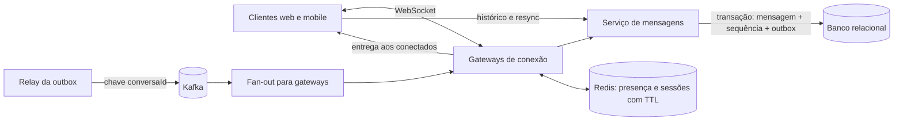

# Task 18 — Caso A10, execução 2

**Prompt literal:** “Explique o design de um chat em 45 minutos com exemplos”

**Agent:** `arquiteto-sistemas`  
**Sessão:** independente 2  
**Nota:** pendente

## Arquivos lidos

- `agents/arquiteto-sistemas.md`
- `skills/design-system-architecture/SKILL.md`
- `skills/design-system-architecture/references/entrevista-system-design.md`
- `skills/design-system-architecture/references/estudos-de-caso-java.md`
- `skills/design-system-architecture/references/system-design.md`
- `skills/design-system-architecture/references/protocolos-comunicacao.md`
- `skills/design-system-architecture/references/consistencia-distribuida.md`
- `skills/design-system-architecture/references/architecture-patterns.md`
- `skills/design-system-architecture/references/capacidade-slos.md`
- `skills/design-system-architecture/references/estimativas-rapidas.md`
- `skills/design-system-architecture/references/nfr-checklist.md`
- `skills/resiliencia-controle-fluxo-java/SKILL.md`
- `skills/resiliencia-controle-fluxo-java/references/capacidade-e-limites.md`
- `skills/resiliencia-controle-fluxo-java/references/backpressure-java.md`
- `skills/resiliencia-controle-fluxo-java/references/isolamento-degradacao-java.md`
- `skills/mensageria-sqs-kafka/SKILL.md`
- `skills/mensageria-sqs-kafka/references/controle-consumo-java.md`
- `skills/gerar-diagramas/SKILL.md`
- `skills/gerar-diagramas/references/exemplos-mermaid.md`
- `skills/arquitetura-limpa-java/SKILL.md`
- `skills/arquitetura-limpa-java/references/decomposicao-bounded-contexts.md`
- `docs/catalogo/convencoes.md`

## Saída bruta completa

# Design de um chat em 45 minutos

Vou organizar a resposta em requisitos, capacidade, desenho, aprofundamento, trade-offs e validação. Como não foram fornecidos números de produto ou carga, vou tratar as cifras abaixo como hipóteses de exercício, não como SLOs de produção.

## 0–5 min — Requisitos e escopo

**Funcionais:** mensagens diretas e em grupos; entrega a usuários online; histórico paginado; presença básica; reconexão que recupere mensagens perdidas. Deixo chamadas de voz/vídeo, busca avançada e edição de mensagens fora do primeiro escopo.

**Garantias por operação:**

- Uma mensagem confirmada ao remetente já está durável; uma repetição do envio não cria uma segunda mensagem.
- A ordem é garantida dentro da conversa, não globalmente.
- Para usuários online, a meta inicial de exercício é entrega p99 abaixo de 500 ms. Ela precisa ser validada com perfil de rede e carga representativos.
- Presença pode ser aproximada e eventualmente consistente; uma desconexão pode levar alguns segundos para aparecer.

Autenticação e autorização são verificadas no servidor: o usuário só envia para conversas das quais participa e só lê histórico autorizado.

## 5–10 min — Capacidade em ordem de grandeza

Como hipótese inicial, uso 10 milhões de usuários ativos por dia, 50 mensagens por usuário/dia e pico de 30 mil mensagens/s. Isso dá cerca de 500 milhões de mensagens/dia, ou 5,8 mil/s em média. Para conexões, 1 milhão de WebSockets simultâneos e capacidade testada de 20 mil por instância de gateway indicariam cerca de 50 instâncias, antes da folga operacional.

Essas contas mudam decisões: o pico define a capacidade de persistência e consumo; as conexões longas pedem gateways especializados; grupos grandes amplificam tráfego por destinatário. Mediria também tamanho máximo da mensagem, distribuição do tamanho dos grupos, retenção do histórico, duração do pico e taxa de reconexão. O tamanho do banco depende principalmente da retenção e do tamanho real dos registros, então não cravaria armazenamento sem essas medições.

## 10–20 min — Desenho de alto nível

Começaria com módulos bem definidos e um banco relacional para mensagens e histórico. Acrescentaria Kafka para distribuir eventos quando a taxa e a necessidade de consumidores desacoplados justificarem o custo operacional. Redis manteria presença efêmera com TTL; não seria a fonte do histórico.



**Envio:** o cliente manda `clientMessageId`, `conversationId` e conteúdo pelo WebSocket. O serviço valida associação e limites, atribui a sequência da conversa e grava mensagem, chave de idempotência e evento de outbox na mesma transação. Só então confirma o envio ao remetente. O relay publica a outbox no Kafka, particionado pela chave `conversationId`; consumidores fazem fan-out para os gateways que mantêm conexões dos destinatários.

**Leitura e reconexão:** cada mensagem entregue carrega sua sequência. Ao reconectar, o cliente envia a última sequência vista; o servidor consulta o intervalo posterior no histórico e reenvia. Assim, a rede pode duplicar ou reordenar entregas sem transformar isso em perda lógica: o cliente deduplica por ID e avança a sequência vista.

## 20–35 min — Aprofundamento: durabilidade, ordem e sobrecarga

**Idempotência e confirmação.** O cliente gera um ID estável para a tentativa lógica de envio. Uma restrição única por conversa/remetente/ID permite repetir após timeout sem duplicar. A confirmação só ocorre depois do commit durável; se a resposta se perder depois do commit, repetir devolve a mensagem original.

Exemplo Java ilustrativo, com persistência e outbox na mesma transação:

```java
public record EnviarMensagem(
        UUID conversationId,
        UUID senderId,
        UUID clientMessageId,
        String texto) {}

@Service
public class EnviarMensagemService {
    private final ParticipacaoRepository participacoes;
    private final MensagemRepository mensagens;
    private final OutboxRepository outbox;

    @Transactional
    public Mensagem enviar(EnviarMensagem comando) {
        participacoes.exigirMembro(comando.conversationId(), comando.senderId());
        var existente = mensagens.buscarPorChaveIdempotencia(
                comando.conversationId(), comando.senderId(), comando.clientMessageId());
        if (existente.isPresent()) return existente.get();

        var mensagem = mensagens.salvarComProximaSequencia(comando);
        outbox.adicionar(EventoMensagem.criada(mensagem));
        return mensagem; // O adapter WebSocket confirma após o commit.
    }
}
```

Na implementação, a criação da sequência e a chave única precisam ser seguras sob concorrência; conflitos de inserção concorrente devem reler a mensagem já criada. O adapter WebSocket não contém a regra de domínio nem confirma antes do commit.

**Ordenação.** A sequência é atribuída no ponto de persistência por conversa. A chave Kafka `conversationId` mantém eventos da conversa na mesma partição e ordenados conforme publicação. O relay precisa preservar essa ordem por chave. Particionamento por conversa distribui a carga geral, mas uma conversa muito ativa pode virar hot key; isso exige medir a cauda de atividade e, se necessário, uma estratégia específica para conversas excepcionalmente grandes. Não prometo ordem global.

**Clientes lentos e gateway cheio.** Cada conexão tem buffer de saída limitado. Se encher, desconecto aquele cliente, registro o motivo e deixo o resync recuperar o intervalo; não permito que um consumidor lento retenha memória sem limite nem afete os demais.

```java
final class ConexaoChat {
    private final BlockingQueue<Mensagem> saida = new ArrayBlockingQueue<>(256);
    private final WebSocketSession sessao;

    boolean entregar(Mensagem mensagem) {
        if (saida.offer(mensagem)) return true;
        sessao.close(CloseStatus.POLICY_VIOLATION);
        return false; // O cliente reconecta e busca desde a última sequência confirmada.
    }
}
```

No consumidor Kafka, limitaria o trabalho em voo. Se faltar capacidade, pausaria as partições afetadas e continuaria chamando `poll`; confirmaria apenas offsets já concluídos em sequência. O efeito de persistência do consumidor também é idempotente, pois a entrega pode se repetir. O lag e, principalmente, a idade do evento mais antigo mostram se o sistema está recuperando ou acumulando atraso.

**Reconexão em massa.** Um reinício de gateway pode provocar tempestade. Aplicaria backoff exponencial com jitter no cliente, limite de admissões de handshake e drenagem gradual dos gateways. Durante indisponibilidade do fan-out, mensagens confirmadas continuam no histórico/outbox; a entrega pode atrasar, mas a reconexão recupera o intervalo.

## 35–40 min — Decisões e perdas aceitas

1. **WebSocket para entrega duplex.** Evita polling contínuo para usuários ativos; custa conexões longas, gestão de sessões e tratamento de clientes lentos. Se o produto tiver poucos usuários simultâneos, começaria com long polling e migraria após medir tráfego e latência.
2. **Monólito modular primeiro.** Simplifica transações, deploy e operação. Separaria gateways e processamento de mensagens quando suas necessidades de escala ou cadência de release divergirem de forma medida.
3. **Ordem por conversa, não global.** Mantém o contrato útil sem serializar todo o sistema. A perda aceita é que duas conversas não têm uma ordem comparável.
4. **Kafka e outbox para distribuição.** A outbox evita a janela entre commit no banco e publicação; o relay pode publicar duplicatas, então consumidores deduplicam. Se a taxa for baixa e não houver consumidores independentes, removeria Kafka inicialmente e entregaria via aplicação/banco.
5. **Redis para presença aproximada.** TTL recupera sessões abandonadas; em troca, presença pode ficar temporariamente stale.

## 40–45 min — Falhas, métricas e provas

| Falha | Comportamento e proteção | Evidência |
|---|---|---|
| Resposta ao remetente se perde após commit | Reenvio com o mesmo `clientMessageId` retorna a mensagem existente | Teste concorrente de idempotência e perda de resposta após commit |
| Gateway cai | Cliente reconecta com jitter e busca após sua última sequência | Ensaio de reconexão em massa e teste de resync sem lacunas |
| Cliente lento | Buffer limitado; desconecta e recupera pelo histórico | Teste de um cliente bloqueado enquanto outros recebem normalmente |
| Consumidor atrasa | Pausa limitada por partição, mede lag/idade e drena gradualmente | Carga acima da capacidade e teste de retomada sem violar ordem |
| Redis indisponível | Presença fica degradada; envio e histórico continuam pelas fontes duráveis | Teste de falha do Redis e validação do fluxo essencial |
| Banco indisponível | Não confirma nova mensagem; cliente pode repetir com a mesma chave | Teste de timeout e recuperação sem duplicidade |

Instrumentaria taxa de mensagens aceitas/rejeitadas, latência de persistência e entrega p50/p95/p99, conexões ativas por gateway, buffers cheios, reconexões, idade da outbox, lag por partição, erros de autorização e consultas de histórico. A hipótese de 20 mil conexões por gateway precisa de ensaio com heap, tráfego realista, TLS e fan-out, não apenas conexões ociosas.

Para fechar, eu recapitulava: o banco é a fonte de verdade; a confirmação ao remetente vem depois da gravação durável; Kafka distribui com ordem por conversa; WebSocket entrega em tempo real; resync cobre desconexões; e cada fila/conexão tem limite. As primeiras medições são tamanho de grupo, padrão de pico/reconexão e capacidade real de gateway, banco e fan-out. Todos os números deste exercício permanecem hipóteses até validação em produção ou ensaio representativo.
