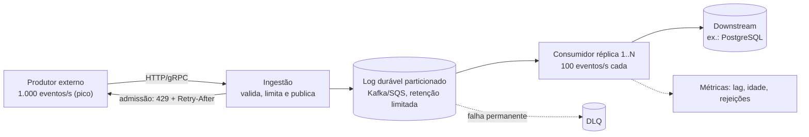

# A01 — Execução 1

**Prompt:** Desenhe em Java um serviço cujo produtor recebe 1.000 eventos/s e consumidor processa 100/s

**Agent:** `arquiteto-sistemas`
**Sessão:** independente 1
**Nota:** 1/2

**Arquivos do catálogo lidos:**
- agents/arquiteto-sistemas.md
- skills/design-system-architecture/SKILL.md
- skills/design-system-architecture/references/capacidade-slos.md
- skills/design-system-architecture/assets/adr-template.md
- skills/resiliencia-controle-fluxo-java/SKILL.md
- skills/resiliencia-controle-fluxo-java/references/backpressure-java.md
- skills/resiliencia-controle-fluxo-java/references/isolamento-degradacao-java.md
- skills/resiliencia-controle-fluxo-java/references/capacidade-e-limites.md (parcial, via saída truncada)
- docs/catalogo/convencoes.md (seção "Decisão de proteção")

## Saída bruta

# Serviço com produtor a 1.000 eventos/s e consumidor a 100/s

## 1. Conclusão antes dos detalhes

Há um **déficit sustentado de 900 eventos/s** (chegada 1.000/s contra saída 100/s, ou seja, 10x). Nenhum buffer
resolve isso: ele só adia o problema. A arquitetura precisa decidir, nesta ordem, uma ou mais destas saídas:

1. **Aumentar a capacidade de saída** até cobrir a chegada (consumidores em paralelo, ~10 a 13 vezes a vazão atual).
2. **Reduzir o trabalho por evento** (lote, deduplicação, descartar o que não precisa processar).
3. **Reduzir a chegada** (o produtor coopera, ou rejeitamos o excedente com destino explícito).
4. **Persistir o excedente de forma durável**, aceitando latência, se o pico for finito.

Não existe resposta correta sem saber se os 1.000/s são **pico com duração finita** ou **carga média**. Isso muda a
decisão (ver hipóteses).

## 2. Hipóteses rotuladas (não foram informadas; seguem com forma de validação)

| # | Hipótese | Por que importa | Como validar | Dono |
|---|---|---|---|---|
| H1 | 1.000/s é **pico de 10 min**, média diária de ~150/s | Define se basta absorver (fila durável) ou se é preciso escalar a saída | Série histórica de ingestão do produtor | Time do produtor |
| H2 | Evento de ~2 KiB típico, 64 KiB máximo | Dimensiona fila e armazenamento | Amostra de tráfego real | Time do produtor |
| H3 | Os 100/s são limite **por instância** (W ≈ 50 ms a 5 em paralelo), não limite do downstream | Se o limite for do downstream (banco/API), escalar o consumidor só move o gargalo | Teste de carga com 1, 2, 4 instâncias medindo o downstream | Time do consumidor |
| H4 | O evento é **idempotente por `eventId`** e perdê-lo tem custo de negócio (não é telemetria descartável) | Define se rejeitar/descartar é aceitável | Dono do produto | Produto |
| H5 | Ordem só importa por chave (ex.: `entidadeId`), não global | Permite particionar e paralelizar | Revisão com o domínio | Produto |
| H6 | O produtor **não coopera** com sinal de demanda (é um sistema externo que empurra) | Se coopera, backpressure resolve na origem | Contrato com o produtor | Arquiteto + produtor |

Daqui em diante assumo H1 a H6. Se H1 for falsa (1.000/s sustentado), o desenho muda: ver gatilhos de revisão.

## 3. Capacidade (números com unidade, fonte e escopo)

| Grandeza | Valor | Fonte |
|---|---|---|
| Chegada pico | 1.000 eventos/s | Dado do pedido |
| Saída atual | 100 eventos/s | Dado do pedido |
| Déficit | 900 eventos/s | 1.000 - 100 |
| Acúmulo em 1 min | 54.000 eventos, ~105 MiB de payload (2 KiB) | Cálculo sobre H2, sem overhead de objetos (medir; pode dobrar) |
| Acúmulo em 10 min (H1) | 540.000 eventos, ~1,03 GiB | Cálculo |
| Acúmulo em 1 h | 3,24 M eventos, ~6,2 GiB | Cálculo |
| Latência do último evento de um pico de 10 min se a saída ficar em 100/s | 540.000 / 100 = 5.400 s (**1,5 h**) | Cálculo |
| Concorrência necessária (Little) para 1.000/s | L = λ × W = 1.000 × 0,05 s = **50 execuções simultâneas** | H3 |
| Instâncias para 1.000/s com 30% de folga | 1.300/s / 100 = **13 instâncias** (ou 1 instância com 65 de concorrência, se o downstream suportar) | H3 |
| Fila em memória de 500 itens | Enche em 500 / 900 = **0,55 s** | Cálculo |

Leitura: uma fila em memória é inútil como solução (0,55 s de folga). O backlog tem de viver num **log/fila durável**
com retenção e limite, e a saída tem de escalar.

Conexões do downstream (soma das réplicas, incluindo autoscaling): `réplicas máximas × pool por réplica + jobs/admin`.
Com 13 réplicas × pool de 10 = 130 conexões; o teto do banco deve ser confirmado (H3). O autoscaling precisa ter
**máximo de réplicas coerente com esse orçamento**, senão o consumidor derruba o downstream.

## 4. Arquitetura proposta

Começo pelo mais simples que atende: **um único serviço Java** (monólito modular) com duas portas, ingestão e
processamento, separadas por um **log durável particionado**. Não há microsserviço adicional: só o log, que é o
requisito que justifica o componente (backlog de ~1 GiB por pico, sobrevivendo a reinício).



Decisões estruturais:

- **Ingestão rápida e barata**: só valida (tamanho máximo, schema) e publica no log. Ela suporta 1.000/s porque não
  faz o trabalho caro.
- **Log particionado por chave** (H5): permite N consumidores em paralelo preservando ordem por chave. Partições
  >= número máximo de réplicas (ex.: 24 partições para até 13 réplicas, com folga).
- **Consumidores escalam horizontalmente** até o teto do downstream; o autoscaling usa **lag/idade do backlog**, não CPU.
- **Rejeição explícita na ingestão** quando o backlog passa de um limiar (idade ou tamanho), em vez de aceitar tudo.

Ack/offset/DLQ concretos ficam com `mensageria-sqs-kafka`; topologia cloud concreta (Kafka gerenciado, VPC) com `arquiteto-cloud`.

## 5. Contrato de proteção do fluxo crítico

| Item | Decisão |
|---|---|
| Quem reduz a produção | Ingestão devolve **429 com Retry-After** ao exceder a admissão; produtor que coopera (H6 falsa) usa o sinal. Sem cooperação, o excedente vai ao log até o limite de retenção |
| Limite de admissão | Token bucket na ingestão: taxa sustentada 1.100/s (pico + 10%), burst 2.000 itens. Escopo: por instância de ingestão (somar réplicas). Motivo: proteger o log |
| Fila em memória | **Limitada**: 500 itens e 1 MiB por consumidor, só para o *prefetch* local. Nunca é o backlog |
| Backlog durável | Limite de idade 30 min (hipótese: o processamento tardio além disso não tem valor, H4) e de tamanho 20 GiB. Estourou: rejeitar (429) e alertar |
| Concorrência do consumidor | Semaphore de 50 por instância (bulkhead do downstream), `tryAcquire` com espera de 100 ms |
| Deadline por evento | 2 s por tentativa de processamento (hipótese); evento com idade acima de 30 min é descartado para a DLQ **com contagem**, nunca silenciosamente |
| Retry | Uma camada dona (o consumidor). Backoff exponencial com jitter, 3 tentativas, só erro transitório. Retry **não** segura permit nem conexão durante a espera |
| Idempotência | Chave `eventId` + escopo `entidadeId`; tabela de deduplicação com TTL maior que a retenção do log |
| Falha permanente | DLQ com replay em **taxa limitada** (ex.: 20/s), nunca em massa |
| Recuperação | Consumidores sobem em rampa; drenagem: após o pico, 1.300/s de saída contra 600/s de chegada = 700/s de folga, e 540.000 eventos drenam em ~13 min (cálculo, validar) |
| Métricas | `fila_lag_eventos`, `fila_idade_segundos` (p99), `ingestao_rejeitada_total{motivo}`, `consumo_processado_total{resultado}`, `downstream_conexoes_em_uso` |
| Prova | Ver plano de evidências (seção 9) |

## 6. Código Java (trechos relevantes)

Java 25. A ideia é mostrar as duas proteções decisivas: **admissão limitada na ingestão** e **concorrência limitada
no consumidor** com virtual threads.

### 6.1 Ingestão: admissão com rejeição explícita

```java
public final class IngestaoEventos {

    private final TokenBucket limite;          // taxa sustentada 1.100/s, burst 2.000
    private final PublicadorLog publicador;    // porta; adapter Kafka/SQS
    private final long tamanhoMaximoBytes = 64 * 1024;
    private final Metricas metricas;

    public Resultado receber(Evento evento) {
        if (evento.tamanhoBytes() > tamanhoMaximoBytes) {
            metricas.rejeitado("payload_grande");
            return Resultado.invalido();                          // 413/422, antes de alocar ou gravar
        }
        if (!limite.tentarConsumir()) {
            metricas.rejeitado("admissao");
            return Resultado.sobrecarga(Duration.ofSeconds(1));   // 429 + Retry-After
        }
        if (publicador.idadeDoBacklog().compareTo(Duration.ofMinutes(30)) > 0) {
            metricas.rejeitado("backlog_cheio");
            return Resultado.sobrecarga(Duration.ofSeconds(5));   // load shedding quando o backlog já é inútil
        }
        publicador.publicar(evento.chave(), evento);              // só devolve aceito após o log confirmar
        return Resultado.aceito();
    }
}
```

`Resultado.aceito()` só sai **depois** da confirmação do log (sem ack antes do efeito durável).

### 6.2 Consumidor: concorrência limitada por bulkhead

```java
public final class ConsumidorEventos {

    private final Semaphore bulkheadDownstream = new Semaphore(50);  // 50 = L de Little (H3); soma das réplicas <= orçamento do banco
    private final ProcessadorIdempotente processador;
    private final Duration deadlineItem = Duration.ofSeconds(2);

    public void consumirLote(List<Evento> lote) throws InterruptedException {
        try (var executor = Executors.newVirtualThreadPerTaskExecutor()) {
            for (var evento : lote) {                                  // lote vem do poll, com tamanho máximo
                if (!bulkheadDownstream.tryAcquire(100, TimeUnit.MILLISECONDS)) {
                    throw new SobrecargaInternaException();            // não confirma o offset; o poll reduz
                }
                executor.submit(() -> {
                    try {
                        processador.processarUmaVez(evento, deadlineItem);   // idempotente por eventId
                    } finally {
                        bulkheadDownstream.release();                  // libera na conclusão real do trabalho
                    }
                });
            }
        }                                                              // fecha e aguarda; só então o offset é confirmado
    }
}
```

Pontos: virtual threads tornam barata a espera, mas **quem limita o downstream é o `Semaphore`**; o commit do offset
ocorre apenas depois que todo o lote terminou; o backoff do retry ocorre fora do permit.

### 6.3 O que não fazer (reprovado nesta revisão)

```java
// Fila ilimitada: com 900/s de déficit estoura o heap em minutos
var executor = Executors.newFixedThreadPool(4);
eventos.forEach(e -> executor.submit(() -> processar(e)));
```

## 7. ADR resumida

**ADR-001: Absorver o pico num log durável e escalar o consumo por partição, com rejeição na ingestão**

- **Status:** Proposta. **Responsáveis:** time do serviço.
- **Contexto:** chegada de 1.000/s, saída de 100/s por instância (déficit de 900/s); itens de ~2 KiB (H2); pico de ~10 min (H1).
- **Decisão:** ingestão leve, log particionado, 13 consumidores no máximo, token bucket e limite de idade do backlog.
- **Alternativas:**

| Alternativa | Ganho | Custo / risco | Por que foi descartada |
|---|---|---|---|
| Fila em memória no processo | Zero componente novo | Enche em 0,55 s; perde tudo no reinício | Não cobre sequer um pico curto |
| Escalar só o consumidor, sem log | Simples | Sem amortecimento; produtor externo sofre rejeição a cada pico | Só serve se a saída >= chegada o tempo todo |
| Rejeitar tudo acima de 100/s | Simplíssimo e seguro | 90% dos eventos recusados; inaceitável se H4 for verdadeira | Perda de negócio |
| Reatividade (WebFlux) com backpressure fim a fim | Demanda propagada | Só ajuda se o produtor cooperar (H6 é falsa) e toda a cadeia for não bloqueante | Complexidade sem benefício aqui |

- **Perdas aceitas:** latência de até 30 min num pico; eventos acima do limite de idade vão à DLQ; rejeição (429) quando o backlog passa do limite.
- **Gatilhos de revisão:** (a) `fila_idade_segundos` p99 > 10 min por 3 dias; (b) chegada média (não pico) acima de 80% da capacidade escalada; (c) H1 invalidada (1.000/s sustentado) — nesse caso é preciso reduzir trabalho por evento ou subir o teto de capacidade, não só buffer.

## 8. Matriz de falhas

| Falha | Impacto | Proteção / limite | Degradação | Recuperação | Métrica | Teste |
|---|---|---|---|---|---|---|
| Pico acima de 1.100/s | Log enche | Token bucket, limite de idade | 429 + Retry-After | Produtor repete com backoff e jitter | `ingestao_rejeitada_total{motivo}` | Carga a 2.000/s por 60 s |
| Downstream lento | Consumo cai, backlog cresce | Semaphore de 50, deadline de 2 s, breaker | Para de confirmar offsets; ingestão passa a rejeitar | Rampa de consumo ao voltar | `downstream_conexoes_em_uso`, lag | Injetar latência 5x no downstream |
| Downstream cai | Idem, sem processamento | Breaker aberto por dependência | Backlog dentro da retenção | Sondas limitadas em half-open | Estado do breaker | Derrubar o downstream 5 min |
| Réplica de consumidor morre | Partições reatribuídas | Offset só após processamento | Reprocessamento (at-least-once) | Idempotência por `eventId` | Rebalanceamentos/min | Matar réplica sob carga |
| Evento venenoso | Bloqueia a partição | Classificação de erro, DLQ | Vai à DLQ após 3 tentativas | Replay a 20/s | `dlq_total` | Evento inválido no meio do lote |
| Autoscaling além do banco | Estoura conexões | Máximo de 13 réplicas, `13 × 10 = 130 <= teto` | Não escala além | Ajustar pool | Conexões do banco | Cálculo + teste de carga |
| Log indisponível | Ingestão não persiste | Não aceitar sem persistir | 503 | Retorno do broker | Erros de publicação | Derrubar o broker |

## 9. Plano de evidências (hipótese vira fato)

| Afirmação | Teste/medição | Esperado | Quem executa |
|---|---|---|---|
| H1: pico de ~10 min | Série histórica do produtor | Média < 20% do pico | Time do produtor |
| H3: 100/s por instância, escalável | Carga com 1, 2, 4, 8 instâncias | Vazão ~linear até o teto do downstream | Time do consumidor |
| Admissão rejeita o excedente | Teste unitário do token bucket (burst, taxa, fronteira) | Nunca passa de 1.100/s sustentado | `java-construtor` |
| Semaphore respeita 50 com virtual threads | Teste de concorrência máxima ativa | Máximo ativo <= 50, libera em falha | `java-construtor` |
| Idempotência | Duplicatas concorrentes | Um único efeito | `java-construtor` |
| Drenagem em ~13 min | Ensaio: pico de 10 min e retorno a 600/s | Backlog zera sem estourar conexões | Time do serviço |

Números de laboratório não viram SLO de produção; as figuras acima são orçamento de projeto até serem medidas.

## 10. Próximos passos

1. Responder H1 e H3 (as duas que mais mudam o desenho).
2. Implementação do esqueleto e das classes acima: `java-construtor`, validado por `java-revisor` em modo `auditoria`.
3. Escolha e topologia do Kafka/SQS na nuvem: `arquiteto-cloud` e `mensageria-sqs-kafka`.
4. Instrumentação e alertas por idade do backlog: `especialista-monitoramento`.
5. Experimento de sobrecarga e queda do downstream: `engenheiro-chaos`.

## Pontuação
- Itens obrigatórios:
  - ✅ Duração do pico assumida explicitamente: "H1 | 1.000/s é **pico de 10 min**" e gatilho se H1 for falsa.
  - ✅ Backlog, bytes e drenagem: "Déficit | 900 eventos/s", "540.000 eventos, ~1,03 GiB", "540.000 eventos drenam em ~13 min".
  - ✅ Fila limitada e política: "Backlog durável | Limite de idade 30 min ... e de tamanho 20 GiB. Estourou: rejeitar (429)"; persistência em log durável.
  - ✅ Aumento de capacidade para déficit sustentado: "Aumentar a capacidade de saída ... ~10 a 13 vezes" e gatilho (c) da ADR.
  - ✅ Forma de verificar: plano de evidências (seção 9) e coluna "Teste" da matriz de falhas.
- Falha bloqueadora: não
- Erro técnico: `consumirLote` submete cada evento do lote a uma virtual thread diferente, o que processa em paralelo registros da mesma partição/chave. Isso contradiz a decisão "Log particionado por chave (H5): ... preservando ordem por chave". Além disso, exceções das tarefas ficam presas no `Future` descartado, e o offset é confirmado "só então", mesmo que algum evento tenha falhado. O texto afirma que a perda de evento tem custo de negócio (H4).
- Justificativa: a decisão de capacidade é exemplar e cumpre todos os itens. A nota cai para 1 por erro técnico relevante: o código do consumidor quebra a ordem por chave declarada no próprio desenho e pode confirmar offset de evento que falhou.
