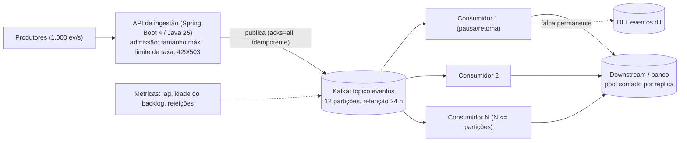

# A01 — Execução 2

**Prompt:** Desenhe em Java um serviço cujo produtor recebe 1.000 eventos/s e consumidor processa 100/s

**Agent:** `arquiteto-sistemas`
**Sessão:** independente 2
**Nota:** 1/2

**Arquivos do catálogo lidos:**
- agents/arquiteto-sistemas.md
- skills/design-system-architecture/SKILL.md
- skills/design-system-architecture/references/capacidade-slos.md
- skills/design-system-architecture/references/estimativas-rapidas.md
- skills/design-system-architecture/assets/adr-template.md
- skills/resiliencia-controle-fluxo-java/SKILL.md
- skills/resiliencia-controle-fluxo-java/references/capacidade-e-limites.md
- skills/resiliencia-controle-fluxo-java/references/backpressure-java.md
- skills/resiliencia-controle-fluxo-java/references/isolamento-degradacao-java.md
- skills/monitoramento-java/references/slo-saturacao-java.md
- docs/catalogo/convencoes.md

## Saída bruta

# Serviço de ingestão com produtor a 1.000 eventos/s e consumidor a 100 eventos/s

## 1. O ponto central: é déficit sustentado, e buffer não resolve

A chegada é 10x a capacidade de saída. O déficit é de **900 eventos/s**. Se isso for sustentado (e o pedido
não diz que é um pico finito), nenhuma fila, em memória ou não, resolve: ela só adia o problema. Só há três saídas,
e o desenho precisa escolher explicitamente:

1. **Aumentar a capacidade de saída** (mais consumidores, ou menos trabalho por evento) até >= 1.000/s.
2. **Reduzir a entrada** (parar/pausar o produtor, ou rejeitar o excedente com 429/503).
3. **Descartar/amostrar** com perda aceita e contada.

Se for um **pico finito** (por exemplo, 1.000/s por N segundos e depois cai abaixo de 100/s), um buffer durável
dimensionado pela duração do pico absorve o excesso e drena depois. Por isso a duração do pico é a pergunta que
decide o desenho (abaixo, como hipótese).

## 2. Hipóteses (rotuladas, com forma de validação)

| # | Hipótese | Como validar | Dono |
|---|---|---|---|
| H1 | O fluxo de 1.000/s é **sustentado**, não pico finito. Desenho base assume sustentado; a variante "pico" é tratada no ADR. | Medir a série de chegada (média, p99 por minuto, duração dos picos) em produção/ambiente de origem | Produto + time do produtor |
| H2 | Evento de ~2 KiB típico, 64 KiB máximo (imposto na borda) | Amostrar payloads reais | Time do produtor |
| H3 | A perda de evento **não é aceitável** (evento de negócio); duplicata é tolerável se o consumo for idempotente | Confirmar com o dono do domínio | Produto |
| H4 | O limite de 100/s é de um consumidor de 1 thread com ~10 ms por evento (W = 10 ms) e é **escalável horizontalmente** até o limite do downstream | Medir W por evento e a capacidade do downstream (conexões, quota) | Time do consumidor |
| H5 | Ordem só importa por chave de entidade (não global) | Confirmar com o domínio | Produto |
| H6 | Deadline de processamento do evento (idade máxima útil): 5 min | Confirmar com o domínio | Produto |

Quando H4 é falsa (o downstream só aguenta 100/s no total), o desenho muda: ver cenário B.

## 3. Capacidade e orçamentos

| Grandeza | Cálculo | Valor | Fonte |
|---|---|---|---|
| Chegada | dado | 1.000 eventos/s | contrato do pedido |
| Saída atual | dado | 100 eventos/s | contrato do pedido |
| Déficit | 1.000 − 100 | 900 eventos/s | derivado |
| Volume/dia | 1.000 × 86.400 | 86,4 M eventos/dia | derivado |
| Dados/dia (H2) | 86,4 M × 2 KiB | ~165 GiB/dia | hipótese |
| Banda de entrada | 1.000 × 2 KiB × 8 | ~16 Mbit/s | hipótese |
| Acúmulo sem escalar | 900 × 2 KiB | ~1,76 MiB/s, ~6,2 GiB/h | hipótese |
| Buffer em memória de 500 itens | 500 ÷ 900 | enche em **0,56 s** | derivado |
| Concorrência necessária (Little) | L = λ × W = 1.000 × 0,010 s | **10 em voo** (H4) | derivado |
| Consumidores com folga | 10 ÷ 0,7 (alvo de 70% de uso) | **~15 workers** efetivos | hipótese |
| Backlog de um pico de 60 s (sem escalar) | 900 × 60 | 54.000 eventos (~105 MiB) | derivado |
| Drenagem desse backlog se a chegada cair a 50/s | 54.000 ÷ (100 − 50) | **18 min** (acima do deadline H6 de 5 min: ou escala, ou descarta por idade) | derivado |

Conclusão numérica: um buffer de 500 itens em memória dura menos de 1 s; só um log durável com retenção
dimensionada pela duração do pico, mais capacidade de consumo escalada, sustenta o regime.

## 4. Desenho (base: log durável + consumidores escalados + admissão na borda)



Decisões de componentes (cada um com requisito que o justifica):

- **Log durável (Kafka)** entre produtor e consumidor: o requisito é "não perder evento" (H3) com déficit
  temporário. Sem isso, o excedente teria de ficar em memória (perda no restart). Alternativa mais simples
  (fila em memória) foi avaliada e descartada pelo cálculo da seção 3.
- **Consumo paralelo por partições**: 12 partições permitem até 12 consumidores ativos (limite superior do grupo);
  com ~15 workers efetivos por contagem de threads/virtual threads por consumidor, ou 10-12 réplicas, atinge-se >=
  1.000/s se H4 for verdadeira. **Chave de partição = id da entidade** (ordem por entidade, H5).
- **Admissão na borda**: o produtor "não coopera" por padrão (não sabemos se ouve 429). Então a API rejeita cedo
  quando o log ou o consumo estão saturados, em vez de aceitar e perder.
- **Monólito modular**: ingestão e consumo no mesmo código base, implantados como dois perfis (`ingestor` e
  `processador`) para escalar separado. Não há justificativa para microsserviços adicionais.

## 5. Contrato de proteção (fluxo crítico: ingestão -> processamento)

| Item | Decisão |
|---|---|
| Quem reduz a produção | Produtor cooperativo: respeita `429` com `Retry-After`. Não cooperativo: a API rejeita, o excedente fica do lado dele (H3 exige que ele reenvie) |
| Limite de admissão | Taxa: 1.100 eventos/s no agregado (10% de folga sobre o nominal), por tenant/produtor autenticado, motivo: proteger o log. Tamanho máx. do evento: 64 KiB, na borda, antes de alocar |
| Limite do backlog | Lag máximo tolerado: 5 min de idade (H6) = ~300.000 eventos a 1.000/s. Acima disso, `503` na ingestão (load shedding por idade), não crescimento infinito |
| Fila em memória | Nenhuma ilimitada. Buffer interno do consumidor: 200 itens e 4 MiB (itens e bytes), com `pause()` do consumer quando cheio |
| Concorrência do consumidor | Semaphore (bulkhead) de 10 permissões por réplica de processamento para o downstream; soma das réplicas <= orçamento de conexões do downstream |
| Retry | Uma camada dona: o consumidor. Backoff exponencial com jitter, máx. 3 tentativas, só para erro transitório, sem segurar permissão durante a espera. Esgotado: DLT |
| Idempotência | Chave `eventId` + escopo `tenant`, com registro de processado (`INSERT ... ON CONFLICT DO NOTHING`); necessário porque a entrega é at-least-once |
| Recuperação | Replay da DLT em taxa limitada (ex.: 20 ev/s); rampa de consumo após um incidente; escala por **lag/idade**, não por CPU, com teto pelo orçamento do downstream |
| Métricas | `kafka_consumer_lag`, `eventos_idade_backlog_segundos`, `ingestao_rejeitadas_total{motivo}`, `bulkhead_ativos`, `dlt_entradas_total` |
| Prova | Ensaio de carga a 1.000 ev/s por 30 min: lag estável abaixo de 5 min, rejeições contadas, zero perda, duplicata sem efeito duplo |

## 6. ADRs

### ADR-001: Desacoplar produtor e consumidor com log durável e escalar o consumo horizontalmente

- **Status:** Proposta. **Data:** 2026-10-07. **Responsáveis:** time dono do serviço.

**Contexto.** 1.000 eventos/s chegam; o consumidor processa 100/s (déficit de 900/s). Evento de negócio sem perda
(H3). Hipóteses H1-H6 pendentes. SLO proposto: 99,9% dos eventos processados em até 5 min em 30 dias
(denominador: eventos aceitos; rejeições 429/503 do próprio serviço contam como falha de disponibilidade da
ingestão).

**Decisão.** Kafka entre ingestão e processamento; 12 partições; consumo escalado até >= 1.000/s; admissão e
load shedding por idade de backlog; DLT para falha permanente. Fora do escopo: o contrato do produtor externo e a
topologia cloud do cluster (`arquiteto-cloud`).

| Alternativa | Ganho | Custo/risco | Por que foi descartada |
|---|---|---|---|
| Fila em memória no mesmo processo (mais simples) | Zero componentes novos | Enche em 0,56 s; perde tudo no restart | Viola H3 e o cálculo de capacidade |
| Uma instância, consumidor único mais rápido | Simples | Exige aumentar 10x o throughput do processamento; só se o W cair para 1 ms | Mantida como **primeira otimização** a medir (reduzir trabalho por evento) |
| Descartar/amostrar 90% | Sem custo extra | Perde 900 ev/s | Só aceitável se H3 for falsa |
| Cadeia reativa com `request(n)` até o produtor | Backpressure ponta a ponta | Só funciona se o produtor externo coopera; hoje não se sabe | Mantida para o trecho interno, se o produtor passar a cooperar |

**Consequências.** Ganho: absorve pico e falha temporária do consumidor. Perda aceita: latência de
processamento fim a fim de segundos a minutos (consistência eventual); entrega at-least-once com deduplicação.
Risco: Kafka vira dependência operacional (retenção, partições, rebalance). Custo operacional: cluster Kafka, runbook
de lag, ~165 GiB/dia de retenção a 24 h (hipótese, custo a estimar pelo `arquiteto-cloud`).

**Gatilhos de revisão.** Idade do backlog p99 > 5 min por 15 min com o teto de réplicas atingido; ou W por evento
subir acima de 15 ms; ou produtor passar a cooperar com backpressure (revisar a admissão).

### ADR-002 (condicional): se o downstream só aguenta 100/s (H4 falsa)

Se a capacidade do downstream for o teto real, escalar consumidores só move o gargalo e satura o banco. Nesse caso
a decisão passa a ser **reduzir a entrada**: agregar/deduplicar eventos antes (batch por entidade), ou aceitar
perda controlada, ou aumentar a capacidade do downstream. Não existe desenho que processe 1.000/s por um destino
de 100/s sem uma dessas três.

## 7. Matriz de falhas

| Falha | Impacto | Proteção/limite | Degradação | Recuperação | Métrica | Teste |
|---|---|---|---|---|---|---|
| Consumidor mais lento que o esperado | Lag cresce | Escala por lag, teto pelo orçamento do downstream | Ingestão devolve 503 acima de 5 min de idade | Drenagem em rampa | `eventos_idade_backlog_segundos` | Carga 1.000 ev/s por 30 min |
| Downstream lento ou fora | Consumo trava, lag cresce | Deadline + timeout de I/O, breaker, bulkhead de 10 | `pause()` do consumer; eventos ficam no log | Sondas em half-open, depois rampa | estado do breaker, `bulkhead_ativos` | Falha injetada (toxiproxy) |
| Kafka indisponível | Ingestão sem destino | Timeout do produtor; sem buffer ilimitado | 503 + `Retry-After` (sem inventar sucesso) | Produtores reenviam | `ingestao_rejeitadas_total{motivo="broker"}` | Derrubar o broker em ambiente de teste |
| Rebalance durante carga | Pausa curta de consumo | Commit só após o efeito durável | Latência sobe temporariamente | Reentrega idempotente | duração do rebalance | Escalar réplicas sob carga |
| Evento venenoso | Bloqueia a partição | Retry limitado, depois DLT | Evento isolado | Replay manual limitado | `dlt_entradas_total` | Evento inválido injetado |
| Produtor ignora 429 | Mais carga na borda | Limite por tenant, rejeição barata | Rejeição precoce | Bloqueio do tenant ruidoso | `ingestao_rejeitadas_total{tenant}` (cardinalidade controlada) | Tenant ruidoso simulado |
| Duplicata por reentrega | Efeito dobrado | Idempotência por `eventId` | Nenhuma | Nenhuma necessária | `eventos_duplicados_total` | Duplicata concorrente |

## 8. Código Java (Java 25, trechos relevantes)

Ingestão com admissão explícita (rejeita cedo, nunca enfileira sem limite):

```java
// Admissão por taxa e por idade do backlog: rejeita cedo em vez de aceitar e perder
public final class IngestaoEventos {

    private final TokenBucket taxa;                 // 1.100 ev/s agregado, burst limitado
    private final MedidorBacklog backlog;           // lê a idade do backlog (lag em tempo)
    private final PublicadorEventos publicador;     // Kafka: acks=all, idempotente
    private final Duration idadeMaxima = Duration.ofMinutes(5);
    private static final int TAMANHO_MAX_BYTES = 64 * 1024;

    public Resultado receber(Evento evento) {
        if (evento.tamanhoBytes() > TAMANHO_MAX_BYTES) {
            return Resultado.invalido("evento acima de 64 KiB");        // 413/422
        }
        if (!taxa.tentarConsumir()) {
            return Resultado.limitado(Duration.ofSeconds(1));           // 429 + Retry-After
        }
        if (backlog.idadeDoMaisAntigo().compareTo(idadeMaxima) > 0) {
            return Resultado.saturado(Duration.ofSeconds(5));           // 503 + Retry-After (load shedding)
        }
        publicador.publicar(evento.chaveEntidade(), evento);            // chave = id da entidade (ordem por entidade)
        return Resultado.aceito();
    }
}
```

Consumidor com bulkhead, `pause()/resume()` e commit apenas depois do efeito durável:

```java
public final class ProcessadorEventos implements Runnable {

    private final Consumer<String, Evento> consumer;
    private final Semaphore bulkhead = new Semaphore(10);               // concorrência máx. contra o downstream
    private final ProcessadorIdempotente processador;                   // INSERT ... ON CONFLICT DO NOTHING
    private final PoliticaRetry retry;                                  // 3 tentativas, backoff exponencial + jitter
    private final Dlt dlt;
    private static final Duration ESPERA_BULKHEAD = Duration.ofMillis(100);

    @Override
    public void run() {
        try (var executor = Executors.newVirtualThreadPerTaskExecutor()) {
            while (!Thread.currentThread().isInterrupted()) {
                var lote = consumer.poll(Duration.ofMillis(500));       // max.poll.records limitado (ex.: 50)
                var futuros = new ArrayList<Future<?>>();
                for (var registro : lote) {
                    futuros.add(executor.submit(() -> tratar(registro)));
                }
                aguardarTodos(futuros);                                 // só confirma depois do efeito durável
                consumer.commitSync();
            }
        }
    }

    private void tratar(ConsumerRecord<String, Evento> registro) {
        try {
            if (!bulkhead.tryAcquire(ESPERA_BULKHEAD.toMillis(), TimeUnit.MILLISECONDS)) {
                throw new RejectedExecutionException("bulkhead cheio"); // volta ao log, sem perder
            }
            try {
                retry.executar(() -> processador.processar(registro.value())); // idempotente por eventId
            } finally {
                bulkhead.release();                                     // libera sempre; backoff fica fora desta seção
            }
        } catch (ErroPermanente e) {
            dlt.enviar(registro, e);                                    // isola evento venenoso
        } catch (InterruptedException e) {
            Thread.currentThread().interrupt();                         // restaura o flag, não vira retry
        }
    }
}
```

Dimensionamento das pool e do consumo (comentário de configuração, números a validar por H4):

```java
// Concorrência por Little: λ=1.000 ev/s × W=0,010 s = 10 em voo; com folga de 70% => ~15
// Bulkhead 10 por réplica x 2 réplicas = 20 permissões <= orçamento de conexões do downstream (ex.: 30)
//   spring.kafka.consumer.max-poll-records=50
//   spring.kafka.consumer.enable-auto-commit=false
//   spring.datasource.hikari.maximum-pool-size=10
//   spring.datasource.hikari.connection-timeout=200   // falha visível, não espera infinita
```

## 9. Plano de evidências

| Afirmação | Teste/medição | Esperado | Responsável |
|---|---|---|---|
| Sustenta 1.000 ev/s com consumo escalado | Ensaio de carga de 30 min, 12 partições | Lag estável, idade < 5 min, 0 perda | Time do serviço |
| Admissão rejeita em vez de crescer sem limite | Teste de carga com consumidor parado | 503 após idade > 5 min, memória estável | Time do serviço |
| Idempotência | Duplicata concorrente do mesmo `eventId` | 1 efeito | Time do serviço |
| Downstream aguenta 10 em voo por réplica | Medição de W e saturação do pool | W <= 15 ms, `hikaricp_connections_pending` = 0 | Time do consumidor |
| Recuperação sem nova tempestade | Derrubar o consumidor 5 min e religar | Drenagem em rampa, sem pico de latência | `engenheiro-chaos` |

Observação: números de laboratório do ensaio não viram SLO de produção; o SLO acima é proposto e depende de H1-H6.

## 10. Próximos passos

1. Confirmar H1 (sustentado ou pico) e H4 (downstream escalável): são as duas respostas que mudam o desenho.
2. Medir W por evento e tentar primeiro reduzir o trabalho por evento (batch, menos round trips) antes de escalar.
3. Implementação em `java-construtor`, revisão por `java-revisor` (modo `auditoria`), métricas e alertas em
   `especialista-monitoramento`, topologia do cluster em `arquiteto-cloud`, ensaio de falha em `engenheiro-chaos`.

## Pontuação
- Itens obrigatórios:
  - ✅ Duração do pico assumida explicitamente: "H1 | O fluxo de 1.000/s é **sustentado**, não pico finito", com variante de pico tratada.
  - ✅ Backlog, bytes e drenagem: "Acúmulo sem escalar | ~1,76 MiB/s, ~6,2 GiB/h", "Backlog de um pico de 60 s | 54.000 eventos (~105 MiB)", "Drenagem ... 18 min".
  - ✅ Fila limitada e política: "Lag máximo tolerado: 5 min de idade ... Acima disso, `503` na ingestão", e buffer interno de "200 itens e 4 MiB".
  - ✅ Aumento de capacidade: "Aumentar a capacidade de saída ... até >= 1.000/s" e ADR-002 para downstream limitado.
  - ✅ Forma de verificar: "Ensaio de carga a 1.000 ev/s por 30 min" e plano de evidências.
- Falha bloqueadora: não
- Erro técnico: `ProcessadorEventos.run` submete cada registro do `poll` a uma virtual thread, o que processa em paralelo registros da mesma partição. Isso contradiz "Chave de partição = id da entidade (ordem por entidade, H5)". A rejeição do bulkhead lança `RejectedExecutionException` com o comentário "volta ao log, sem perder", mas a posição do consumer já avançou e o próximo `commitSync` confirma offsets posteriores, ou seja, há perda. O diagrama anuncia "pausa/retoma", que o código não usa.
- Justificativa: todos os itens obrigatórios estão presentes e quantificados. A nota cai para 1 por erro técnico relevante: o consumidor quebra a ordem por chave e afirma falsamente "sem perder" justamente no cenário de saturação que o caso trata.
