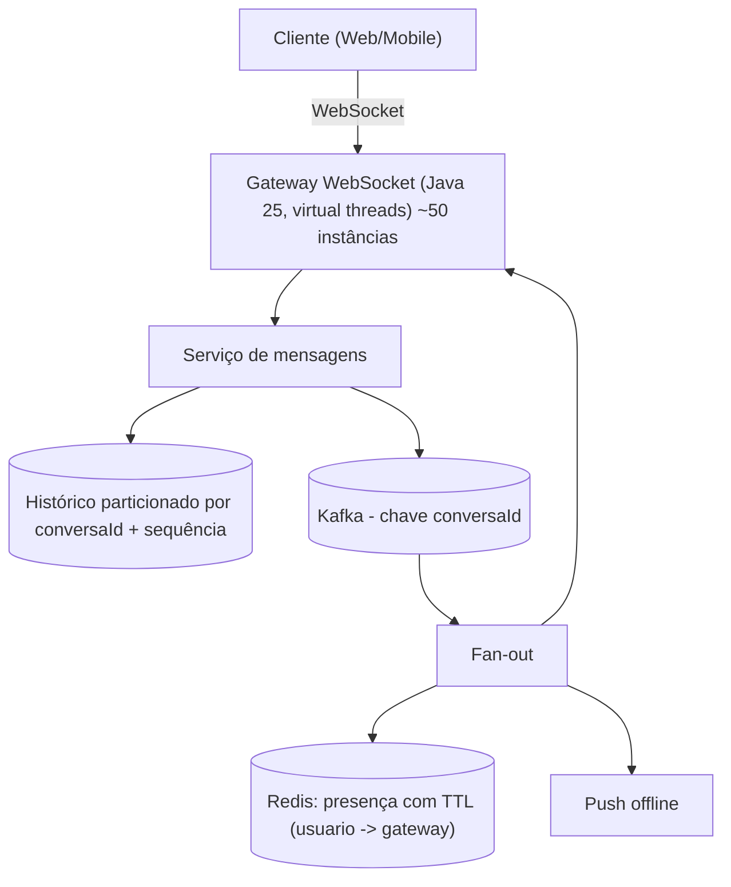

# A10 — Execução 1

**Prompt:** Explique o design de um chat em 45 minutos com exemplos

**Agent:** `arquiteto-sistemas`
**Sessão:** independente 1
**Nota:** 2/2

**Arquivos do catálogo lidos:** agents/arquiteto-sistemas.md; skills/design-system-architecture/SKILL.md; skills/design-system-architecture/references/entrevista-system-design.md; skills/design-system-architecture/references/estudos-de-caso-java.md; skills/design-system-architecture/references/protocolos-comunicacao.md; skills/design-system-architecture/references/estimativas-rapidas.md

## Saída bruta

# Design de um chat em 45 minutos

Variante `design`, formato de roteiro de entrevista. Os números são **hipóteses de exercício**: servem para mostrar o método, não são SLO de produção. Cada um deve ser trocado pelo número real do seu sistema.

## Visão geral do tempo

| Tempo | Etapa | O que produzir |
|---|---|---|
| 0-5 min | Requisitos | 3-5 RF, RNF com números, fora de escopo |
| 5-10 min | Capacidade | taxa média/pico, conexões, armazenamento |
| 10-20 min | Desenho de alto nível | componentes, fluxo principal, simples primeiro |
| 20-35 min | Aprofundamento e falhas | ordem, reconexão, cliente lento, tempestade de reconexão |
| 35-40 min | Trade-offs | escolhas, perdas aceitas, gatilhos de revisão |
| 40-45 min | Revisão | requisitos x desenho, riscos, o que medir primeiro |

## 0-5 min: Requisitos

**Funcionais (essenciais):**
1. Mensagens 1:1 e em grupo.
2. Ordem das mensagens **por conversa**.
3. Entrega em tempo real a quem está online; quem está offline recebe depois.
4. Histórico consultável.
5. Indicador de presença.

**Não funcionais (com número):**
- Entrega p99 < 500 ms para destinatário online.
- Nenhuma mensagem perdida **depois** que o remetente recebeu a confirmação (durabilidade).
- Fora de escopo, declarado em voz alta: mídia/anexos, criptografia ponta a ponta, busca textual, chamadas de voz.

**SLI/SLO de exemplo:** SLI = mensagens entregues a destinatários online em até 500 ms / mensagens enviadas a destinatários online. SLO = 99% em janela de 30 dias (hipótese a validar com o produto).

## 5-10 min: Capacidade (conta de padeiro em voz alta)

Premissas (hipóteses): 10 M usuários ativos/dia, 50 mensagens por usuário/dia.

- Volume: 10 M x 50 = 500 M msg/dia; 500 M / 86.400 ≈ **5.800 msg/s** de média. Pico assumido de ~5x: **30.000 msg/s** (declare a duração; ex.: 15 min na hora do almoço, hipótese).
- Conexões: 1 M WebSocket simultâneos. Com ~20 mil conexões por instância, são **~50 gateways** (com folga).
- Armazenamento: 500 M msg/dia x ~500 bytes ≈ 250 GB/dia antes de índices e réplicas. Isso já indica particionamento do histórico por conversa/tempo.
- Lei de Little para o gateway: L = lambda x W. Conexões abertas são o recurso escasso, não a CPU.

O que a conta muda no desenho: precisamos de uma camada dedicada a conexões longas (gateway), e o histórico não cabe num único nó sem particionamento.

## 10-20 min: Desenho de alto nível

Começo simples e justifico cada adição.

**Alternativa simples (vale para milhares de usuários):** long polling + banco relacional com sequência por conversa. Sem gateway dedicado, sem broker. Só saímos dela quando a conta de conexões e de latência mostra que não atende (gatilho: p99 de entrega > 500 ms ou custo de polling dominante).

**Desenho para a escala do exercício:**



Justificativa por componente:
- **Gateway WebSocket**: mantém as conexões longas (requisito de tempo real). Protocolo WebSocket para chat/presença/duplex contínuo.
- **Serviço de mensagens**: valida, atribui sequência, persiste.
- **Kafka particionado por `conversaId`**: ordem por partição = ordem por conversa; desacopla gravação de entrega.
- **Redis de presença com TTL**: diz em qual gateway cada usuário está; TTL evita presença "fantasma" quando um gateway morre.
- **Histórico**: banco particionado por conversa; leitura paginada por sequência.

Fluxo de envio, com o contrato:
1. Cliente envia `{clientMsgId, conversaId, texto}` pelo WebSocket.
2. Serviço de mensagens persiste, atribui `sequencia` por conversa e só então confirma (ack) ao remetente. Durabilidade antes da confirmação.
3. Publica no Kafka com chave `conversaId`.
4. Fan-out consulta presença e entrega ao(s) gateway(s) dos destinatários; offline vai para push/resync posterior.

## 20-35 min: Aprofundamento e falhas

Escolho dois pontos críticos: **ordem e reconexão** e **proteção do gateway**.

### 1. Ordem e reconexão (sequência por conversa + resync)

Não confio na ordem de chegada pela rede. Cada mensagem recebe uma sequência por conversa ao ser persistida. O cliente guarda a última sequência vista; ao reconectar, envia-a, e o servidor reenvia o intervalo faltante.

```java
// Reenvio do intervalo faltante após reconexão (resync): o servidor é a fonte da verdade da ordem.
List<MensagemChat> resync(String conversaId, long ultimaSequenciaVista, int limite) {
    // limite evita resposta ilimitada; se faltar mais, o cliente pagina
    return repositorio.buscarApos(conversaId, ultimaSequenciaVista, limite);
}
```

**Idempotência no envio:** o cliente gera `clientMsgId`. Se houver timeout e reenvio, a chave (`conversaId` + `clientMsgId`) com restrição única garante que a mensagem não duplica; o reenvio devolve a mesma sequência já atribuída.

### 2. Cliente lento e buffer de saída limitado

Um cliente com rede ruim não pode derrubar o gateway. O buffer de saída por conexão é **limitado**; ao encher, desconecta-se o cliente lento, que fará resync ao voltar.

```java
// Buffer de saída por conexão LIMITADO: cliente lento é desconectado (e fará resync), não derruba o gateway.
final class ConexaoCliente {
    private final FilaLimitada<MensagemChat> saida = new FilaLimitada<>(256);

    boolean entregar(MensagemChat mensagem) {
        if (saida.oferecer(mensagem) == FilaLimitada.Admissao.ACEITO) return true;
        fechar("cliente lento: buffer de saída cheio"); // o cliente reconecta e pede o que faltou
        return false;
    }

    void fechar(String motivo) { /* fecha o WebSocket com código de política e registra métrica */ }
}
```

Quem reduz a produção? O gateway corta o consumidor lento; o dado não se perde, porque o histórico persistido é a fonte do resync.

### Matriz de falhas (resumida)

| Falha | Impacto | Proteção / limite | Degradação | Recuperação | Métrica / teste |
|---|---|---|---|---|---|
| Gateway reinicia | milhares de clientes reconectam juntos | backoff exponencial **com jitter** no cliente + admissão de handshake (taxa máxima de novos handshakes por instância) | novas conexões esperam; online continuam | resync pela última sequência | pico de handshakes/s; teste de reconexão em massa |
| Cliente lento | memória do gateway | buffer de 256 por conexão; desconecta | só aquele cliente reconecta | resync | conexões fechadas por buffer cheio |
| Consumidor Kafka lento | atraso de entrega | pausa por partição; lag fica no broker, memória estável | entrega atrasa, mas ordem preservada | consumidor alcança o lag | lag por partição; alerta de saturação |
| Reenvio por timeout do cliente | duplicata | chave `clientMsgId` única | nenhuma | n/a | teste: duplicata não duplica |
| Redis de presença fora | não sabe onde está o usuário | tratar como "offline": cai no push/resync | sem indicador de presença, mensagens não se perdem | presença reconstrói com os heartbeats | taxa de erro do Redis |
| Pico acima da capacidade | latência explode | admissão: rejeitar rápido (rate limit por usuário) em vez de aceitar tudo | parte dos envios recebe erro explícito e o cliente repete com o mesmo `clientMsgId` | normaliza com o fim do pico | taxa de rejeição; p99 |

Pergunta de maturidade que respondo agora: a recuperação não pode gerar nova tempestade. Por isso o jitter e a admissão de handshake, não só o backoff.

## 35-40 min: Trade-offs

| Decisão | Ganho | Perda aceita | Gatilho para revisar |
|---|---|---|---|
| Ordem **por conversa**, não global | barata e suficiente; escala por partição | mensagens de conversas diferentes não têm ordem relativa | nunca precisaria, salvo requisito legal de ordem global |
| Kafka por `conversaId` | ordem + desacoplamento + replay | um broker a operar; conversa muito quente satura uma partição | lag sustentado em uma partição |
| Push em todos os grupos | latência baixa | fan-out caro em grupos grandes | grupo acima de N membros: limitar o tamanho ou tratá-lo como canal (pull) |
| Desconectar cliente lento | gateway protegido | cliente lento reconecta e faz resync | taxa de desconexões por buffer cheio acima do esperado |
| Consistência | forte na gravação (ack só após persistir), eventual na entrega | pequeno atraso na entrega | p99 de entrega acima do SLO |

Consistência declarada por operação: envio = forte (persistiu, então confirma); entrega e presença = eventual.

## 40-45 min: Revisão

**Requisitos x desenho:**
- Ordem por conversa: sequência + partição Kafka por `conversaId`.
- Nada perdido após confirmação: ack só depois de persistir.
- p99 < 500 ms online: caminho gateway -> mensagens -> Kafka -> gateway, medido ponta a ponta.
- Presença: Redis com TTL, tolerante a perda.

**Riscos em aberto:**
1. Tempestade de reconexão após queda de gateway ou deploy.
2. Grupos gigantes (fan-out amplificado).
3. Hipóteses de carga (pico 5x, 20 mil conexões/instância) ainda não medidas.

**O que mediria primeiro em produção:** conexões por gateway (saturação), p99 de entrega ponta a ponta, lag por partição, taxa de desconexão por buffer cheio e taxa de handshakes durante deploys.

**Plano de evidências (hipótese -> prova -> responsável):**
- 20 mil conexões/instância -> teste de carga de conexões -> time de plataforma.
- Reconexão em massa limitada -> teste que derruba um gateway e mede handshakes/s -> time de plataforma.
- Cliente lento não afeta os demais -> teste com cliente simulado lento -> time do gateway.
- Duplicata de envio não duplica -> teste de integração com reenvio -> time de mensagens.

## Rubrica de autoavaliação (0-2 por critério)

Requisitos com números, capacidade que mude o desenho (50 gateways, particionamento), desenho simples primeiro, consistência por operação, falhas com limites e idempotência, trade-offs com perda aceita e gatilho, e comunicação organizada com premissas confirmadas.

## Armadilhas a evitar na entrevista

- Falar de Kafka e Kubernetes antes de um único número.
- Dizer "a fila resolve" para déficit sustentado (buffer só adia o colapso).
- Retry sem jitter e sem idempotência.
- Ignorar grupos grandes e a cauda da distribuição.
- Gastar 20 minutos no desenho e não chegar às falhas.

Observação: o estudo de caso "Chat" do catálogo traz os mesmos trechos Java; os números aqui são hipóteses de exercício e não substituem medição.

## Pontuação
- Itens obrigatórios:
  - ✅ Roteiro M10: cronograma 0-5 (requisitos), 5-10 (capacidade), 10-20 (desenho), 20-35 (aprofundamento e falhas), 35-40 (trade-offs), 40-45 (revisão).
  - ✅ Ordenação por conversa: "Cada mensagem recebe uma sequência por conversa"; "Kafka particionado por `conversaId`".
  - ✅ Reconexão com resync: "ao reconectar, envia-a, e o servidor reenvia o intervalo faltante" (`resync(..., limite)`).
  - ✅ Backpressure por conexão: "buffer de saída por conexão é **limitado** ... `FilaLimitada<>(256)`"; desconecta o cliente lento.
  - ✅ Trechos em Java: `resync` e `ConexaoCliente`.
  - ✅ Capacidade e falhas: "5.800 msg/s", "~50 gateways", "250 GB/dia" e matriz de falhas.
  - ✅ Forma de verificar: plano de evidências (hipótese → prova → responsável).
- Falha bloqueadora: não
- Justificativa: atende todos os itens com números e provas. Observação sem impacto na nota: o fluxo "persiste e então publica no Kafka" é escrita dupla sem outbox. Se a publicação falhar, a entrega em tempo real se perde até o próximo resync.
