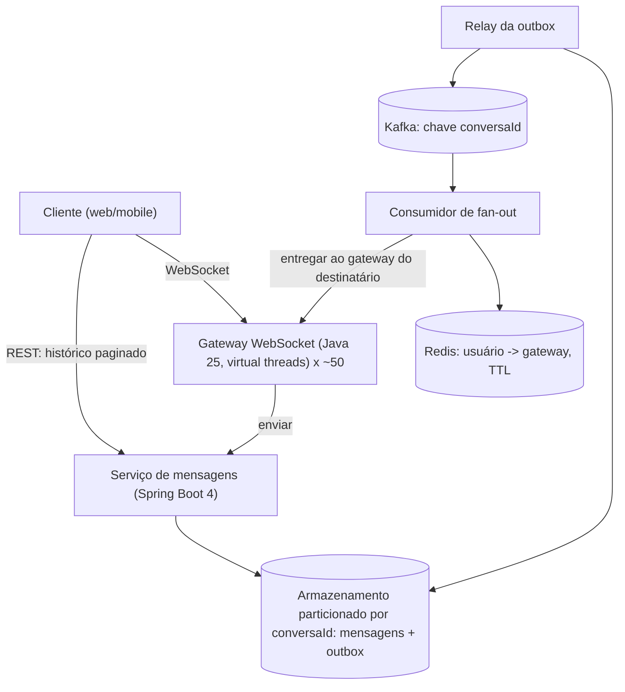

# A10 — Execução 2

**Prompt:** Explique o design de um chat em 45 minutos com exemplos

**Agent:** `arquiteto-sistemas`
**Sessão:** independente 2
**Nota:** 2/2

**Arquivos do catálogo lidos:**
- agents/arquiteto-sistemas.md
- skills/design-system-architecture/SKILL.md
- skills/design-system-architecture/references/entrevista-system-design.md
- skills/design-system-architecture/references/estudos-de-caso-java.md
- skills/design-system-architecture/references/estimativas-rapidas.md
- skills/design-system-architecture/references/protocolos-comunicacao.md
- skills/design-system-architecture/references/consistencia-distribuida.md
- skills/design-system-architecture/references/capacidade-slos.md

## Saída bruta

# Design de um chat em 45 minutos (roteiro com exemplos)

Variante `design`. Os números abaixo são **hipóteses de exercício**: mostram o método e devem ser trocados
pelos do seu sistema. Números de laboratório não viram SLO de produção.

## Cronograma

| Tempo | Etapa | Entregável |
|---|---|---|
| 0–5 min | Requisitos | RF essenciais, RNF com número, fora de escopo |
| 5–10 min | Capacidade | Conta de padeiro que muda o desenho |
| 10–20 min | Alto nível | Componentes e fluxo, começando simples |
| 20–35 min | Aprofundamento e falhas | Ordem, reconexão, cliente lento, tempestade de reconexão |
| 35–40 min | Trade-offs | Perda aceita e gatilho de revisão |
| 40–45 min | Revisão | Requisitos x desenho, riscos, o que medir primeiro |

## 0–5 min: requisitos

**Funcionais (essenciais):** mensagens 1:1 e em grupo; entrega em tempo real a quem está online; histórico
paginado; presença (online/offline).

**Fora de escopo (declarado):** mídia/anexos, chamadas de voz, criptografia ponta a ponta, busca textual.

**Não funcionais, com número e escopo:**

| Operação | SLI (numerador / denominador) | SLO (hipótese) |
|---|---|---|
| Entrega a destinatário online | mensagens entregues em < 500 ms / mensagens enviadas a destinatários online | p99 < 500 ms, 99,9% em 30 dias |
| Durabilidade | mensagens confirmadas ao remetente e recuperáveis / mensagens confirmadas | 100% (nenhuma perda após o ack) |
| Ordem | pares de mensagens da mesma conversa entregues fora de ordem / pares | 0, **por conversa** (não global) |
| Histórico | leituras de histórico com 2xx e < 200 ms / leituras válidas | p99 < 200 ms |

Consistência **por operação**: enviar mensagem exige gravação durável e ordem por conversa antes do ack; presença
tolera segundos de atraso; histórico tolera réplica levemente atrasada, mas o remetente lê a própria escrita.

## 5–10 min: capacidade (conta em voz alta)

| Grandeza | Conta | Resultado |
|---|---|---|
| Mensagens/dia | 10 M usuários ativos x 50 | 500 M/dia |
| Taxa média | 500 M / 86.400 | ~5.800 msg/s |
| Pico (hipótese: fator ~5, duração 15 min a validar) | 5.800 x 5 | ~30.000 msg/s |
| Armazenamento | 500 M x 1 KiB (payload + metadados) | ~475 GiB/dia, ~170 TiB/ano antes de índices e réplicas |
| Conexões simultâneas | 10% dos ativos online ao mesmo tempo | ~1 M WebSockets |
| Instâncias de gateway | 1 M / ~20 mil por instância | ~50 (com folga, ~60) |
| Banda de saída no pico | 30.000 x 1 KiB x 8 x fan-out médio 3 | ~0,7 Gbit/s |

O que a conta **muda no desenho**:

1. 170 TiB/ano não cabe em um nó: o armazenamento de mensagens precisa de particionamento (chave `conversaId`).
2. 1 M conexões longas exigem uma camada de gateway separada, com estado de conexão.
3. Memória de saída: 20 mil conexões x fila de 256 mensagens x 1 KiB = ~5 GiB no pior caso por instância.
   Por isso o buffer por conexão é limitado **em itens e em bytes**.

## 10–20 min: alto nível

**Alternativa simples primeiro:** long polling + um PostgreSQL com sequência por conversa atende milhares de
usuários sem gateway dedicado nem broker. Cada componente abaixo existe por causa de um número acima.



Fluxo principal (envio):

1. Cliente envia `{clientMsgId, conversaId, texto}` pelo WebSocket.
2. O serviço de mensagens, **numa única transação**, grava a mensagem com `seq` da conversa e uma linha na
   outbox. Só então responde `ACK(seq)` ao remetente.
3. O relay publica no Kafka com chave `conversaId` (a ordem por partição garante a ordem por conversa).
4. O consumidor de fan-out consulta a presença (Redis, com TTL) e entrega ao gateway onde cada destinatário
   está conectado. Offline: nada a fazer, ele busca pelo histórico ao reconectar.

Protocolos por salto: WebSocket cliente-gateway (duplex contínuo; exige buffer por conexão, sequência, resync e
heartbeat); gateway-serviço HTTP/gRPC com deadline; eventos via Kafka (at-least-once, ordem por chave,
consumidor idempotente).

## 20–35 min: aprofundamento e falhas

### 1) Ordem e reconexão: sequência por conversa, não confiança na rede

Cada mensagem recebe `seq` crescente por conversa ao ser persistida. Na reconexão o cliente informa a última
`seq` vista e o servidor reenvia o intervalo faltante (resync).

```java
// Resync na reconexão: o cliente diz até onde viu; o servidor devolve o que falta, em ordem e paginado.
record PedidoResync(String conversaId, long ultimaSeqVista) {}

List<MensagemChat> reenviar(PedidoResync pedido, int limite) {
    // consulta indexada por (conversaId, seq): barata e determinística
    return repositorio.buscarApos(pedido.conversaId(), pedido.ultimaSeqVista(), limite);
}
```

### 2) Idempotência no envio

O cliente gera `clientMsgId`. Se o ack se perdeu e o cliente reenvia, a restrição única
`(conversaId, clientMsgId)` devolve a **mesma** `seq` em vez de gravar duas vezes. Perguntas de maturidade:
"essa operação pode repetir? qual o efeito de duas execuções?" Resposta: nenhum efeito extra.

### 3) Cliente lento: buffer de saída limitado por conexão

```java
// Fila de saída LIMITADA: cliente lento é desconectado (e fará resync), não derruba o gateway.
final class ConexaoCliente {
    private final FilaLimitada<MensagemChat> saida = new FilaLimitada<>(256);

    boolean entregar(MensagemChat mensagem) {
        if (saida.oferecer(mensagem) == FilaLimitada.Admissao.ACEITO) return true;
        fechar("cliente lento: buffer de saída cheio"); // o cliente reconecta e pede o que faltou
        return false;
    }

    void fechar(String motivo) { /* fecha o WebSocket com código de política e registra métrica */ }
}
```

Fila ilimitada aqui seria um OOM esperando acontecer: 20 mil conexões x memória sem teto.

### 4) Tempestade de reconexão

Um gateway reinicia e ~20 mil clientes reconectam juntos; se o gateway tem 50 instâncias, o resto absorve, mas o
handshake (TLS + autenticação + resync) é caro. Proteções: backoff exponencial **com jitter** no cliente,
admissão limitada de handshakes por segundo no gateway (rejeita com código que manda o cliente esperar) e
resync paginado.

### Contrato de proteção do fluxo crítico (entrega a online)

| Item | Decisão |
|---|---|
| Quem reduz a produção | Remetente só envia o próximo lote após `ACK`; janela de envios sem ack limitada por conexão (ex.: 32) |
| Limites (unidade, escopo, motivo) | Saída: 256 mensagens **e** 256 KiB por conexão (memória); handshakes: N/s por instância (CPU/TLS); mensagens: quota por usuário (ex.: 20 msg/s, anti-abuso); tamanho de grupo máximo (ex.: 1.000) |
| Excedente | Cliente lento: desconecta e faz resync. Quota estourada: rejeita a mensagem com erro explícito. Handshake excedente: rejeita com tempo de espera |
| Retry e idempotência | Dono do retry: o cliente (backoff + jitter) com `clientMsgId`; servidor deduplica; consumidor Kafka deduplica por `(conversaId, seq)` |
| Recuperação | Resync por `seq`; fan-out atrasado é reprocessado do offset; sem nova tempestade por causa do jitter e da admissão |
| Métricas | Conexões por gateway, tamanho do buffer de saída, desconexões por "cliente lento", lag do consumidor de fan-out, handshakes rejeitados, latência de entrega p99 (SLI) |
| Prova | Teste de reconexão em massa; cliente lento não afeta os demais; reenvio duplicado não duplica; derrubar um gateway e medir a recuperação |

### Matriz de falhas

| Falha | Impacto | Proteção/limite | Degradação | Recuperação | Métrica | Teste |
|---|---|---|---|---|---|---|
| Gateway reinicia | ~20 mil desconectados | Backoff+jitter, admissão de handshake | Entrega atrasa, nada se perde | Resync por `seq` | Reconexões/s, handshakes rejeitados | Matar instância sob carga |
| Consumidor de fan-out lento | Entrega online atrasa | Pausa por partição; lag alertado; workers escalam com teto do downstream | Online recebe tarde; offline não sente | Drena o lag | Lag por partição | Pausar consumidor e observar memória estável |
| Redis (presença) fora | Não se sabe onde o usuário está | Fallback: tratar como offline + notificação push | Sem push em tempo real; histórico íntegro | Presença reconstrói pelos heartbeats | Erros de presença | Derrubar Redis |
| Broker fora | Mensagens não chegam ao fan-out | Outbox retém (já gravado e com ack) | Entrega atrasada | Relay drena ao voltar | Lag da outbox | Parar o relay por 10 min |
| Partição quente (conversa/grupo gigante) | Uma partição satura | Limite de tamanho de grupo; grupos gigantes viram canal (pull) | Grupo grande recebe por pull | Rebalancear/re-particionar | Msgs/s por partição | Carga com cauda longa |
| Banco de mensagens lento | Ack demora | Deadline no envio; admissão limitada | Rejeita envio rápido em vez de degradar todos | Pool/limites; escalar partições | p99 de gravação, rejeições | Teste de carga com banco limitado |

Orçamento de conexões: o pool de conexões do banco é somado entre réplicas do serviço de mensagens e autoscaling
(ex.: 10 réplicas x 20 = 200 deve caber no orçamento do banco, que não é o `max_connections` bruto). Virtual
threads tornam barato esperar, não criam conexões.

## 35–40 min: trade-offs e ADRs

**ADR-1: ordem por conversa, não global.**
- Decisão: sequência e partição Kafka por `conversaId`.
- Alternativa simples: ordem global (um único sequenciador). Rejeitada: é gargalo e desnecessária, ninguém
  percebe a ordem entre conversas diferentes.
- Perda aceita: mensagens de conversas distintas não têm ordem relativa.
- Custo: partição quente se uma conversa for gigante.
- Gatilho de revisão: partição acima de X msg/s sustentado (a medir).

**ADR-2: fan-out por push para grupos pequenos, pull para grupos grandes.**
- Alternativa simples: push para todos. Rejeitada: grupo de 100 mil membros amplifica 1 envio em 100 mil entregas.
- Perda aceita: em canais grandes, a entrega não é imediata (o cliente busca).
- Gatilho: tamanho de grupo > limite definido (ex.: 1.000) ou lag de fan-out acima do SLO.

**ADR-3: monólito modular para o serviço de mensagens, gateway separado.**
- O gateway é separado porque tem perfil de recurso distinto (conexões longas, memória por conexão, escala por
  nº de conexões); o resto (mensagens, histórico, grupos) começa como um monólito modular.
- Gatilho para extrair: times ou escala distintos medidos.

Resumo da perda aceita: ordem global, entrega imediata em grupos gigantes e presença estritamente atual.

## 40–45 min: revisão

- Requisitos x desenho: durabilidade (ack só após commit + outbox), ordem por conversa (`seq` + partição),
  latência (caminho curto para online), reconexão (resync).
- Riscos em aberto: tempestade de reconexão em escala real; grupos gigantes; duração real do pico (hipótese);
  custo de armazenamento de 170 TiB/ano e política de retenção/arquivamento.
- Hipóteses pendentes com dono e prova:

| Hipótese | Prova | Responsável |
|---|---|---|
| ~20 mil conexões por instância | Teste de carga de conexões (memória, GC, CPU) | Time de plataforma |
| Fator de pico 5x por 15 min | Dados de produção ou de produto parecido | Produto + dados |
| Fan-out médio 3 | Distribuição real de tamanho de grupo (cauda longa) | Dados |
| p99 < 500 ms ponta a ponta | Ensaio com Kafka, Redis e gateway reais | Time de backend |

- O que medir primeiro em produção: latência de entrega p99 (SLI), lag do fan-out, tamanho do buffer de saída
  e taxa de desconexão por cliente lento.

## Armadilhas que o roteiro evita

- Começar por microsserviços, Kafka e Kubernetes sem um número de carga.
- "Fila resolve": buffer não resolve déficit sustentado; é preciso pausar o produtor, rejeitar ou persistir.
- Fila de saída ilimitada por conexão; retry sem limite, sem jitter e sem idempotência.
- Média no lugar de percentil; ignorar a cauda (grupos gigantes/hot keys).
- Gastar 20 minutos no desenho e não chegar às falhas.

## Autoavaliação pela rubrica (0–2)

Requisitos 2 (números e escopo), capacidade 2 (a conta muda o desenho: partição, gateway, buffer), desenho 2
(simples primeiro, cada componente ligado a um número), dados e consistência 2 (por operação, `seq` e outbox),
falhas e proteções 2 (limites com unidade, idempotência, recuperação), trade-offs 2 (perda aceita e gatilho),
comunicação 2 (cronograma e premissas declaradas).

Próximos passos naturais: `projetista-api` para o contrato do histórico (paginação por cursor de `seq`),
`especialista-monitoramento` para os alertas de saturação, `engenheiro-chaos` para o game day de
reconexão em massa e `java-construtor` para implementar o desenho.

## Pontuação
- Itens obrigatórios:
  - ✅ Roteiro M10: cronograma completo, de requisitos a revisão.
  - ✅ Ordenação por conversa: "Ordem | ... | 0, **por conversa** (não global)"; `seq` + partição por `conversaId`.
  - ✅ Reconexão com resync: "Na reconexão o cliente informa a última `seq` vista e o servidor reenvia o intervalo faltante".
  - ✅ Backpressure por conexão: "Saída: 256 mensagens **e** 256 KiB por conexão"; janela de 32 envios sem ack; admissão de handshake.
  - ✅ Trechos em Java: `PedidoResync`/`reenviar` e `ConexaoCliente`.
  - ✅ Capacidade e falhas: tabela de capacidade, "o que a conta muda no desenho", matriz de falhas e outbox.
  - ✅ Forma de verificar: hipóteses com prova e responsável; coluna "Teste" da matriz.
- Falha bloqueadora: não
- Justificativa: resposta completa e quantificada, com limites por conexão em itens e bytes e outbox para a escrita dupla.
