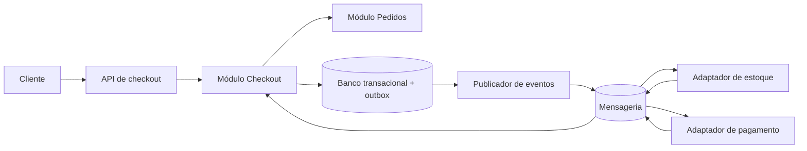

# EXJ eval 3 — execução A

Executor independente: `eval_exj_release_3a`. Avaliador: agente principal. Nota: **2/2**.

## Saída bruta

Skill: `design-system-architecture` + agent: `arquiteto-sistemas`. No Codex, aplica-se a skill; o agent só pode ser acionado se estiver instalado no cliente. O encaminhamento corresponde ao pedido de desenho de sistema e registro de decisão arquitetural.

**Premissas:** catálogo, estoque e pagamentos são sistemas externos ao checkout. O checkout precisa resistir a respostas tardias e chamadas repetidas. Volume, metas de latência e estrutura das equipes ainda não foram informados.

O checkout mantém uma máquina de estados persistida: `INICIADO → RESERVANDO_ESTOQUE → AGUARDANDO_PAGAMENTO → CONFIRMADO`. Falha de reserva leva a `CANCELADO`; falha definitiva de pagamento aciona a liberação da reserva antes de `CANCELADO`. Cada pedido recebe uma chave de idempotência. Mensagens são processadas de forma idempotente, com tentativas limitadas e tratamento de falhas persistentes. A gravação da mudança de estado e do evento na outbox ocorre na mesma transação local. Consultas ao checkout expõem o estado atual enquanto as etapas externas estão pendentes.

## ADR 001 — Estrutura do checkout

**Status:** Proposto.

**Contexto:** O fluxo depende de estoque e pagamento, que podem falhar ou responder em momentos diferentes. É necessário preservar o estado do pedido sem depender de uma transação distribuída. Ainda não há evidência de que partes do checkout precisem de deploy ou escala independentes.

**Decisão:** Implementar o núcleo de checkout como **monolito modular**, com limites explícitos entre Checkout, Pedidos e os adaptadores de integração. Usar eventos assíncronos e outbox para coordenar as etapas externas. Cada módulo possui interfaces definidas; o acesso direto às tabelas de outro módulo fica fora desses contratos.

**Alternativa considerada:** Microsserviços separados para Checkout e Pedidos. Eles permitiriam deploy e escala independentes, mas acrescentariam comunicação remota e operação distribuída entre componentes que, pelas premissas atuais, podem compartilhar a mesma transação local.

**Consequências:** O monolito simplifica a consistência do estado interno e a operação inicial. As integrações continuam sujeitas a consistência eventual, duplicação de mensagens e compensações; esses casos precisam estar explícitos no fluxo. A separação modular permite extrair um serviço posteriormente, caso métricas de carga, necessidade de deploy independente ou limites de equipe justifiquem essa mudança.

**Critérios para reavaliar:** medir volume e latência por etapa, frequência de falhas e compensações, necessidade real de escala isolada e ritmo de alterações de cada módulo. Essas medidas e as metas de negócio devem ser definidas antes de tornar o ADR aceito.

## Justificativa

Seleciona o par correto, declara premissas, distingue arquitetura distribuída da arquitetura interna e registra trade-offs e critérios de revisão no ADR.
