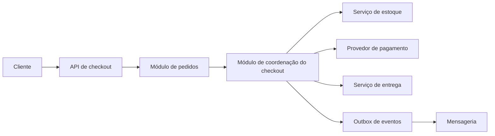

# EXJ eval 3 — execução B

Executor independente: `eval_exj_release_3b`. Avaliador: agente principal. Nota: **2/2**.

## Saída bruta

Skill: `design-system-architecture` + agent: `arquiteto-sistemas`. No Codex, aplica-se a skill; o agent só pode ser acionado se estiver instalado no cliente.

**Decisão:** começar com um **monolito modular para o checkout**, integrado aos serviços de estoque, pagamento e entrega. O checkout é distribuído porque atravessa esses sistemas, mas ainda não há dados sobre escala ou autonomia das equipes que justifiquem dividir sua coordenação em microsserviços.

Cada módulo tem interfaces e dados sob sua responsabilidade. A coordenação persiste o estado do checkout e avança por etapas: criar pedido, reservar estoque, autorizar pagamento e solicitar entrega. Chamadas externas usam chaves de idempotência; resultados e eventos são registrados de forma durável. Se uma etapa falhar, a coordenação executa a compensação cabível, como liberar a reserva ou cancelar a autorização. Falhas e compensações esgotadas ficam visíveis para intervenção operacional.

### ADR 001 — Organização do checkout distribuído

- **Status:** proposto.
- **Contexto:** o checkout depende de sistemas com falhas e tempos de resposta independentes. É preciso evitar pedidos perdidos, cobranças duplicadas e estados sem recuperação.
- **Decisão:** manter pedidos e coordenação do checkout em um monolito modular, com limites internos explícitos. Integrar os sistemas externos por adaptadores, persistir o progresso do fluxo e publicar eventos por outbox.
- **Alternativa considerada:** microsserviços separados para pedidos e coordenação. Essa divisão permitiria implantação e escala independentes, mas acrescentaria comunicação, operação e tratamento de consistência distribuída entre componentes que, por enquanto, formam um único fluxo de negócio.
- **Consequências:** uma implantação concentra a evolução inicial e simplifica mudanças no fluxo. Os limites entre módulos precisam ser preservados; integrações externas continuam exigindo idempotência, observabilidade, repetição controlada e compensações.
- **Revisão da decisão:** reconsiderar a separação quando houver necessidade comprovada de escala ou implantação independentes, equipes com responsabilidade estável por cada domínio, ou acoplamento entre módulos impedindo sua evolução.

O encaminhamento corresponde ao pedido de arquitetura e ADR. Antes de fechar a decisão para produção, faltam volumes esperados, metas de disponibilidade, limites de tempo, regras de captura e estorno de pagamento e contratos dos sistemas integrados.

## Justificativa

Seleciona o par correto, informa a limitação do agent, mantém as fronteiras e trade-offs claros e registra condições ainda necessárias para aprovação do ADR.
