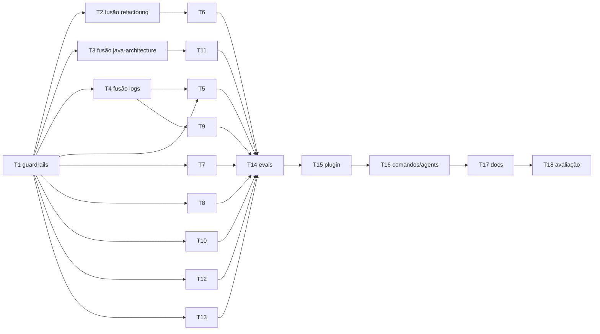

# Evolução do catálogo — references, fusões, padrão Anthropic e entorno — Plano de implementação

> **For agentic workers:** REQUIRED SUB-SKILL: Use superpowers:subagent-driven-development (recommended) or superpowers:executing-plans to implement this plan task-by-task. Steps use checkbox (`- [ ]`) syntax for tracking.

**Goal:** Deixar cada skill da trilha Java no formato de skill da Anthropic (SKILL.md enxuto + `references/` + `assets/` + `evals/`), fundir as skills redundantes e transformar o repositório num plugin instalável com comandos de fluxo que usam as skills como núcleo.

**Architecture:** Primeiro entram as regras do padrão Anthropic como testes em `validation/java` (com lista de pendências que só pode encolher). Depois vêm as três fusões, o fatiamento de cada skill em `references/` (conteúdo movido, não reescrito, e enriquecido com exemplos que apontam para `examples/java`), os `assets/` e `evals/`, e por fim o entorno: manifesto de plugin, comandos finos que delegam a agents/skills, ajuste dos agents, README e CLAUDE.md do repositório.

**Tech Stack:** Markdown + YAML frontmatter; validação em Java 25 / JUnit 5 / SnakeYAML (`validation/java`); exemplos Maven em `examples/java`; manifesto de plugin do Claude Code (`.claude-plugin/`).

**Spec:** pedido do usuário em 2026-10-07 (4 pontos: references por skill, fusões, padrão de skill da Anthropic, entorno do repo). Referência de estrutura: `skill-creator` oficial da Anthropic (`~/.claude/plugins/marketplaces/claude-plugins-official/plugins/skill-creator/skills/skill-creator/SKILL.md`, seção "Anatomy of a Skill"). Convenções locais: [convencoes.md](../../catalogo/convencoes.md).

## Global Constraints

- Explicações, comentários de código e textos em **português**; termos técnicos consagrados em inglês.
- Exemplos de programação da trilha em **Java 25** (sem preview) / Spring Boot 4; trechos parciais apontam para a fonte executável em `examples/java`.
- Ferramentas auxiliares (`graphify`, `openspec-*`, `python-pro`, `remover-imports-nao-usados`, `terraform-engineer`) **não são reescritas** — só recebem ajustes estruturais mínimos (TOC, links). Lista em `Catalogo.AUXILIARES`.
- Anatomia-alvo (Anthropic): `SKILL.md` obrigatório (frontmatter `name` + `description`); recursos opcionais `references/` (lidos sob demanda), `assets/` (arquivos usados na saída: templates, YAML, SQL), `scripts/` (só para operação determinística repetitiva).
- `SKILL.md` com **≤ 500 linhas**; reference com **> 300 linhas** abre com `## Sumário`; `references/` tem **um nível** (sem subpastas) e todo arquivo nele é **linkado a partir do SKILL.md** com "quando ler".
- `name`: `^[a-z0-9-]{1,64}$`, igual ao nome da pasta. `description`: ≤ 1024 caracteres, sem `<`/`>`, diz **o quê + quando** e termina com "Uso: …" (convenção existente).
- Conteúdo movido para `references/` é **movido, não reescrito**: nenhuma regra some no fatiamento (ver Review Focus 1).
- Uma fonte de verdade por tema (resiliência, mensageria, testes…): references apontam, não copiam.
- `mvn -f validation/java/pom.xml verify` verde ao fim de **cada** task. Compilação não é teste; teste pulado é pendência.
- Commits pequenos, mensagem em português no padrão `tipo(escopo): resumo` + linha `Co-Authored-By: Claude Opus 5.5 <noreply@anthropic.com>`.

## Review Focus

1. **Regra perdida no fatiamento** — ao mover seções do SKILL.md para `references/`, uma linha de regra (ex.: "sem DLQ = Crítico") some. Esperado: toda linha não vazia do SKILL.md antigo existe no novo SKILL.md ou em algum arquivo de `references/`. Cada task de fatiamento roda o script de preservação (seção "Ferramenta compartilhada").
2. **Link de agent/README/matriz apontando para skill fundida** — após remover `refactoring-remove-parameter`, `java-architecture` e `padrao-de-logs-java`, qualquer `skills:`/`related-skills`/link para elas quebra a instalação. Esperado: `CatalogoEstruturaTest` e `ReferenciasCatalogoTest` falham com o nome exato; testes já cobrem, e a Task 2/3 roda o grep de resíduos.
3. **Skill disparando no momento errado** — description reescrita perde o gatilho ("revise esse diff" deixa de chamar `revisao-de-codigo-java`). Esperado: `evals/evals.json` de cada skill tem ao menos um prompt que deve disparar e um que não deve; Task 15 roda os casos A01–A12 contra baseline.
4. **Reference órfã** — arquivo novo em `references/` que nenhum SKILL.md cita nunca será lido. Esperado: `PadraoAnthropicTest.referencesDevemSerLinkadasPeloSkill` falha nomeando o arquivo.
5. **Comando que cita agent/skill inexistente** — novo `/java:revisar` aponta para nome errado e falha só em uso. Esperado: `ComandosCatalogoTest` valida todo nome entre crases que case com skill/agent conhecido.

---

## Diagnóstico (base do plano)

### Estado atual (34 skills, 11 agents, 5 comandos)

| Situação | Skills |
|---|---|
| **> 500 linhas** (viola Anthropic) | `revisao-de-codigo-java` (532), `graphify` (750, auxiliar — preservar) |
| **Sem `references/` e > 250 linhas** (tudo no corpo, carregado sempre) | `api-rest-design` (348), `arquitetura-limpa-java` (445), `banco-de-dados-performance` (330), `devops-cicd` (354), `java-architecture` (266), `padrao-de-logs-java` (283), `persistencia-jpa` (370), `seguranca-aplicacao-java` (372), `spring-data-redis` (347, 1 ref) , `java-moderno` (313, 1 ref), `monitoramento-java` (306, 1 ref), `qualidade-codigo-java` (397, carregada **proativamente**), `refinamento-de-historias` (344, 1 ref) |
| **References rasas** (< 60 linhas, quase sem exemplo) | `resiliencia-controle-fluxo-java` (4 refs de 26–57 linhas), `testes-sistemas-java` (SKILL.md de 32 linhas + 3 refs rasas), `design-system-architecture` (vários refs de ~30 linhas) |
| **References > 300 linhas sem sumário** | `cloud-architect/references/{aws,azure,gcp,cost,multi-cloud}.md` (394–633), `qualidade-codigo-java/references/refatoracoes-java.md` (608), `revisao-de-codigo-java/references/exemplos-revisao-java.md` (343) |
| **Template de saída dentro de `references/`** (deveria ser `assets/`) | `design-system-architecture/references/adr-template.md`; formatos de saída inline em `refinamento-de-historias`, `revisao-de-codigo-java`, `chaos-engineer`, `cloud-architect` |
| **Sem `evals/`** | todas (as avaliações A01–A12 vivem só em `docs/catalogo/avaliacoes-agents.md`) |

### Fusões (ponto 2)

| Decisão | De → Para | Motivo |
|---|---|---|
| **Fundir** | `refactoring-remove-parameter` → `qualidade-codigo-java/references/refatoracoes-fowler.md` | `refatoracoes-java.md:458` já tem `## Remove Parameter`; skill inteira é um item de catálogo. |
| **Fundir** | `java-architecture` → `arquitetura-limpa-java` (camadas clássicas e módulos Spring viram references) + `testes-sistemas-java` (seção de testes slice/Testcontainers) | Duas skills disputam "arquitetura interna de app Java"; ambas se citam no "quando NÃO usar". Uma skill com variante hexagonal (padrão) × clássica é mais coesa. |
| **Fundir** | `padrao-de-logs-java` → `monitoramento-java/references/logs-*.md` | Logs são um dos três pilares que `monitoramento-java` já declara; hoje a skill de monitoramento manda ler a de logs (`monitoramento-java:25,48`). |
| Manter separadas | `persistencia-jpa` × `banco-de-dados-performance` | Camadas diferentes (ORM × SGBD). Só deduplicar "orçamento de conexões" (fonte: banco). |
| Manter separadas | `revisao-de-codigo-java` × `qualidade-codigo-java` | "O que revisar" × "como corrigir". Deduplicar: checklist vira item curto + link para a reference de qualidade. |
| Manter separadas | `design-system-architecture` × `cloud-architect`, `openspec-*` (geradas pelo CLI), `remover-imports-nao-usados` (multi-linguagem) | Fronteiras claras ou conteúdo gerado/auxiliar. |

Resultado: **34 → 31 skills**, sem perda de conteúdo. Nomes removidos ganham tabela de migração no README.

### Entorno (ponto 4)

- A raiz já tem `skills/`, `agents/`, `commands/` — o layout de plugin do Claude Code. Falta só `.claude-plugin/plugin.json` + `marketplace.json` para trocar "copie para `~/.claude/skills`" por instalação versionada.
- Só há comandos `/opsx:*`. Faltam portas de entrada para os fluxos que o README descreve (criar app, revisar, refatorar, feature ponta a ponta, ADR, validar catálogo).
- Agent `cloud-architect` tem o mesmo nome da skill `cloud-architect` (ambíguo na invocação); os demais agents têm nome pt-BR de papel.
- Agents listam skills, mas não dizem **qual reference** ler por assunto — com o fatiamento isso vira o ganho real de contexto.
- Repo não tem `CLAUDE.md` próprio para quem mantém o catálogo.

---

## Estrutura-alvo de arquivos

```text
.claude-plugin/
  plugin.json                       # manifesto do plugin (nome, versão, descrição)
  marketplace.json                  # permite /plugin marketplace add <repo>
CLAUDE.md                           # regras para manter o catálogo (aponta convencoes.md)
commands/
  opsx/*.md                         # existentes
  java/{nova-app,feature,revisar,refatorar}.md
  arq/adr.md
  catalogo/{validar,avaliar}.md
skills/<nome>/
  SKILL.md                          # ≤ 500 linhas: quando usar/não usar, entradas, decisão, passo a passo,
                                    # saída, validação, "Guia de references" (arquivo → quando ler), quem aplica o quê
  references/<tema>.md              # um nível; > 300 linhas abre com "## Sumário"
  assets/<template>                 # templates de saída, YAML/SQL/JSON prontos
  evals/evals.json                  # casos de disparo e de decisão (formato do skill-creator)
validation/java/src/test/java/br/com/srportto/catalogo/
  PadraoAnthropicTest.java          # novas regras estruturais
  ComandosCatalogoTest.java         # comandos → skills/agents existentes
  PluginManifestoTest.java          # manifesto válido e coerente
```

Formato de `evals/evals.json` (schema do skill-creator, `references/schemas.md`):

```json
{
  "skill_name": "mensageria-sqs-kafka",
  "evals": [
    {
      "id": 1,
      "prompt": "Kafka ficou lento; pare o poll até acabar o trabalho",
      "expected_output": "Mantém poll() dentro de max.poll.interval.ms com pause/resume; limita trabalho em voo; commit só do processado",
      "files": [],
      "expectations": [
        "Não recomenda parar de chamar poll()",
        "Commit/ack ocorre depois do efeito durável"
      ]
    }
  ],
  "trigger": {
    "should_trigger": ["Como configuro DLQ numa fila SQS nova?"],
    "should_not_trigger": ["Crie um índice para essa query PostgreSQL"]
  }
}
```

## Ferramenta compartilhada — script de preservação

Usado em toda fusão e fatiamento (Tasks 2–13). Salve como `preserva.sh` no scratchpad, não no repositório:

```bash
# Uso: preserva.sh <ref-git-antiga:caminho> <pasta-nova-da-skill>
# Lista linhas não vazias do arquivo antigo que não aparecem em nenhum .md da pasta nova.
antigo="$1"; nova="$2"
git show "$antigo" | sed 's/[[:space:]]*$//' | grep -v '^\s*$' | grep -v '^---$' | sort -u > /tmp/antigo.txt
cat "$nova"/SKILL.md "$nova"/references/*.md 2>/dev/null | sed 's/[[:space:]]*$//' | sort -u > /tmp/novo.txt
perdidas=$(comm -23 /tmp/antigo.txt /tmp/novo.txt)
echo "$perdidas"; echo "$(printf '%s' "$perdidas" | grep -c . ) linhas perdidas"
```

Expected: `0 linhas perdidas`, exceto frontmatter e títulos reescritos; cada linha restante é recolocada ou justificada na mensagem do commit. Quando o conteúdo vai para outra skill (ex.: testes de `java-architecture` → `testes-sistemas-java`), rode uma vez por pasta de destino e cruze as listas.

---

## Fase 0 — Guardrails

### Task 1: Testes do padrão Anthropic com lista de pendências

**Files:**
- Create: `validation/java/src/test/java/br/com/srportto/catalogo/PadraoAnthropicTest.java`
- Modify: `validation/java/src/test/java/br/com/srportto/catalogo/Catalogo.java` (adicionar `skillsDaTrilha()`)

**Interfaces:**
- Produces: `Catalogo.skillsDaTrilha(): List<Path>` (pastas de skill não auxiliares); `PadraoAnthropicTest.PENDENCIAS: Set<String>` no formato `"<skill>:<regra>"` — tasks seguintes **removem** entradas; a Task 16 exige o conjunto vazio.

- [ ] **Step 1: Escrever os testes**

```java
package br.com.srportto.catalogo;

import org.junit.jupiter.api.DisplayName;
import org.junit.jupiter.api.Test;

import java.io.IOException;
import java.io.UncheckedIOException;
import java.nio.file.Files;
import java.nio.file.Path;
import java.util.ArrayList;
import java.util.List;
import java.util.Map;
import java.util.Set;
import java.util.stream.Stream;

import static org.junit.jupiter.api.Assertions.assertTrue;

/** Regras estruturais do padrão de skill da Anthropic (skill-creator: "Anatomy of a Skill"). */
class PadraoAnthropicTest {

    // Violações conhecidas no início do plano; cada task remove as suas. Só pode encolher.
    static final Set<String> PENDENCIAS = Set.of(
            "revisao-de-codigo-java:tamanho",
            "cloud-architect/references/aws.md:sumario",
            "cloud-architect/references/azure.md:sumario",
            "cloud-architect/references/gcp.md:sumario",
            "cloud-architect/references/cost.md:sumario",
            "cloud-architect/references/multi-cloud.md:sumario",
            "qualidade-codigo-java/references/refatoracoes-java.md:sumario",
            "revisao-de-codigo-java/references/exemplos-revisao-java.md:sumario");

    static final int MAX_LINHAS_SKILL = 500;
    static final int LINHAS_EXIGE_SUMARIO = 300;

    private static List<Path> arquivos(Path pasta) {
        if (!Files.isDirectory(pasta)) return List.of();
        try (Stream<Path> itens = Files.list(pasta)) {
            return itens.sorted().toList();
        } catch (IOException erro) {
            throw new UncheckedIOException(erro);
        }
    }

    private static void registrar(List<String> erros, String chave, String mensagem) {
        if (!PENDENCIAS.contains(chave)) erros.add(chave + " → " + mensagem);
    }

    @DisplayName("PadraoAnthropic: SKILL.md deve ter no maximo 500 linhas")
    @Test void skillDeveTerNoMaximo500Linhas() {
        var erros = new ArrayList<String>();
        for (Path pasta : Catalogo.skillsDaTrilha()) {
            long linhas = Catalogo.ler(pasta.resolve("SKILL.md")).lines().count();
            if (linhas > MAX_LINHAS_SKILL) {
                registrar(erros, pasta.getFileName() + ":tamanho", linhas + " linhas; mova seções para references/");
            }
        }
        assertTrue(erros.isEmpty(), () -> String.join("\n", erros));
    }

    @DisplayName("PadraoAnthropic: name e description devem respeitar os limites")
    @Test void nameEDescriptionDevemRespeitarLimites() throws Exception {
        var erros = new ArrayList<String>();
        for (Path pasta : Catalogo.skillsDaTrilha()) {
            Map<String, Object> dados = CatalogoEstruturaTest.metadados(pasta.resolve("SKILL.md"));
            String nome = String.valueOf(dados.get("name"));
            String descricao = String.valueOf(dados.get("description"));
            if (!nome.matches("[a-z0-9-]{1,64}")) erros.add(nome + " → name fora de ^[a-z0-9-]{1,64}$");
            if (descricao.length() > 1024) erros.add(nome + " → description com " + descricao.length() + " caracteres");
            if (descricao.contains("<") || descricao.contains(">")) erros.add(nome + " → description com '<' ou '>'");
        }
        assertTrue(erros.isEmpty(), () -> String.join("\n", erros));
    }

    @DisplayName("PadraoAnthropic: references devem ter um nivel e ser linkadas pelo SKILL.md")
    @Test void referencesDevemSerLinkadasPeloSkill() {
        var erros = new ArrayList<String>();
        for (Path pasta : Catalogo.skillsDaTrilha()) {
            String skill = Catalogo.ler(pasta.resolve("SKILL.md"));
            for (Path ref : arquivos(pasta.resolve("references"))) {
                String rel = "references/" + ref.getFileName();
                if (Files.isDirectory(ref)) erros.add(pasta.getFileName() + "/" + rel + " → subpasta; mantenha um nível");
                else if (!skill.contains(rel)) erros.add(pasta.getFileName() + "/" + rel + " → órfã; cite no SKILL.md com 'quando ler'");
            }
        }
        assertTrue(erros.isEmpty(), () -> String.join("\n", erros));
    }

    @DisplayName("PadraoAnthropic: references longas devem abrir com sumario")
    @Test void referencesLongasDevemTerSumario() {
        var erros = new ArrayList<String>();
        for (Path pasta : Catalogo.skillsDaTrilha()) {
            for (Path ref : arquivos(pasta.resolve("references"))) {
                if (!ref.toString().endsWith(".md")) continue;
                String texto = Catalogo.ler(ref);
                if (texto.lines().count() > LINHAS_EXIGE_SUMARIO && !texto.contains("## Sumário")) {
                    registrar(erros, pasta.getFileName() + "/references/" + ref.getFileName() + ":sumario", "sem '## Sumário'");
                }
            }
        }
        assertTrue(erros.isEmpty(), () -> String.join("\n", erros));
    }

    @DisplayName("PadraoAnthropic: assets devem ser citados pelo SKILL.md ou por uma reference")
    @Test void assetsDevemSerCitados() {
        var erros = new ArrayList<String>();
        for (Path pasta : Catalogo.skillsDaTrilha()) {
            var textos = new StringBuilder(Catalogo.ler(pasta.resolve("SKILL.md")));
            arquivos(pasta.resolve("references")).forEach(r -> textos.append(Catalogo.ler(r)));
            for (Path asset : arquivos(pasta.resolve("assets"))) {
                if (!textos.toString().contains("assets/" + asset.getFileName())) {
                    erros.add(pasta.getFileName() + "/assets/" + asset.getFileName() + " → não citado");
                }
            }
        }
        assertTrue(erros.isEmpty(), () -> String.join("\n", erros));
    }
}
```

Em `Catalogo.java`, depois de `diretorios(...)`:

```java
    /** Pastas de skill da trilha (exclui ferramentas auxiliares preservadas). */
    static List<Path> skillsDaTrilha() {
        return diretorios("skills").stream()
                .filter(p -> !AUXILIARES.containsKey(p.getFileName().toString()))
                .toList();
    }
```

- [ ] **Step 2: Rodar e confirmar que só as pendências declaradas existem**

Run: `mvn -f validation/java/pom.xml verify`
Expected: PASS. Se falhar, a mensagem lista uma violação não prevista: acrescente-a a `PENDENCIAS` **somente** se for violação real do estado atual (não bug do teste) e anote qual task a resolve.

- [ ] **Step 3: Provar que o teste morde** — remova temporariamente `"revisao-de-codigo-java:tamanho"` de `PENDENCIAS`, rode de novo e confirme FAIL com `revisao-de-codigo-java:tamanho → 532 linhas`. Restaure.

- [ ] **Step 4: Commit**

```bash
git add validation/java/src/test/java/br/com/srportto/catalogo/
git commit -m "test(catalogo): regras do padrão de skill da Anthropic com pendências declaradas"
```

---

## Fase 1 — Fusões

### Task 2: Fundir `refactoring-remove-parameter` em `qualidade-codigo-java`

**Files:**
- Delete: `skills/refactoring-remove-parameter/`
- Modify: `skills/qualidade-codigo-java/references/refatoracoes-java.md` → renomear para `references/refatoracoes-fowler.md`, incorporar "Code Before/After", "Quando NÃO aplicar", "Task — passos internos" e "Validação" da skill removida na seção `## Remove Parameter`; adicionar `## Sumário`
- Modify: `skills/qualidade-codigo-java/SKILL.md` (link novo; `related-skills` sem o nome removido)
- Modify: `agents/refatorador-java.md` (`skills:` e "Resolução das skills" → `qualidade-codigo-java` + `references/refatoracoes-fowler.md#remove-parameter`)
- Modify: `skills/padroes-de-projeto-java/SKILL.md`, `skills/remover-imports-nao-usados/SKILL.md` (`related-skills`), `skills/README.md` (inventário, mapa rápido, nova seção "Migração de nomes"), `docs/catalogo/matriz-cobertura.md` se citar
- Modify: `validation/java/.../PadraoAnthropicTest.java` (remover `qualidade-codigo-java/references/refatoracoes-java.md:sumario`)

- [ ] **Step 1:** Copiar as seções da skill removida para `refatoracoes-fowler.md` (texto integral, sem frontmatter); deduplicar o que já existia na `## Remove Parameter` mantendo a versão mais completa de cada parágrafo.
- [ ] **Step 2:** Abrir o arquivo com `## Sumário` listando cada refactoring com âncora.
- [ ] **Step 3:** Resíduos — Run: `grep -rn "refactoring-remove-parameter" --include=*.md --include=*.java . | grep -v "^./.superpowers\|^./docs/superpowers"` → Expected: só a linha da tabela "Migração de nomes" no README.
- [ ] **Step 4:** Run: `mvn -f validation/java/pom.xml verify` → Expected: PASS.
- [ ] **Step 5:** Commit `refactor(catalogo): funde refactoring-remove-parameter em qualidade-codigo-java`.

### Task 3: Fundir `java-architecture` em `arquitetura-limpa-java` e `testes-sistemas-java`

**Files:**
- Delete: `skills/java-architecture/`
- Create (em `skills/arquitetura-limpa-java/references/`):
  - `camadas-classicas.md` ← `java-architecture/SKILL.md:32-194` (workflow, controller, service/repository, DTOs) — variante não hexagonal
  - `modulos-spring.md` ← trechos de escolha Web × WebFlux, JPA, Security, Data Redis
  - `ddd-tatico.md` ← `arquitetura-limpa-java/SKILL.md:237-386`
  - `decomposicao-bounded-contexts.md` ← `arquitetura-limpa-java/SKILL.md:387-437`
  - `anti-padroes-e-gotchas.md` ← `:167-210`
  - `equivalencia-legado.md` ← `:211-236`
- Create: `skills/testes-sistemas-java/references/testes-slice-spring.md` ← `java-architecture/SKILL.md:195-266` (tipos de teste, Testcontainers) — ajustar para Floci quando citar AWS local
- Modify: `skills/arquitetura-limpa-java/SKILL.md` — vira: decisão hexagonal (padrão) × clássica, regra de dependência, "que classe vai em qual camada", exemplo mínimo, mapa de erros, **Guia de references**; `description` passa a cobrir "app não hexagonal e escolha de módulos Spring"
- Modify: todos os `related-skills`/agents/README/matriz que citam `java-architecture` (`grep -rln java-architecture skills agents docs/catalogo commands`)

- [ ] **Step 1:** Rodar `preserva.sh` (seção "Ferramenta compartilhada") contra `HEAD:skills/java-architecture/SKILL.md` + `HEAD:skills/arquitetura-limpa-java/SKILL.md` depois de mover — Expected: `0 linhas perdidas`.
- [ ] **Step 2:** Resíduos: `grep -rn "java-architecture" skills agents commands docs/catalogo` → Expected: só README (tabela de migração).
- [ ] **Step 3:** `mvn -f validation/java/pom.xml verify` → PASS.
- [ ] **Step 4:** Commit `refactor(catalogo): funde java-architecture em arquitetura-limpa-java e testes-sistemas-java`.

### Task 4: Fundir `padrao-de-logs-java` em `monitoramento-java`

**Files:**
- Delete: `skills/padrao-de-logs-java/`
- Create (em `skills/monitoramento-java/references/`):
  - `logs-estruturados.md` ← `padrao-de-logs-java/SKILL.md:32-152` (regras de ouro, JSON, níveis)
  - `logs-mdc-correlacao.md` ← `:153-219`
  - `logs-por-camada.md` ← `:220-276` (o que logar por camada + erros comuns)
  - `metricas-micrometer.md` ← `monitoramento-java/SKILL.md:58-140`
  - `tracing-opentelemetry.md` ← `:141-275`
- Create: `skills/monitoramento-java/assets/application-observabilidade.yml` (logging estruturado + actuator + otel), `assets/alertas-prometheus.yml` (regras RED/saturação citadas em `slo-saturacao-java.md`)
- Modify: `skills/monitoramento-java/SKILL.md` — workflow de instrumentação + tabela "pilar → reference"; `description` inclui "padrão de logs, MDC, nível"
- Modify: agents `java-revisor`, `engenheiro-seguranca`, `especialista-monitoramento` (skills e resolução: "logs → `monitoramento-java/references/logs-*.md`"); `related-skills` de `seguranca-aplicacao-java`, `revisao-de-codigo-java`; README; matriz (linha M8)

- [ ] **Step 1: Preservação** (script em "Ferramenta compartilhada").

Run: `bash preserva.sh HEAD:skills/padrao-de-logs-java/SKILL.md skills/monitoramento-java`
Expected: `0 linhas perdidas` — exceto frontmatter e títulos reescritos; cada linha restante é justificada no commit ou recolocada.

- [ ] **Step 2:** Mesmo script para `HEAD:skills/monitoramento-java/SKILL.md`.
- [ ] **Step 3:** Resíduos `grep -rn "padrao-de-logs-java" skills agents commands docs/catalogo` → só README.
- [ ] **Step 4:** `mvn -f validation/java/pom.xml verify` → PASS.
- [ ] **Step 5:** Commit `refactor(catalogo): funde padrao-de-logs-java em monitoramento-java`.

---

## Fase 2 — `references/` por skill (ponto 1 + ponto 3)

**Molde de toda task desta fase** (repetido em cada uma por ser executada isoladamente):

1. Mover as seções indicadas para os arquivos de `references/` (texto integral; cada arquivo abre com 1 parágrafo "quando ler este arquivo").
2. Reescrever o `SKILL.md` no contrato do catálogo: **Quando usar / Quando NÃO usar → Entradas → Decisão (tabela ou árvore) → Passo a passo (checklist copiável) → Saída → Validação → Gotchas → Guia de references (arquivo | quando ler) → Quem aplica o quê**.
3. Enriquecer: cada reference ganha ao menos um exemplo **antes/depois em Java 25** ou aponta para a classe/teste executável em `examples/java` que prova a regra.
4. Rodar `preserva.sh` contra o SKILL.md antigo → `0 linhas perdidas`.
5. `mvn -f validation/java/pom.xml verify` → PASS (e `mvn -f examples/java/pom.xml verify` se algum exemplo foi tocado).
6. Commit `docs(<skill>): fatia em references e aplica padrão Anthropic`.

### Task 5: `revisao-de-codigo-java` (532 → ≤ 250 linhas)

**Files:** `skills/revisao-de-codigo-java/` — Create `references/checklist-correcao.md` (`:60-131`), `checklist-contrato-http.md` (`:132-186`), `checklist-estilo.md` (imutabilidade, streams, nomenclatura, complexidade, heurísticas, DRY — `:187-371`; cada item curto + link para a reference correspondente de `qualidade-codigo-java` em vez de repetir exemplo), `checklist-testes-resiliencia.md` (`:372-441`), `checklist-logs-arquitetura.md` (`:442-461`); `assets/relatorio-revisao.md` (template `:472-532`); `## Sumário` em `exemplos-revisao-java.md`. SKILL.md mantém: severidades, fluxo, **tabela-resumo de 1 linha por item** com link, formato de relatório → `assets/`.
**Modify:** remover `revisao-de-codigo-java:tamanho` e `…exemplos-revisao-java.md:sumario` de `PENDENCIAS`; `agents/java-revisor.md` "Resolução" passa a citar o checklist por assunto.

### Task 6: `qualidade-codigo-java` (carregada proativamente — prioridade de contexto)

**Files:** Create `references/clean-code-principios.md` (`:41-118`), `nomenclatura.md` (`:119-203`), `imutabilidade-optional-streams.md` (`:204-287`), `excecoes.md` (`:288-323`), `genericos-tipos.md` (`:324-365`), `object-calisthenics.md` (`:366-397` + smells). SKILL.md ≤ 150 linhas: tabela "sintoma → princípio → reference → refactoring".

### Task 7: `api-rest-design`

**Files:** Create `references/convencoes-rest.md` (`:43-173`), `paginacao.md` (`:174-202`), `problem-details-rfc9457.md` (`:203-244`), `hateoas.md` (`:245-266`), `openapi-31.md` (`:267-307`), `validacao-borda.md` (`:308-327`), **novo** `idempotencia-quotas-http.md` (Idempotency-Key, 429 + `Retry-After`, 503, deadline — apontando para `resiliencia-controle-fluxo-java`); `assets/openapi-base.yaml`, `assets/problem-details.json`.

### Task 8: `persistencia-jpa` e `banco-de-dados-performance`

**Files (jpa):** `references/n-mais-um.md` (`:43-101`), `transacoes.md` (`:102-186`), `entidades-projecoes.md` (`:187-229`), `locking.md` (`:230-313`), `migrations-expand-contract.md` (`:314-325`), `replica-leitura.md` (`:326-335`).
**Files (banco):** `references/reescrita-sql.md` (`:45-103`), `planos-e-slow-queries.md` (`:104-143`), `indices.md` (`:144-185`), `jsonb-vacuum-replicacao.md` (`:186-213`), `tuning-postgresql-mysql.md` (`:214-244`), `orcamento-conexoes.md` (`:245-300`, **fonte única** — `persistencia-jpa` só aponta); `assets/diagnostico-postgresql.sql` (top slow queries, bloat, locks, índices não usados).

### Task 9: `seguranca-aplicacao-java`

**Files:** `references/controle-acesso.md` (A01), `criptografia-senhas.md` (A02), `injecao.md` (A03), `design-inseguro.md` (A04), `configuracao-headers-cors.md` (A05), `abuso-recursos-quotas.md` (API4), `autenticacao-jwt.md` (A07 + trechos JWT de `:229-351`), `integridade-dependencias.md` (A08 + varredura), `logs-seguranca.md` (A09 → aponta `monitoramento-java/references/logs-*.md`), `ssrf.md` (A10). SKILL.md: workflow + tabela OWASP → reference.

### Task 10: `spring-data-redis`, `mensageria-sqs-kafka`, `resiliencia-controle-fluxo-java`

**Files (redis):** `references/configuracao-serializacao.md` (`:28-98`), `cache.md` (`:99-160`, `:301-319`), `rate-limiting.md` (`:161-201`), `agendamento-sorted-set.md` (`:202-218`), `streams-consumer-group.md` (`:219-260`), `lua-atomicidade.md` (`:261-281`); `cache-protecao-java.md` mantido.
**Files (mensageria):** `references/sqs-dlq-redrive.md` (`:58-111`), `erro-central-interceptor.md` (`:112-167`), `kafka-produtor-consumidor.md` (`:168-218`), `escolha-broker.md` (`:231-242`); refs existentes mantidas.
**Files (resiliência — enriquecer, não fatiar):** cada reference (26–57 linhas) ganha exemplo Java antes/depois e link para o teste que prova (`examples/java/fundamentos`, `examples/java/reativo/.../ProtecoesTest.java`, `FluxoSobDemandaTest.java`); `isolamento-degradacao-java.md` ganha bulkhead com semáforo × virtual threads; `timeouts-retries-java.md` ganha tabela de orçamento de deadline por salto.

### Task 11: `java-moderno`, `criar-aplicacao-java`, `testes-sistemas-java`

**Files (java-moderno):** `references/records.md` (`:30-61`), `pattern-matching.md` (`:100-152`), `text-blocks-var.md` (`:188-214`, `:268-290`), `virtual-threads.md` (`:215-267` + pinning, `ScopedValue`), `migracao-por-versao.md` (`:291-307`); `sealed-e-switch.md` absorve `:62-99` e `:153-187`. SKILL.md: tabela "problema → feature → reference".
**Files (criar-aplicacao-java):** organização por variante (padrão "domain organization" da Anthropic) — `references/variante-rest.md`, `variante-crud-banco.md`, `variante-sqs-listener.md`, `variante-kafka-consumer.md`, `variante-ponte-sqs-kafka.md`, `parametros.md` (`:76-161`); `assets/esqueleto/` com `pom.xml`, `application.yml`, `Dockerfile`, classes `Application`/`DisponibilidadeController` (substitui a dependência do `docs/based-java-aplication.md` externo). **Prova:** novo teste em `validation/java` ou módulo em `examples/java` que copia `assets/esqueleto` para `target/` e roda `mvn -q verify` nele.
**Files (testes-sistemas-java):** SKILL.md de 32 → ~150 linhas com tabela "risco → tipo de teste → ferramenta → exemplo executável"; refs ganham código Java real (latch/barrier, relógio injetável, `FlociContainer`, ArchUnit) apontando `examples/java/integracao` e `carga`.

### Task 12: `devops-cicd`, `cloud-architect`, `chaos-engineer`, `design-system-architecture`

**Files (devops):** `references/pipeline-ci.md` (`:29-113`), `dockerfile-jvm.md` (`:114-169`), `kubernetes-manifests.md` (`:170-274`), `probes-graceful-shutdown.md` (`:275-326`) — casando com as variantes `pipeline`/`docker`/`k8s` do agent; `assets/ci.yml`, `assets/Dockerfile`, `assets/.dockerignore`, `assets/k8s-deployment.yaml`, `assets/k8s-service.yaml`.
**Files (cloud):** `## Sumário` em `aws/azure/gcp/cost/multi-cloud.md` (remove 5 pendências); `references/padroes-cloud.md` ← `SKILL.md:136-258`; `assets/topologia-template.md` ← `:259-268`.
**Files (chaos):** `references/toxiproxy-java.md` (aponta `ExperimentoCoordenadorLentoExternoIT`); `assets/relatorio-experimento.md` ← `:215-224`.
**Files (design-system):** mover `references/adr-template.md` → `assets/adr-template.md`; `references/estimativas-rapidas.md` (números de latência/back-of-envelope, conversões); enriquecer `consistencia-distribuida.md`, `nfr-checklist.md`, `protocolos-comunicacao.md` (≈30 linhas cada) com exemplo aplicado ao estudo de caso de checkout.

### Task 13: `refinamento-de-historias`, `gerar-diagramas`, `padroes-de-projeto-java`

**Files:** refinamento → `references/eixos-interrogatorio.md` (`:98-165`), `criterios-aceite.md` (`:166-186`), `anti-padroes-historia.md` (`:187-255`); `assets/template-historia.md` (`:256-311`). gerar-diagramas → `references/exemplos-mermaid.md` (C4/flowchart, sequência, estado, ER com o domínio de checkout). padrões → `references/strategy-lista-injetada.md` (`:67-113`) e `quando-nao-aplicar.md` (`:52-66`).

---

## Fase 3 — Evals por skill

### Task 14: `evals/evals.json` em todas as skills da trilha

**Files:** Create `skills/<skill>/evals/evals.json` em cada skill de `Catalogo.skillsDaTrilha()` (as 9 auxiliares ficam de fora); Modify `PadraoAnthropicTest` com:

```java
    @DisplayName("PadraoAnthropic: toda skill da trilha deve ter evals com disparo positivo e negativo")
    @Test void skillsDevemTerEvals() throws Exception {
        var erros = new ArrayList<String>();
        var json = new com.fasterxml.jackson.databind.ObjectMapper();
        for (Path pasta : Catalogo.skillsDaTrilha()) {
            Path arquivo = pasta.resolve("evals/evals.json");
            if (!Files.exists(arquivo)) { erros.add(pasta.getFileName() + " → sem evals/evals.json"); continue; }
            var raiz = json.readTree(arquivo.toFile());
            if (!pasta.getFileName().toString().equals(raiz.path("skill_name").asText())) erros.add(pasta.getFileName() + " → skill_name divergente");
            if (raiz.path("evals").size() < 2) erros.add(pasta.getFileName() + " → menos de 2 casos");
            if (raiz.path("trigger").path("should_trigger").isEmpty() || raiz.path("trigger").path("should_not_trigger").isEmpty())
                erros.add(pasta.getFileName() + " → trigger sem caso positivo e negativo");
        }
        assertTrue(erros.isEmpty(), () -> String.join("\n", erros));
    }
```

(adicionar `com.fasterxml.jackson.core:jackson-databind` com escopo `test` em `validation/java/pom.xml`, versão fixada em `docs/catalogo/compatibilidade.md`).

- [ ] **Step 1:** Escrever o teste; Run `mvn -f validation/java/pom.xml verify` → Expected: FAIL listando cada skill sem evals.
- [ ] **Step 2:** Criar os `evals.json`: casos A01–A12 de `avaliacoes-agents.md` vão para a skill-fonte da coluna "Fonte no catálogo"; demais skills ganham 2 casos de decisão + `should_not_trigger` com um prompt da skill vizinha (ex.: `persistencia-jpa` ↔ `banco-de-dados-performance`).
- [ ] **Step 3:** Run → PASS. Commit `test(catalogo): evals de decisão e disparo por skill`.

---

## Fase 4 — Entorno (ponto 4)

### Task 15: Plugin instalável

**Files:** Create `.claude-plugin/plugin.json`, `.claude-plugin/marketplace.json`, `validation/java/.../PluginManifestoTest.java`; Modify `skills/README.md` (seção "Instalação": `/plugin marketplace add srportto/skills-manager` + `/plugin install`; cópia manual vira alternativa).

```json
{
  "name": "catalogo-java",
  "version": "2.0.0",
  "description": "Skills, agents e comandos para engenharia de software e system design com Java 25 + Spring Boot 4.",
  "author": { "name": "srportto" }
}
```

```json
{
  "name": "srportto-catalogo",
  "owner": { "name": "srportto" },
  "plugins": [
    { "name": "catalogo-java", "source": "./", "description": "Catálogo Java: skills, agents e comandos de fluxo." }
  ]
}
```

- [ ] **Step 1:** Antes de escrever, confirmar com o agent `claude-code-guide` o schema atual de `plugin.json`/`marketplace.json` e como comandos em subpasta (`commands/opsx/apply.md`) são nomeados dentro de plugin; ajustar os JSON acima ao que a doc disser.
- [ ] **Step 2:** `PluginManifestoTest`: JSON válido; `plugin.json.name` igual a `marketplace.plugins[0].name`; `version` semver; `source` existe.
- [ ] **Step 3:** Teste manual: `/plugin marketplace add <caminho-local-do-repo>` numa sessão limpa e conferir que skills, agents e `/opsx:*` aparecem. Registrar resultado no PR (não é evidência automatizada).
- [ ] **Step 4:** `mvn -f validation/java/pom.xml verify` → PASS. Commit `feat(plugin): empacota o catálogo como plugin do Claude Code`.

### Task 16: Comandos de fluxo + agents apontando references

**Files:**
- Create `commands/java/nova-app.md` → agent `java-construtor` (skill `criar-aplicacao-java`) e, ao fim, `java-revisor` modo `auditoria`
- Create `commands/java/feature.md` → `refinamento-de-historias` → `/opsx:propose` → `java-construtor` → `java-revisor` (`tempestivo` e `auditoria`)
- Create `commands/java/revisar.md` → `java-revisor`; argumento `tempestivo|auditoria` (padrão `tempestivo`)
- Create `commands/java/refatorar.md` → `refatorador-java` → `java-revisor` `tempestivo`
- Create `commands/arq/adr.md` → `arquiteto-sistemas` com `design-system-architecture/assets/adr-template.md`
- Create `commands/catalogo/validar.md` → roda os 4 comandos Maven do README e relata executado × pendente
- Create `commands/catalogo/avaliar.md` → protocolo de `avaliacoes-agents.md` (A01–A12, 2 execuções, saída em `docs/catalogo/avaliacoes/<data>/`)
- Create `validation/java/.../ComandosCatalogoTest.java`
- Modify `agents/*.md`: bloco "Resolução das skills" passa a mapear **assunto → skill → reference** (ex.: java-revisor: "DLQ → `mensageria-sqs-kafka/references/sqs-dlq-redrive.md`"); listas `skills:` sem nomes fundidos
- Modify `agents/cloud-architect.md` → renomear para `agents/arquiteto-cloud.md` (`name: arquiteto-cloud`); atualizar README, matriz, `avaliacoes-agents.md`
- Remove `PENDENCIAS` restantes e troque o conjunto por `Set.of()` com assert: `assertTrue(PENDENCIAS.isEmpty())` num teste próprio

Molde de comando (fino, igual ao padrão `/opsx:*` — o comando não repete passos da skill):

```markdown
---
name: "Java: Revisar"
description: Revisa diff, classe ou entrega Java com o agent java-revisor
category: Workflow
tags: [java, revisao]
---

Acione o agent `java-revisor` com a entrada abaixo. Modo: primeiro argumento (`tempestivo` ou `auditoria`);
sem argumento, use `tempestivo`. O agent aplica `revisao-de-codigo-java` e lê só as references do assunto.

Entrada: $ARGUMENTS
```

`ComandosCatalogoTest` (núcleo):

```java
    @DisplayName("ComandosCatalogo: nomes citados em comandos devem existir")
    @Test void nomesCitadosDevemExistir() throws Exception {
        Set<String> skills = Catalogo.diretorios("skills").stream().map(p -> p.getFileName().toString()).collect(Collectors.toSet());
        Set<String> agents = Catalogo.agents().stream().map(p -> p.getFileName().toString().replace(".md", "")).collect(Collectors.toSet());
        var citado = Pattern.compile("`([a-z0-9]+(?:-[a-z0-9]+)+)`");
        var erros = new ArrayList<String>();
        try (var arquivos = Files.walk(Catalogo.RAIZ.resolve("commands"))) {
            for (Path arquivo : arquivos.filter(p -> p.toString().endsWith(".md")).toList()) {
                var m = citado.matcher(Catalogo.ler(arquivo));
                while (m.find()) {
                    String nome = m.group(1);
                    boolean pareceCatalogo = nome.endsWith("-java") || nome.startsWith("openspec-") || nome.contains("revisor")
                            || nome.contains("construtor") || nome.contains("arquiteto") || nome.contains("refatorador");
                    if (pareceCatalogo && !skills.contains(nome) && !agents.contains(nome)) erros.add(Catalogo.relativo(arquivo) + " → " + nome);
                }
            }
        }
        assertTrue(erros.isEmpty(), () -> String.join("\n", erros));
    }
```

- [ ] **Step 1:** Escrever `ComandosCatalogoTest`; criar `commands/java/revisar.md` citando `java-revisorx` de propósito → Run → Expected: FAIL `commands/java/revisar.md → java-revisorx`. Corrigir.
- [ ] **Step 2:** Criar os demais comandos e ajustar agents.
- [ ] **Step 3:** `mvn -f validation/java/pom.xml verify` → PASS com `PENDENCIAS` vazio.
- [ ] **Step 4:** Commit `feat(comandos): fluxos java/arq/catalogo e agents resolvendo references`.

### Task 17: README "Comece aqui", CLAUDE.md e convenções

**Files:**
- Modify `skills/README.md`: abrir com **Comece aqui** (instalar plugin → 3 comandos mais usados); diagrama Mermaid "pedido → comando → agent → skill → reference" (seguindo `gerar-diagramas`); tabela "Migração de nomes" (`refactoring-remove-parameter`, `java-architecture`, `padrao-de-logs-java`, agent `cloud-architect`); inventário 31 skills.
- Modify `docs/catalogo/convencoes.md`: seção "Anatomia de skill" (SKILL.md/references/assets/evals, limites de linhas, sumário, um nível, "quando ler") e "Comandos" (finos, delegam).
- Create `CLAUDE.md` na raiz: idioma pt-BR; antes de commitar rode `mvn -f validation/java/pom.xml verify`; mudança em skill → atualizar `evals.json` e rodar `/catalogo:avaliar` nos casos afetados; nunca reescrever auxiliares; link para convenções.
- Modify `docs/catalogo/matriz-cobertura.md`: destinos apontam para as novas references.

- [ ] **Step 1:** Editar; `mvn -f validation/java/pom.xml verify` → PASS (links e inventário).
- [ ] **Step 2:** Commit `docs(catalogo): guia de entrada, convenções de anatomia e CLAUDE.md`.

---

## Fase 5 — Prova comportamental

### Task 18: Avaliação antes × depois

- [ ] **Step 1:** Baseline já existe em `.superpowers/sdd/2026-10-06-evolucao-skills-agents-java/baseline` — conferir se reflete `main` atual; senão, copiar `skills/` e `agents/` de `main` para `.superpowers/sdd/2026-10-07-references-fusoes/baseline`.
- [ ] **Step 2:** Rodar `/catalogo:avaliar` (A01–A12, 2 execuções independentes cada) contra baseline e contra a branch; saídas em `docs/catalogo/avaliacoes/2026-10-07/`.
- [ ] **Step 3:** Meta (de `avaliacoes-agents.md`): nenhum zero, ≥ 90% dos pontos por execução (≥ 22/24; 44/48 somando as duas), nota 2 em A01–A08. Regressão em qualquer caso → abrir a reference/descrição responsável e corrigir antes do merge.
- [ ] **Step 4:** (Opcional) `skill-creator` → otimização de `description` com os `trigger` dos `evals.json` nas skills cujo disparo falhou.
- [ ] **Step 5:** Registrar resultados na tabela de `avaliacoes-agents.md`; commit `docs(avaliacoes): resultados pós-fatiamento e fusões`.

---

## Ordem e dependências



Tasks 5–13 são independentes entre si (cada uma toca só sua pasta de skill + `PENDENCIAS`) e podem rodar em paralelo após as fusões das quais dependem.
