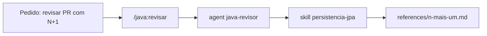

# Catálogo de skills e agents

Catálogo de **skills** e **agents** para engenharia de software e system design com Java (Java 25 +
Spring Boot 4). Use para consultar convenções, decidir arquitetura, construir, revisar e operar
sistemas Java com limites de recursos explícitos e evidência de funcionamento.

## Comece aqui

1. **Instale o plugin** (detalhes na seção [Instalação como plugin do Claude Code](#instalação-como-plugin-do-claude-code)):
   `/plugin marketplace add srportto/skills-manager` e `/plugin install catalogo-java@srportto-catalogo`.
2. **Use um destes 3 comandos** (finos: só delegam ao agent e à skill certos):
   - `/java:nova-app` — cria uma aplicação Java hexagonal buildável e a audita ao fim.
   - `/java:revisar` — revisa diff, classe ou entrega com o `java-revisor`.
   - `/opsx:propose` — abre uma change OpenSpec com todos os artefatos.
3. **Não decore nomes de skill**: o comando aciona o agent, e o agent lê só a skill e a reference do
   assunto (tabela "Resolução das skills" de cada agent).



## Fonte e instalação

### Instalação como plugin do Claude Code

```text
/plugin marketplace add srportto/skills-manager
/plugin install catalogo-java@srportto-catalogo
```

Skills, agents e comandos `/opsx:*` passam a vir do plugin `catalogo-java` (marketplace `srportto-catalogo`).
Validação manual pendente: o teste ponta a ponta numa sessão limpa ainda não foi registrado; o
`PluginManifestoTest` só garante a coerência dos manifestos em `.claude-plugin/`.

A cópia manual descrita abaixo continua válida como alternativa.

### Cópia manual (alternativa)

Este repositório é a **fonte** do catálogo:

| Conteúdo | Fonte (este repositório) | Destino típico de instalação |
|---|---|---|
| Skills | `skills/<nome>/SKILL.md` (+ `references/`, `assets/`, `evals/`) | `.claude/skills/<nome>/SKILL.md`, `.codex/skills/...` |
| Agents | `agents/<nome>.md` | `.claude/agents/<nome>.md` |
| Exemplos Java executáveis | `examples/java/` | permanecem no repositório (não são instalados) |
| Validação do catálogo | `validation/java/` | permanece no repositório |
| Convenções e rastreabilidade | `docs/catalogo/` | permanece no repositório |

Referências entre skills são relativas à raiz em que a skill foi encontrada (`skills/` aqui,
`.claude/skills/` numa instalação). Quando um agent ou skill cita `.claude/skills/<nome>`, leia como
"a skill `<nome>` na raiz instalada"; nesta fonte, o mesmo arquivo está em `skills/<nome>`. Detalhes em
[convenções do catálogo](../docs/catalogo/convencoes.md).

Caminhos como `apps/expurgo-particao`, `apps/temporiza-autorizacao`, `docs/based-java-aplication.md`,
`docs/patterns-arquitetura-java/` ou `openspec/changes/` vêm do monorepo em que o catálogo nasceu. Neste
repositório eles são **contexto externo/ilustrativo**: não existem aqui e não são pré-requisito de nenhuma
skill. Use o contexto recebido do projeto atual no lugar deles.

## Como usar

### 1. Leitura direta (referência)

Abra o `SKILL.md` (ou o `.md` do agent). O frontmatter traz `name` e `description` (gatilhos em pt-BR que
dizem **quando** a skill se aplica); o corpo traz a referência e aponta `references/` para leitura sob
demanda.

**Skills deste catálogo (exceto as de openspec e `gerar-diagramas`/`qualidade-codigo-java`, que declaram
carga proativa) não devem ser carregadas proativamente pela sessão principal** — cada `description`
termina com "Uso: agent `X` ou `/<nome-da-skill>`".

### 2. Por agent (uso programático)

Cada agent declara `description` (quando invocá-lo), `tools`, `model`/`effort` (metadados do executor de
origem — quem instala mapeia para capacidades equivalentes) e a lista `skills` que consome. Fluxo típico:

1. Você faz um pedido ("revise esse diff", "crie uma app nova", "desenhe o consumo desse tópico").
2. O agent correspondente lê as skills pertinentes ao escopo — não todas — e aplica os critérios.
3. Ele devolve decisões, artefatos, **testes executados com resultado** e pendências.
4. Outro agent valida quando a entrega exige (ex.: `java-construtor` → `java-revisor` modo `auditoria`).

Compilação não é teste; teste pulado é pendência, nunca aprovação.

## Inventário

31 skills, uma pasta cada em `skills/`: 21 da trilha Java, 1 de fluxo spec-driven e 9 auxiliares.

### Trilha Java — engenharia, arquitetura e operação

| Skill | Responsabilidade | Agents principais |
|---|---|---|
| `api-rest-design` | Contrato REST, OpenAPI 3.1, paginação, RFC 9457, 429/503 e idempotência | `projetista-api` |
| `arquitetura-limpa-java` | Camadas hexagonais (e clássicas), módulos Spring, DDD tático/estratégico, fronteiras | `java-revisor`, `java-construtor` |
| `banco-de-dados-performance` | SQL/SGBD: EXPLAIN, índices, tuning, conexões, replicação | `especialista-banco-dados` |
| `chaos-engineer` | Experimentos de falha, game days, abort e recuperação | `engenheiro-chaos` |
| `cloud-architect` | Topologia de nuvem, DNS/LB/CDN, IAM, DR, FinOps | `arquiteto-cloud` |
| `criar-aplicacao-java` | Esqueleto Spring Boot 4 + variantes (REST, banco, SQS, Kafka) | `java-construtor` |
| `design-system-architecture` | System design, capacidade/SLO, consistência, protocolos, ADR, estudos de caso | `arquiteto-sistemas` |
| `devops-cicd` | Pipeline, Dockerfile, manifests K8s, probes e drenagem | `engenheiro-devops` |
| `gerar-diagramas` | Diagramas Mermaid versionados | sessão principal |
| `java-moderno` | Features do Java 25 (records, sealed, virtual threads...) | `java-construtor`, `java-revisor` |
| `mensageria-sqs-kafka` | Ack/offset, DLQ, idempotência, outbox, controle de consumo e replay | `java-construtor`, `java-revisor` |
| `monitoramento-java` | Logs (JSON, MDC, níveis), métricas, tracing, SLO/saturação, alertas, health groups | `especialista-monitoramento`, `java-revisor`, `engenheiro-seguranca` |
| `padroes-de-projeto-java` | GoF e quando **não** aplicar | `java-revisor`, `refatorador-java` |
| `persistencia-jpa` | JPA/Hibernate, transações, locking, idempotência transacional | `especialista-banco-dados`, `java-construtor` |
| `qualidade-codigo-java` | Clean code e refactorings aplicados | `java-construtor`, `refatorador-java` |
| `refinamento-de-historias` | Demanda → história pronta (DoR, critérios observáveis, limites) | sessão principal |
| `resiliencia-controle-fluxo-java` | Backpressure, admissão, rate limiting, deadline, retry, breaker, bulkhead, fallback | `arquiteto-sistemas`, `java-construtor`, `java-revisor` |
| `revisao-de-codigo-java` | Checklist de revisão por severidade | `java-revisor`, `projetista-api` |
| `seguranca-aplicacao-java` | OWASP em Java, JWT, CORS, abuso de recursos e quotas | `engenheiro-seguranca` |
| `spring-data-redis` | Cache protegido, limite distribuído atômico, streams e recuperação | `java-construtor` |
| `testes-sistemas-java` | Provas de concorrência, idempotência, contrato, falha e carga | `java-construtor`, `java-revisor` |

### Fluxo spec-driven

| Skill | Responsabilidade | Agents principais |
|---|---|---|
| `openspec-catalogo-java` | Encaixa skills e agents do catálogo nas fases do OpenSpec; `config.yaml` modelo | todos, por fase |

### Ferramentas auxiliares (fora da trilha de exemplos Java)

Preservadas sem reescrita; a regra "todo exemplo de programação é Java" não se aplica a elas.

| Skill | Motivo |
|---|---|
| `graphify` | Grafo de conhecimento; ferramenta importada com scripts próprios |
| `openspec-apply-change`, `openspec-archive-change`, `openspec-explore`, `openspec-propose`, `openspec-sync-specs` | Fluxo OpenSpec 1.4.1 gerado, com ganchos para `openspec-catalogo-java` |
| `python-pro` | Python para serviços não Java (ex.: Lambdas); nunca usada pelo fluxo `java-construtor` |
| `remover-imports-nao-usados` | Multi-linguagem por propósito |
| `terraform-engineer` | IaC; Terratest usa Go por exigência da ferramenta |

### Agents

| Agent | Papel | Entrega verificável |
|---|---|---|
| `arquiteto-sistemas` | Decide arquitetura, capacidade, consistência e proteções | ADR + orçamento de capacidade + matriz de falhas |
| `arquiteto-cloud` | Topologia de nuvem, limites de serviço, DR e custo | Topologia + capacidade + custo + plano de recuperação |
| `engenheiro-chaos` | Exercita sobrecarga, falhas e recuperação | Hipótese + baseline + abort + relatório |
| `engenheiro-devops` | Pipeline, imagem, manifests, probes e drenagem | Pipeline e ciclo de vida verificados |
| `engenheiro-seguranca` | Auditoria dedicada, abuso de recursos e limites por identidade | Modelo de ameaça + testes de abuso |
| `especialista-banco-dados` | SQL/SGBD, conexões agregadas, locks e lag | Baseline + orçamento + comparação após ajuste |
| `especialista-monitoramento` | SLO, saturação, cardinalidade, alertas e runbook | Instrumentação validada + runbook |
| `java-construtor` | Implementa em Java com proteções pertinentes ao escopo | Código + comandos e resultados de testes |
| `java-revisor` | Revisa invariantes e evidências (`tempestivo`/`auditoria`) | Achados com arquivo, risco, cenário e correção |
| `projetista-api` | Contrato HTTP, quotas, 429/503, deadline e idempotência | Contrato + testes de contrato |
| `refatorador-java` | Refactorings sem mudar comportamento | Testes antes/depois |

Fronteiras: arquiteto decide, construtor implementa, revisor verifica, monitoramento mede, chaos exercita
falhas.

## Estrutura da fonte

```text
skills/                      # uma pasta por skill (SKILL.md + references/, assets/, evals/ opcionais)
agents/                      # um .md por agent
docs/catalogo/               # convenções, matriz de cobertura, compatibilidade, avaliações de agents
examples/java/               # exemplos Maven executáveis (fundamentos, linguagem, reativo, integracao, carga)
validation/java/             # testes Java que validam estrutura, links e linguagem do catálogo
```

> **Crédito do conteúdo técnico:** parte das skills foi traduzida, adaptada e estendida a partir de
> [`Jeffallan/claude-skills`](https://github.com/Jeffallan/claude-skills); as de openspec vêm do próprio
> OpenSpec e `graphify` do projeto Graphify. A origem é creditada aqui, em ponto único.

## Padrão de cada skill

Contrato completo em [convenções](../docs/catalogo/convencoes.md). Em resumo:

- Frontmatter com `name`, `description` (gatilhos em pt-BR) e `metadata` opcional.
- Anatomia (`SKILL.md` ≤ 500 linhas, `references/`, `assets/`, `evals/evals.json`) em [convenções](../docs/catalogo/convencoes.md#anatomia-de-skill).
- Quando usar / **quando não usar**, entradas, decisão, passo a passo, saída, critérios de validação e
  limites; referências longas em `references/`, lidas sob demanda.
- Explicações e comentários de código em português; termos técnicos consagrados em inglês.
- Exemplos de programação em Java; trechos parciais apontam para a fonte executável em `examples/java`.
- Fecha com **quem aplica o quê**.

## Mapa rápido de skills por tarefa

| Tarefa | Skill principal | Skills complementares |
|---|---|---|
| Criar aplicação nova do zero | `criar-aplicacao-java` | `arquitetura-limpa-java`, `mensageria-sqs-kafka`, `persistencia-jpa` |
| Dúvida sobre em qual camada colocar código | `arquitetura-limpa-java` | `criar-aplicacao-java` |
| Desenhar sistema distribuído, estimar capacidade, escrever ADR | `design-system-architecture` | `resiliencia-controle-fluxo-java`, `arquitetura-limpa-java` |
| Proteger fluxo contra sobrecarga/falha (fila, retry, breaker, bulkhead) | `resiliencia-controle-fluxo-java` | `testes-sistemas-java`, `monitoramento-java` |
| Provar concorrência, idempotência, falha ou carga | `testes-sistemas-java` | `resiliencia-controle-fluxo-java` |
| Decompor monolito em microsserviços | `arquitetura-limpa-java` (seção DDD) | `design-system-architecture`, `mensageria-sqs-kafka` |
| Desenhar contrato de API | `api-rest-design` | `arquitetura-limpa-java` |
| Resolver N+1, LazyInit, dirty checking | `persistencia-jpa` | `banco-de-dados-performance` |
| Otimizar query SQL, criar índice, tuning, orçamento de conexões | `banco-de-dados-performance` | `persistencia-jpa` |
| Padronizar logs (JSON, MDC, traceId) | `monitoramento-java` | `revisao-de-codigo-java` |
| Configurar observabilidade, SLO e alertas | `monitoramento-java` | `devops-cicd` |
| Implementar autenticação/autorização ou quotas | `seguranca-aplicacao-java` | `resiliencia-controle-fluxo-java` |
| Refinar demanda/história bruta | `refinamento-de-historias` | `openspec-propose`, `api-rest-design`, `design-system-architecture` |
| Revisar diff/PR | `revisao-de-codigo-java` | `testes-sistemas-java`, `arquitetura-limpa-java`, `persistencia-jpa` |
| Aplicar refactoring | `qualidade-codigo-java` | `remover-imports-nao-usados` |
| Escolher entre patterns | `padroes-de-projeto-java` | `qualidade-codigo-java` |
| Migrar para features modernas Java | `java-moderno` | `revisao-de-codigo-java` |
| Adicionar mensageria (SQS/Kafka) | `mensageria-sqs-kafka` | `criar-aplicacao-java`, `resiliencia-controle-fluxo-java` |
| Cache, limite distribuído ou fila de trabalho com Redis/Valkey | `spring-data-redis` | `resiliencia-controle-fluxo-java` |
| Pipeline CI/CD, Dockerfile, manifests Kubernetes | `devops-cicd` | `monitoramento-java` (probes) |
| Topologia de nuvem (VPC, IAM, DR, FinOps) | `cloud-architect` | `devops-cicd`, `terraform-engineer` |
| Experimento de chaos / game day | `chaos-engineer` | `monitoramento-java`, `testes-sistemas-java` |
| Gerar diagrama Mermaid versionado | `gerar-diagramas` | `design-system-architecture` |
| Remover imports não usados | `remover-imports-nao-usados` | — |
| Terraform IaC | `terraform-engineer` | `cloud-architect` |
| Código Python fora da trilha Java | `python-pro` | — |
| Grafo de conhecimento do código | `graphify` | — |
| Proposta/execução de change OpenSpec | `openspec-propose`, `openspec-apply-change` | `openspec-explore`, `openspec-sync-specs`, `openspec-archive-change` |

## Fluxos de trabalho

| Você quer... | Primeiro | Depois (validação) |
|---|---|---|
| Criar uma aplicação nova | `java-construtor` | `java-revisor` (modo `auditoria`) |
| Desenhar um sistema ou decisão arquitetural | `arquiteto-sistemas` | `java-construtor` (implementa) → `java-revisor` |
| Adicionar feature em app existente | sessão principal com skills | `java-revisor` (`tempestivo` → `auditoria`) |
| Revisar um PR/diff | `java-revisor` (modo `tempestivo`) | `java-revisor` (`auditoria`, se grande) |
| Aplicar um refactoring | `refatorador-java` | `java-revisor` (modo `tempestivo`) |
| Desenhar contrato de API | `projetista-api` | `java-construtor` → `java-revisor` |
| Investigar query lenta ou pool saturado | `especialista-banco-dados` | — |
| Configurar observabilidade e SLO | `especialista-monitoramento` | `engenheiro-chaos` (exercita alertas) |
| Testar resiliência | `engenheiro-chaos` | `especialista-monitoramento` |
| Auditar segurança dedicada | `engenheiro-seguranca` | `java-revisor` (`auditoria`) |
| Montar pipeline (CI/Docker/K8s) | `engenheiro-devops` | `java-revisor` (`auditoria`, se entrega Java) |

`java-revisor` é a última linha de defesa antes de algo ser declarado pronto; os modos diferem em
amplitude (`tempestivo` = diff pontual; `auditoria` = entrega completa com veredicto
APROVADO/REPROVADO/PENDENTE quando faltar evidência executada).

## Migração de nomes

Skills e agents que mudaram de nome ou foram fundidos; use o destino indicado.

| Nome antigo | Destino | Observação |
|---|---|---|
| `refactoring-remove-parameter` | `qualidade-codigo-java` | `references/refatoracoes-fowler.md#remove-parameter` |
| `java-architecture` | `arquitetura-limpa-java` + `testes-sistemas-java` | camadas clássicas em `references/camadas-classicas.md`, módulos Spring em `references/modulos-spring.md`; testes de slice e Testcontainers em `testes-sistemas-java/references/testes-slice-spring.md` |
| `padrao-de-logs-java` | `monitoramento-java` | `references/logs-estruturados.md`, `logs-mdc-correlacao.md`, `logs-por-camada.md` |
| agent `cloud-architect` | agent `arquiteto-cloud` | nome igual ao da skill `cloud-architect` causava ambiguidade; a skill mantém o nome |

## Validação do catálogo

```bash
mvn -f validation/java/pom.xml verify                 # estrutura, links, inventário e linguagem
mvn -f examples/java/pom.xml verify                   # exemplos determinísticos
mvn -f examples/java/pom.xml -Pintegracao verify      # serviços reais efêmeros (requer Docker)
mvn -f examples/java/pom.xml -Pcarga verify           # ensaio de carga controlado
```

Detalhes e versões em [exemplos Java](../examples/java/README.md) e
[compatibilidade](../docs/catalogo/compatibilidade.md).

## Princípios do catálogo

- **Uma fonte de verdade por tema** — resiliência em `resiliencia-controle-fluxo-java`; ack/offset/DLQ em
  `mensageria-sqs-kafka`; instrumentação em `monitoramento-java`; provas em `testes-sistemas-java`. As
  demais apontam para elas em vez de copiar regras.
- **Limites explícitos** — fila, concorrência, espera, retry e fallback têm unidade, escopo e motivo.
- **Evidência acima de texto** — compilação, testes executados e verificações pendentes são relatados
  separadamente.
- **Proporcionalidade** — CRUD simples não ganha broker, WebFlux ou circuit breaker sem motivo.
- **`Quando NÃO usar` explícito** e **quem aplica o quê** em toda skill.
- **Mensageria com DLQ e tratamento central de erro** — regras em `mensageria-sqs-kafka`, verificadas pelo
  `java-revisor` no modo `auditoria`.
