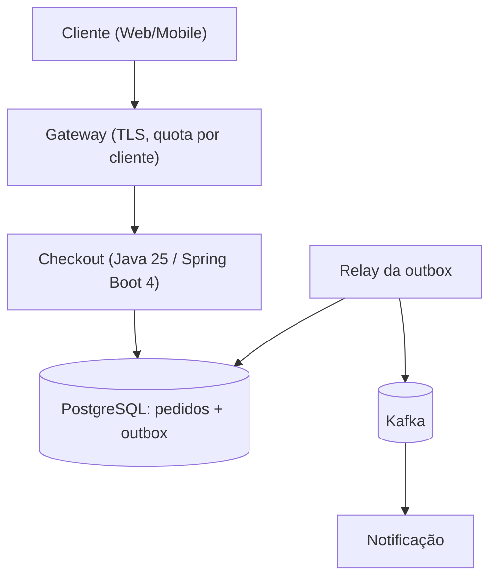

# Design de Arquitetura de Sistemas

Referência para desenhar ou revisar a arquitetura de **sistemas distribuídos** em alto nível, partindo de
requisitos e capacidade mensuráveis até decisões registradas (ADR), proteções e evidências.

## Quando usar

- Desenhar a arquitetura de um sistema novo ou decompor um monólito.
- Revisar uma arquitetura existente (capacidade, consistência, tráfego, falhas).
- Escrever ADR, matriz de falhas ou estimativa de capacidade.
- Comparar protocolos, bancos ou padrões arquiteturais com trade-offs explícitos.

## Quando NÃO usar

- Camada de um código dentro da aplicação hexagonal → `arquitetura-limpa-java`.
- Stack Spring Boot 4 e camadas clássicas → `arquitetura-limpa-java` (`references/camadas-classicas.md`, `references/modulos-spring.md`).
- Contrato HTTP (OpenAPI, RFC 9457, 429/503) → `api-rest-design`.
- Topologia cloud concreta (VPC, IAM, DR, FinOps) → skill `cloud-architect` (agent `arquiteto-cloud`).
- Implementação de backpressure, retry, breaker, bulkhead → `resiliencia-controle-fluxo-java` (esta skill
  decide **onde** e **com qual limite**; aquela explica **como**).
- Ack/offset/DLQ concretos → `mensageria-sqs-kafka`.
- Pattern GoF → `padroes-de-projeto-java`.

## Entradas

Objetivo de negócio, operações e seus efeitos, carga conhecida (média, pico e duração), dados e retenção,
restrições (equipe, prazo, custo, compliance) e o que já foi decidido. Use o que foi informado; pergunte só o
que muda a decisão. O que faltar vira **hipótese rotulada** com forma de validação.

## Decisão

| Pergunta | Se sim | Onde aprofundar |
|---|---|---|
| Faltam números de carga? | Estimar ordem de grandeza e rotular como hipótese | [estimativas rápidas](references/estimativas-rapidas.md), [capacidade e SLOs](references/capacidade-slos.md) |
| Operação exige consistência forte? | Decidir por operação, com idempotência e outbox | [consistência](references/consistencia-distribuida.md) |
| Há integração entre serviços? | Escolher protocolo e dono do retry por salto | [protocolos](references/protocolos-comunicacao.md), [rede e tráfego](references/rede-trafego.md) |
| Decisão relevante tomada? | Registrar ADR com alternativas e perda aceita | [`assets/adr-template.md`](assets/adr-template.md) |

## Passo a passo

1. **Requisitos** — RF por operação e RNF observáveis ([checklist NFR](references/nfr-checklist.md)).
   SLI com numerador/denominador, SLO com janela.
2. **Capacidade** — taxa/pico/duração, item, armazenamento, banda, memória de fila, concorrência
   (Lei de Little), conexões somadas das réplicas, orçamento de deadline e amplificação por fan-out/retry
   ([capacidade e SLOs](references/capacidade-slos.md)).
3. **Arquitetura** — comece pela alternativa mais simples que atende (monólito modular); acrescente
   componente só com requisito que o justifique ([padrões](references/architecture-patterns.md)).
4. **Dados e consistência** — decisão **por operação**: consistência exigida, replicação, particionamento,
   efeitos distribuídos ([consistência](references/consistencia-distribuida.md),
   [seleção de banco](references/database-selection.md)).
5. **Tráfego e comunicação** — DNS/LB/gateway/CDN, dono do retry em cada salto, protocolo por necessidade
   ([rede e tráfego](references/rede-trafego.md), [protocolos](references/protocolos-comunicacao.md)).
6. **Falhas e proteções** — matriz de falhas com limite (unidade, escopo, motivo), rejeição/degradação,
   idempotência e recuperação, seguindo o contrato de proteção de `docs/catalogo/convencoes.md`.
7. **Decisões** — ADR para cada decisão relevante ([template](assets/adr-template.md)).
8. **Evidência** — liste o teste/medição que transforma cada hipótese crítica em evidência e quem executa.

O documento end-to-end está em [roteiro de system design](references/system-design.md); diagramas seguem
`gerar-diagramas` (Mermaid).

## Validação

- Cada número tem unidade, fonte (medido, contrato, hipótese) e escopo.
- Toda decisão relevante tem ADR com alternativa simples avaliada e perda aceita.
- Toda hipótese crítica aponta o teste ou a medição que a prova, com responsável.
- O diagrama é Mermaid (`gerar-diagramas`) e a matriz de falhas cobre cada salto.

## Gotchas

- Média esconde pico: sempre registrar duração e percentil.
- Pool de conexões é somado entre réplicas e autoscaling; ver [estimativas rápidas](references/estimativas-rapidas.md).
- Exatamente-uma-vez tem fronteira: Kafka transacional não torna HTTP externo idempotente.
- Números de laboratório (estudos de caso) ilustram o método; não são SLO de produção.

## Guia de references

| Tópico | Referência | Quando carregar |
|---|---|---|
| Requisitos não funcionais | [nfr-checklist.md](references/nfr-checklist.md) | Levantar e escrever RNF verificáveis |
| Capacidade, SLI/SLO, orçamentos | [capacidade-slos.md](references/capacidade-slos.md) | Estimar carga, conexões, deadline, disponibilidade |
| Padrões arquiteturais | [architecture-patterns.md](references/architecture-patterns.md) | Monólito modular, microsserviços, serverless, estado, redundância |
| Consistência distribuída | [consistencia-distribuida.md](references/consistencia-distribuida.md) | CAP/PACELC, replicação, quorum, sharding, outbox/saga |
| Seleção de persistência | [database-selection.md](references/database-selection.md) | Escolher modelo de dados por operação |
| Rede e tráfego | [rede-trafego.md](references/rede-trafego.md) | DNS, L4/L7, balanceamento, gateway, CDN/edge |
| Protocolos e mensageria | [protocolos-comunicacao.md](references/protocolos-comunicacao.md) | REST/gRPC/GraphQL/WebSocket, RabbitMQ/SQS/Kafka |
| Estimativas rápidas | [estimativas-rapidas.md](references/estimativas-rapidas.md) | Latências, conversões req/dia→req/s, Little e pools Java |
| Documento completo | [system-design.md](references/system-design.md) | Desenho end-to-end |
| Estudos de caso | [estudos-de-caso-java.md](references/estudos-de-caso-java.md) | Encurtador, chat, feed, checkout (executável com ensaio de carga) |
| Entrevista | [entrevista-system-design.md](references/entrevista-system-design.md) | Roteiro de 45 min, rubrica e armadilhas |

## Restrições

**Fazer:**

- Registrar números com unidade, fonte e escopo; separar média, pico (com duração) e percentis.
- Avaliar a alternativa mais simples e escrever a perda aceita de cada decisão.
- Definir, para cada fluxo crítico, quem reduz a produção sob sobrecarga e para onde vai o excedente.
- Somar recursos compartilhados entre réplicas (conexões, quotas de provedor) e considerar autoscaling.
- Declarar consistência por operação e o comportamento sob partição/atraso de réplica.
- Planejar operação: observabilidade, runbook, rollout/rollback e custo.

**Não fazer:**

- Over-engineering para escala hipotética (microsserviço por entidade, reatividade por moda).
- Fila sem limite, retry sem orçamento, fallback que inventa sucesso de negócio.
- Tratar CAP como menu de "dois de três" ou "NoSQL" como sinônimo de "sem transações".
- Copiar números de laboratório como SLO de produção.
- Pular modelo de ameaça mínimo.

## Saída

1. Requisitos e SLIs/SLOs por operação.
2. Tabela de capacidade e orçamentos (conexões, deadline, fila).
3. Diagrama Mermaid de alto nível.
4. ADRs com alternativas, perda aceita, custo e gatilhos de revisão.
5. Matriz de falhas: falha, impacto, proteção/limite, degradação, recuperação, métrica, teste.
6. Hipóteses pendentes e provas necessárias, com responsável.

### Exemplo de diagrama

Exemplo completo de ADR (incluindo alternativas e perda aceita) em [`assets/adr-template.md`](assets/adr-template.md) (template pronto para copiar).

## Quem aplica o quê

| Cenário | Agent / Modo | Skills complementares |
|---|---|---|
| Desenhar arquitetura nova | `arquiteto-sistemas` | `resiliencia-controle-fluxo-java`, `cloud-architect` |
| Revisar arquitetura existente | `arquiteto-sistemas` (modo revisão) | `revisao-de-codigo-java` |
| Escrever ADR pontual | sessão principal + `/design-system-architecture` | `arquitetura-limpa-java` |
| Decompor monolito | `arquiteto-sistemas` + `especialista-banco-dados` | `mensageria-sqs-kafka`, `monitoramento-java` |
| Implementar o desenho | `java-construtor` | `resiliencia-controle-fluxo-java`, `testes-sistemas-java` |
| Validar design antes de implementação | `java-revisor` (modo `auditoria`) | esta skill como referência de critérios |

[Documentação base](https://jeffallan.github.io/claude-skills/skills/api-architecture/architecture-designer/)
_(renomeada neste catálogo para `design-system-architecture`; conteúdo reescrito para Java e capacidade)_
