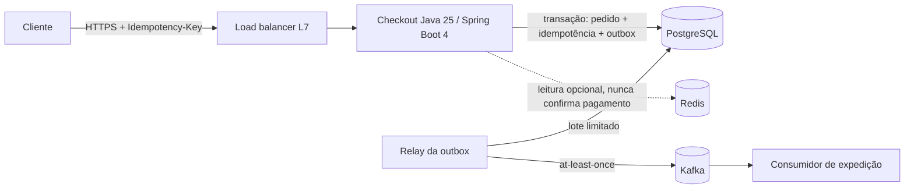

# Roteiro de design de sistema Java

Documento end-to-end para desenhar ou revisar um sistema. Preencha na ordem: cada seção consome números da
anterior. Hipóteses não medidas ficam rotuladas.

## Entradas

Objetivo de negócio, operações, usuários/tenants, dados, restrições de equipe/custo/prazo e RF/RNF. Registre
hipóteses e informação faltante que altera decisão. Pergunte apenas o que muda a decisão.

## Template

````markdown
# Sistema: {nome}

## 1. Requisitos
### Funcionais
- {operação}: {efeito de negócio observável}
### Não funcionais (por operação)
| Operação | SLI (numerador/denominador, fonte) | SLO e janela | Latência alvo (p50/p95/p99) | Consistência exigida |
|---|---|---|---|---|
### Restrições
Equipe, prazo, orçamento mensal, compliance, stack obrigatória (Java 25 / Spring Boot 4).

## 2. Capacidade (ver capacidade-slos.md)
| Operação | Média/s | Pico/s e duração | Item (bytes) | Leitura:escrita | Retenção | Crescimento |
|---|---|---|---|---|---|---|
Derivados: armazenamento, banda, memória de fila, concorrência (Lei de Little), conexões somadas das réplicas,
orçamento de deadline por salto, amplificação por fan-out e retry.

## 3. Arquitetura
Diagrama Mermaid (ver gerar-diagramas). Comece por monólito modular quando atender; justifique cada
componente adicional por requisito.

## 4. Fluxos críticos
Por fluxo: protocolo, dono dos dados, consistência, confirmação (quando o efeito é durável), deadline,
dono do retry, idempotência.

## 5. Dados
Modelo por operação, chave/consulta, índice, replicação, atraso tolerado, particionamento e migração.

## 6. Decisões (ADRs)
Lista de ADRs com link (ver `assets/adr-template.md`).

## 7. Matriz de falhas
| Componente/dependência | Falha | Impacto | Proteção e limite | Degradação | Recuperação | Métrica | Teste |
|---|---|---|---|---|---|---|---|

## 8. Segurança
Identidade, autorização, tenant, TLS/mTLS, segredos, limites por identidade e abuso de recursos.

## 9. Operação e entrega
Observabilidade (SLO, alertas, runbook), probes, rollout/rollback, migração e compatibilidade, custo.

## 10. Evolução
Gatilhos mensuráveis para escalar, particionar ou extrair serviço.
````

## Exemplo: checkout de pedidos



- **Requisitos:** criar pedido sem duplicar cobrança; SLO 99,9% de criações bem-sucedidas em 30 dias;
  p99 < 300 ms em carga nominal.
- **Capacidade (hipótese a validar):** média 50/s, pico 400/s por 15 min, item 2 KiB → ~0,8 MiB/s de
  escrita lógica no pico; concorrência média no pico = 400/s × 0,08 s ≈ 32 requisições ativas.
- **Proteção:** entrada HTTP limita concorrência (ex.: 64 por instância) e payload (64 KiB); excedente
  recebe 503 imediato, sem fila ilimitada. Pool de 20 conexões por instância × 6 réplicas = 120 ≤ orçamento
  do banco. Cada dependência tem deadline derivado do orçamento restante.
- **Falhas:** cache indisponível não envia tráfego ilimitado ao banco; broker indisponível acumula eventos
  na outbox (limpeza por retenção) e o relay drena em taxa limitada no retorno.
- **Prova:** idempotência concorrente e outbox em
  [`ProcessadorIdempotente`](../../../examples/java/integracao/src/main/java/br/com/srportto/exemplos/ProcessadorIdempotente.java);
  aplicação executável [`CheckoutApplication`](../../../examples/java/integracao/src/main/java/br/com/srportto/exemplos/CheckoutApplication.java) e ensaio de carga em [estudos de caso](estudos-de-caso-java.md).

Um caso simples pode dispensar broker e relay: documente quando a consistência local já atende. Não copie
números de laboratório como SLO.

## Revisão

- Qual requisito justifica cada componente?
- A topologia sobrevive à falha prevista? Onde está o SPOF lógico (banco, DNS, credencial, região)?
- Quem confirma efeitos, quem repete, quem descarta e com qual limite?
- Como observar saturação e recuperar sem nova tempestade de retries?
- Que teste transforma cada hipótese em evidência?
