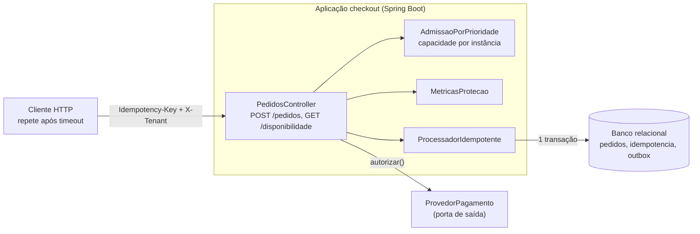
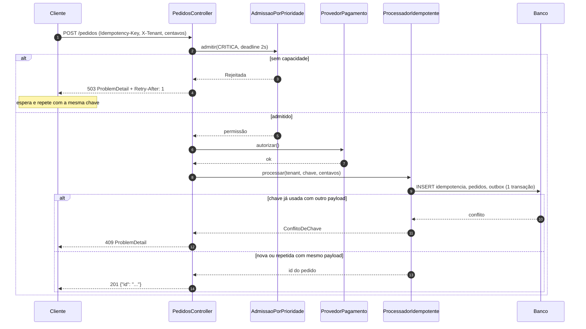
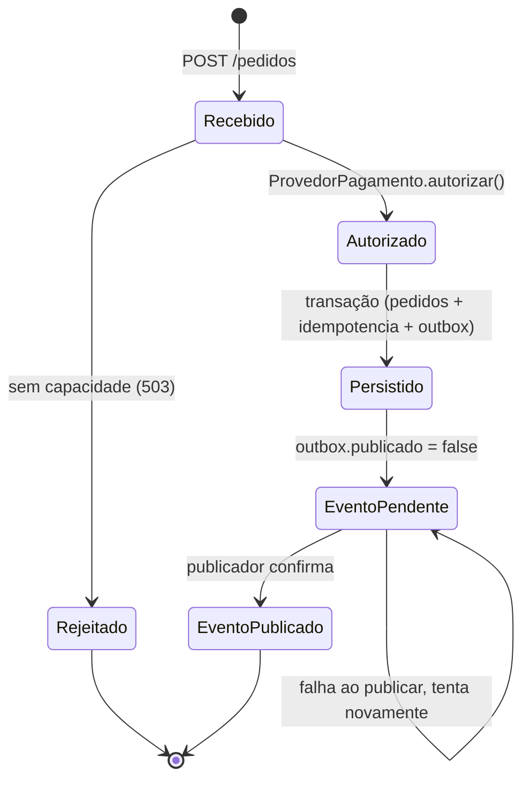
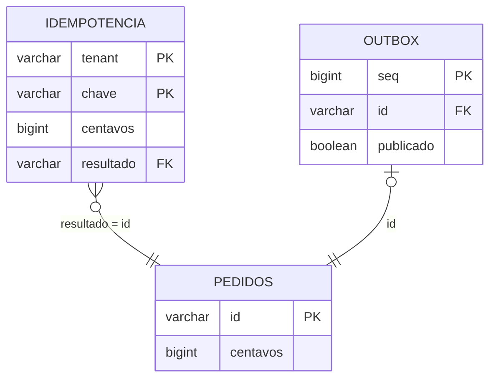

# Exemplos Mermaid do domínio de checkout

Leia este arquivo quando for escrever um diagrama novo e quiser um modelo válido (renderiza no GitHub) para
cada tipo: visão de containers, sequência, máquina de estados e modelo de dados. Todos usam o domínio de
checkout executável em
[`CheckoutApplication`](../../../examples/java/integracao/src/main/java/br/com/srportto/exemplos/CheckoutApplication.java)
e
[`ProcessadorIdempotente`](../../../examples/java/integracao/src/main/java/br/com/srportto/exemplos/ProcessadorIdempotente.java);
os nomes de componentes, rotas, cabeçalhos e tabelas vêm de lá. Mermaid não tem sintaxe C4 estável no GitHub:
use `flowchart` com `subgraph` para representar containers.

## 1. Visão de containers (flowchart com subgraphs)

## 2. Sequência: criar pedido com Idempotency-Key e caminho 503

## 3. Máquina de estados: evento da outbox

O checkout não persiste coluna de status no pedido; o ciclo de vida real está no evento da `outbox`
(coluna `publicado`). O diagrama abaixo modela esse ciclo e a decisão de admissão.

Se o domínio ganhar status de pedido/autorização persistido, desenhe cada aresta com o motivo e a checagem
explícita de origem (ver `refinamento-de-historias`, eixo "Máquina de estados").

## 4. Modelo de dados (erDiagram)

## Regras rápidas de validade

- Rótulo com `(`, `:` ou `/` vai entre aspas duplas; use ` ` para quebra de linha em nó.
- Um diagrama por bloco, pequeno; se passar de ~15 nós, divida por fluxo.
- Nomeie nós com componentes reais (classe, tabela, cabeçalho), nunca "Serviço A".
