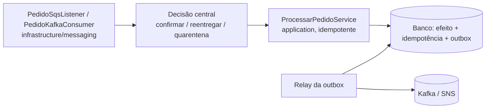

# Mensageria SQS e Kafka

## Visão geral

Garantias concretas de consumo e publicação em aplicações Java/Spring Boot hexagonais: **quando confirmar**,
**como limitar o trabalho em voo**, **como não duplicar efeitos** e **como recuperar** sem perder mensagens.
Mecanismos gerais de proteção (deadline, retry, breaker) estão em `resiliencia-controle-fluxo-java`; esta skill é
dona de ack, offset, DLQ/DLT, outbox e replay.

**Quando NÃO usar:** gerar aplicação nova → `criar-aplicacao-java`; dúvida de camada → `arquitetura-limpa-java`;
o que logar → `monitoramento-java/references/logs-por-camada.md`; métricas de lag/backlog → `monitoramento-java`.

## Garantias em uma tabela

| Pergunta | SQS (standard) | Kafka |
|---|---|---|
| Entrega | At-least-once; duplicatas possíveis | At-least-once com commit após o processamento |
| O que é "ack" | `DeleteMessage` com o receipt handle da entrega | Commit do offset **seguinte** ao último processado da partição |
| Ordem | Nenhuma na standard; FIFO ordena por `MessageGroupId` | Por partição (chave define a partição) |
| Trabalho em voo | Mensagens recebidas e não apagadas (invisíveis) | Registros já entregues pelo `poll` e ainda não commitados |
| Falha repetida | `RedrivePolicy` move para DLQ após `maxReceiveCount` | Política da aplicação (ex.: N tentativas → DLT) |
| Replay | Só da DLQ (redrive) ou reenvio manual | Reset de offset / novo grupo, dentro da retenção |

**Exactly-once tem fronteira.** Produtor idempotente e transações Kafka evitam duplicatas *dentro do Kafka*
(read-process-write entre tópicos). Elas **não** tornam exatamente-uma-vez um efeito externo (banco, HTTP,
e-mail). Para efeitos externos: idempotência persistida + outbox/inbox.

## 1. Onde a mensageria vive na arquitetura

Listener SQS e consumer Kafka são **driving adapters** em `infrastructure/messaging/`: recebem a mensagem,
chamam uma `port/in` e devolvem a decisão de ack ao ponto central. Produtor é **driven adapter** que implementa
uma `port/out`. O domínio nunca conhece o broker.



## 2. Regra de ouro: toda fila SQS nasce com sua DLQ

**Nenhuma fila SQS é criada — em Terraform, CLI ou qualquer IaC, nem localmente — sem DLQ e `RedrivePolicy`.**
Sem DLQ, uma mensagem venenosa reentrega para sempre, consome throughput e não deixa rastro.

```hcl
# Terraform - fila principal + DLQ SEMPRE juntas
resource "aws_sqs_queue" "fila_dlq" {
  name                      = "fila-pedidos-dlq"
  message_retention_seconds = 1209600 # 14 dias: tempo para investigar e fazer redrive
}

resource "aws_sqs_queue" "fila" {
  name                       = "fila-pedidos"
  visibility_timeout_seconds = 60 # > tempo máximo de processamento, ou renove durante o processamento
  redrive_policy = jsonencode({
    deadLetterTargetArn = aws_sqs_queue.fila_dlq.arn
    maxReceiveCount     = 3
  })
}
```

Localmente, use o **Floci** (emulador AWS, porta 4566): `docker run -d -p 4566:4566 floci/floci:2.2.0`. Com
`AWS_ENDPOINT_URL=http://localhost:4566`, `AWS_ACCESS_KEY_ID=test`, `AWS_SECRET_ACCESS_KEY=test` e
`AWS_DEFAULT_REGION=us-east-1`, AWS CLI e AWS SDK v2 apontam para ele sem mudança de código. A mesma regra: criar
a DLQ, obter o ARN e só então criar a fila com `RedrivePolicy`:

```bash
aws --endpoint-url=http://localhost:4566 sqs create-queue --queue-name fila-pedidos-dlq
ARN_DLQ=$(aws --endpoint-url=http://localhost:4566 sqs get-queue-attributes \
  --queue-url http://localhost:4566/000000000000/fila-pedidos-dlq \
  --attribute-names QueueArn --query 'Attributes.QueueArn' --output text)
aws --endpoint-url=http://localhost:4566 sqs create-queue --queue-name fila-pedidos \
  --attributes "{\"RedrivePolicy\":\"{\\\"deadLetterTargetArn\\\":\\\"$ARN_DLQ\\\",\\\"maxReceiveCount\\\":\\\"3\\\"}\"}"
```

`maxReceiveCount=3` é um default razoável, não universal: conte que **cada recebimento é uma tentativa** (inclusive
os que expiraram por visibility timeout). A retenção da DLQ deve ser **maior** que a da fila principal, senão a
mensagem pode expirar antes da investigação. O `java-revisor` (modo `auditoria`) reprova fila nova sem DLQ.

### Visibility timeout e renovação

Intervalo em que a mensagem entregue fica invisível. Se o processamento passar do timeout, a mensagem reaparece
e **outro consumidor processa a mesma mensagem em paralelo**. Duas opções: timeout acima do tempo máximo de
processamento (incluindo retries internos e deadline), ou **renovar** com `ChangeMessageVisibility` enquanto
processa (ex.: a cada metade do timeout), parando ao terminar. Visibilidade máxima por mensagem: 12 horas.

### Mensagens em voo limitadas

Peça ao SQS só o que cabe: `MaxNumberOfMessages = min(10, capacidade livre)`. Mensagens recebidas e não
processadas ficam invisíveis consumindo o timeout — buscar mais do que se processa gera reentregas e duplicatas.
O backlog deve ficar **no broker**, não em fila em memória. Com `@SqsListener` (Spring Cloud AWS), limite via
`maxConcurrentMessages`/`maxMessagesPerPoll` do container.

## 3. Ponto central de decisão de erro

Assim como o `@ControllerAdvice` classifica exceções HTTP num só lugar, **toda falha de consumo passa por um ponto
único** que decide entre **confirmar**, **reentregar** ou **quarentenar**:

| Situação | Decisão | Por quê |
|---|---|---|
| Efeito concluído (ou já aplicado antes — idempotência) | Confirmar | Trabalho feito |
| Falha transitória (timeout, dependência fora, lock) | Reentregar | Nova tentativa pode funcionar; tentativas limitadas |
| Falha permanente (schema inválido, regra violada) | Copiar para quarentena (DLQ/DLT) **e então** confirmar | Não adianta repetir; o dado de negócio não pode sumir |
| Quarentena indisponível | **Não confirmar** (reentregar) | Confirmar sem cópia durável é perda silenciosa |
| Efeito com resultado desconhecido (timeout após enviar) | Reentregar + idempotência/reconciliação | Repetir às cegas pode duplicar o efeito |
| Falha desconhecida | Tratar como transitória | Repetir é mais seguro que descartar |

Implementação de referência, testada:
[ConsumoControlado](../../examples/java/integracao/src/main/java/br/com/srportto/exemplos/ConsumoControlado.java).

**Listener manual (SDK)** — o listener só delega:

```java
// infrastructure/messaging — o listener não decide nada sozinho
var resultado = decisao.consumir(mensagem);           // ConsumoControlado<Message>
if (resultado.decisao() == ConsumoControlado.Decisao.CONFIRMAR) {
    sqs.deleteMessage(r -> r.queueUrl(fila).receiptHandle(mensagem.receiptHandle()));
}
// REENTREGAR: não apaga; a mensagem reaparece após o timeout/backoff e a RedrivePolicy limita as tentativas.
```

**`@KafkaListener` (spring-kafka)** — o ponto central é um `DefaultErrorHandler` configurado uma vez:

```java
@Bean
DefaultErrorHandler errorHandler(KafkaTemplate<String, String> kafkaTemplate) {
    var recuperador = new DeadLetterPublishingRecoverer(kafkaTemplate);
    // 1 tentativa inicial + 3 retentativas, com backoff exponencial (1 s, 2 s, 4 s, teto 10 s).
    var backoff = new ExponentialBackOffWithMaxRetries(3);
    backoff.setInitialInterval(1_000L);
    backoff.setMultiplier(2.0);
    backoff.setMaxInterval(10_000L);
    var handler = new DefaultErrorHandler(recuperador, backoff);
    // Exceção permanente vai direto para o DLT, sem gastar retentativas.
    handler.addNotRetryableExceptions(PedidoInvalidoException.class);
    return handler;
}
```

Notas: `FixedBackOff(1000L, 3)` significa **3 retentativas** (4 execuções no total). O retry do
`DefaultErrorHandler` acontece **bloqueando a partição** (seek para o registro que falhou): retries longos atrasam
toda a partição e contam para `max.poll.interval.ms`. Se a publicação no DLT falhar, o handler não commita o
offset — o registro é reprocessado (configure `DeadLetterPublishingRecoverer` para **falhar** quando o envio falhar,
nunca para ignorar). Com `@SqsListener` gerenciado, o equivalente é um `ErrorHandler`/`AcknowledgementResultCallback`
central.

**Reprova em revisão:** classificação duplicada; `try/catch` no listener decidindo ack inline; descarte genérico
(`return true` / ack) de mensagem com dado de negócio sem quarentena durável; ack antes do efeito.

## 4. Kafka produtor

- **Chave define partição e ordem**: mesma chave → mesma partição → ordem garantida entre elas. Use id de negócio
  estável (id do pedido/agregado). Chave muito concentrada vira **hot partition**.
- **`acks=all`** aguarda as réplicas **em sincronia (ISR)**, não "todas as réplicas". A durabilidade real depende de
  `min.insync.replicas` no tópico/broker: com `replication.factor=3` e `min.insync.replicas=2`, a escrita só é
  confirmada com ao menos 2 cópias; com `min.insync.replicas=1`, `acks=all` ainda pode perder dado se o líder cair.
- **Produtor idempotente** (`enable.idempotence=true`, default nos clientes atuais com `acks=all`) evita duplicatas
  causadas pelos **retries internos do próprio produtor**; não evita duplicatas de reenvio pela aplicação.
- **Retries do produtor** são automáticos até `delivery.timeout.ms`; não acrescente retry de aplicação em cima sem
  orçamento — e, se acrescentar, o consumidor precisa deduplicar.
- **Dependência:** `spring-boot-starter-kafka` (autoconfigura `KafkaTemplate`); sem o starter falta o bean.

```yaml
spring:
  kafka:
    producer:
      acks: all
      properties:
        enable.idempotence: true
        delivery.timeout.ms: 120000
```

Publicar **depois** do commit do banco perde o evento se o processo cair entre os dois; publicar **antes** cria
evento de algo que pode sofrer rollback. Use **outbox** (seção 6).

## 5. Kafka consumidor

- **Consumer group:** cada partição tem no máximo um consumidor ativo do grupo; paralelismo máximo = número de
  partições. Mais instâncias que partições ficam ociosas.
- **`auto.offset.reset`** só vale quando **não há offset commitado válido** para o grupo (grupo novo ou offset
  expirado/fora da retenção): `earliest` lê desde o início disponível, `latest` só o que chegar. Não é "configuração
  de leitura" do dia a dia.
- **Commit do concluído:** commite o offset `último processado + 1` **depois** do efeito durável. Com
  `@KafkaListener` e processamento síncrono, o `AckMode` padrão (`BATCH`) commita após o retorno do listener —
  correto. Se você entregar o registro a outra thread e retornar, o commit automático confirma trabalho **não
  feito**: use ack manual.
- **Manter o poll vivo:** o tempo entre `poll()` não pode passar de `max.poll.interval.ms` (default 5 min), senão o
  membro sai do grupo e as partições são reatribuídas (com reprocessamento). Processamento lento: reduza
  `max.poll.records`, ou processe de forma assíncrona **pausando** as partições ocupadas (`pause`/`resume`) e
  continuando a chamar `poll()`. **Nunca "pare o poll" até o trabalho acabar.**
- **`KafkaConsumer` não é thread-safe:** só a thread do laço chama `poll`, `commit`, `pause`; workers devolvem
  resultados por fila.
- **Ordem e paralelismo:** paralelizar **dentro** de uma partição quebra a ordem por chave. Paralelize entre
  partições, ou por chave com cuidado explícito.
- **Rebalance:** em `onPartitionsRevoked`, espere (limitado) o trabalho em andamento e commite o concluído; o resto
  será reprocessado pelo novo dono — por isso o efeito precisa ser idempotente.

Detalhes, números e o exemplo completo:
[controle de consumo](references/controle-consumo-java.md).

## 6. Idempotência, outbox e replay

- **Idempotência persistida**: chave + escopo (tenant) + hash/campos do payload + resultado, gravados **na mesma
  transação** do efeito quando estão no mesmo banco; a restrição única arbitra corridas entre instâncias. Mesma chave
  com payload diferente = conflito, nunca sobrescrita.
- **Outbox**: o evento é gravado na mesma transação do efeito; um relay publica em ordem (sequência), marca como
  publicado e aceita duplicatas (at-least-once). **Inbox/deduplicação** no consumidor fecha o ciclo.
- **Replay** de DLQ/outbox em **taxa limitada** e com o destino saudável; a quarentena tem retenção, dono e acesso
  controlado.

Detalhes e provas: [idempotência, outbox e replay](references/idempotencia-outbox-replay-java.md).

## 7. Decisão SQS × Kafka × RabbitMQ

| Aspecto | SQS | Kafka | RabbitMQ |
|---|---|---|---|
| Modelo | Fila gerenciada, consumo destrutivo | Log retido, consumo por offset | Broker com exchanges/filas, consumo destrutivo |
| Múltiplos consumidores independentes | Via SNS fan-out | Nativo (um grupo por consumidor) | Via exchange fan-out |
| Ordem | FIFO por grupo | Por partição | Por fila (com 1 consumidor ou single-active) |
| Replay | DLQ redrive | Nativo dentro da retenção | Não nativo (streams à parte) |
| Controle de fluxo do consumidor | Quantas mensagens pedir | `max.poll.records`, pause/resume | `prefetch` (QoS) |
| Operação | Gerenciado (AWS) | Cluster/serviço gerenciado; partições e retenção a dimensionar | Cluster a operar |
| Quando usar | Trabalho a executar por um processador | Histórico/eventos para vários consumidores, replay | Roteamento flexível, RPC assíncrono, filas de trabalho |

## 8. Erros comuns

| Erro | Consequência | Correção |
|---|---|---|
| Fila SQS sem DLQ | Mensagem venenosa reentrega para sempre | Seção 2 |
| Ack/commit antes do efeito durável | Perda em queda | Confirmar só após efeito ou quarentena durável |
| Descarte genérico de mensagem "inválida" | Dado de negócio some sem rastro | Quarentena durável e então confirmar |
| Receber mais mensagens do que processa | Reentregas por visibility timeout, duplicatas | Limitar em voo; deixar backlog no broker |
| Parar o `poll()` durante processamento longo | Rebalance, reprocessamento em cascata | `pause`/`resume` + poll contínuo; `max.poll.records` menor |
| Commit automático com processamento assíncrono | Offset confirmado de trabalho não feito | Ack manual após conclusão |
| Idempotência em memória em produção | Duplica após reinício ou em várias instâncias | Restrição única no banco, na transação do efeito |
| `acks=all` com `min.insync.replicas=1` | Perda se o líder cair | `min.insync.replicas ≥ 2` com RF 3 |
| Retry sem limite por partição | Partição travada por uma mensagem | Tentativas limitadas → DLT |
| Logar payload | PII no log | Logar ids (`monitoramento-java`, logs) |

## 9. Validação

- `java-revisor` (modo `auditoria`) verifica: DLQ + `RedrivePolicy` em toda fila; ponto central de decisão; ack só
  após efeito/quarentena; trabalho em voo limitado; idempotência persistida; poll mantido.
- **Provas executáveis** (`testes-sistemas-java`): duplicatas concorrentes e reinício sem efeito duplicado; falha
  de envio para DLQ/DLT sem confirmação; trabalho em voo nunca acima do limite; replay em taxa limitada. Referências:
  [ConsumidorKafkaLimitadoExternoIT](../../examples/java/integracao/src/test/java/br/com/srportto/exemplos/ConsumidorKafkaLimitadoExternoIT.java)
  e [ConsumidorSqsLimitadoExternoIT](../../examples/java/integracao/src/test/java/br/com/srportto/exemplos/ConsumidorSqsLimitadoExternoIT.java)
  (perfil `integracao`, Docker obrigatório).

## Skills e agents relacionados

| Situação | Use |
|---|---|
| Criar aplicação que nasce consumindo fila/publicando em Kafka | skill `criar-aplicacao-java` |
| Camada de uma classe de mensageria | skill `arquitetura-limpa-java` |
| Deadline, retry, breaker, limites gerais | skill `resiliencia-controle-fluxo-java` |
| Transação e restrição única com JPA | skill `persistencia-jpa` |
| Lag, idade do backlog, alertas | skill `monitoramento-java` |
| O que logar no consumer | skill `monitoramento-java` (`references/logs-por-camada.md`) |
| Revisão de código de mensageria | agent `java-revisor` |

Fontes: [KafkaConsumer (javadoc 4.x)](https://kafka.apache.org/42/javadoc/org/apache/kafka/clients/consumer/KafkaConsumer.html),
[SQS visibility timeout](https://docs.aws.amazon.com/AWSSimpleQueueService/latest/SQSDeveloperGuide/sqs-visibility-timeout.html),
[SQS dead-letter queues](https://docs.aws.amazon.com/AWSSimpleQueueService/latest/SQSDeveloperGuide/sqs-dead-letter-queues.html).
