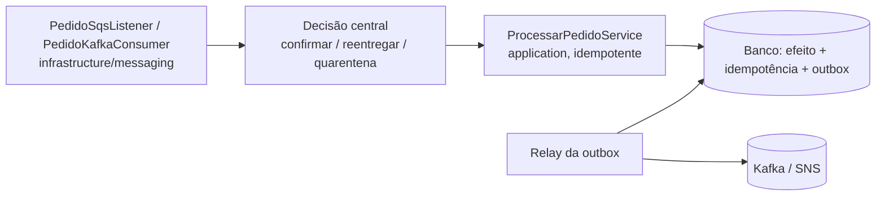

# Mensageria SQS e Kafka

Garantias concretas de consumo e publicação em aplicações Java/Spring Boot hexagonais: **quando confirmar**,
**como limitar o trabalho em voo**, **como não duplicar efeitos** e **como recuperar** sem perder mensagens.
Mecanismos gerais de proteção (deadline, retry, breaker) estão em `resiliencia-controle-fluxo-java`; esta skill é
dona de ack, offset, DLQ/DLT, outbox e replay.

## Quando usar / Quando NÃO usar

- **Usar:** dúvida de ack/offset, DLQ, idempotência, retry de listener, backlog, replay, outbox, escolha de broker.
- **NÃO usar:** gerar aplicação nova → `criar-aplicacao-java`; dúvida de camada → `arquitetura-limpa-java`;
  o que logar → `monitoramento-java/references/logs-por-camada.md`; métricas de lag/backlog → `monitoramento-java`;
  deadline/retry/breaker gerais → `resiliencia-controle-fluxo-java`.

## Entradas

Broker (SQS, Kafka ou ambos); efeito do consumo (banco, HTTP, publicação); tolerância a duplicata e a perda;
tempo máximo de processamento; taxa de chegada e capacidade downstream; necessidade de ordem e de replay.

## Regras duras (reprovam em revisão)

1. **Toda fila SQS nasce com DLQ + `RedrivePolicy`** (sem DLQ = **Crítico**) — em Terraform, CLI, Floci local.
2. **Ponto central de decisão de erro**: toda falha de consumo passa por um único ponto que decide confirmar,
   reentregar ou quarentenar; sem `try/catch` decidindo ack inline.
3. **Ack/commit só depois do efeito durável** (ou da cópia durável em quarentena).
4. **Poll mantido dentro de `max.poll.interval.ms`** com `pause`/`resume`; nunca "parar o poll" até o trabalho acabar.
5. Trabalho em voo limitado; idempotência persistida (restrição única na transação do efeito).

## Garantias em uma tabela

| Pergunta | SQS (standard) | Kafka |
|---|---|---|
| Entrega | At-least-once; duplicatas possíveis | At-least-once com commit após o processamento |
| O que é "ack" | `DeleteMessage` com o receipt handle da entrega | Commit do offset **seguinte** ao último processado da partição |
| Ordem | Nenhuma na standard; FIFO ordena por `MessageGroupId` | Por partição (chave define a partição) |
| Trabalho em voo | Mensagens recebidas e não apagadas (invisíveis) | Registros já entregues pelo `poll` e ainda não commitados |
| Falha repetida | `RedrivePolicy` move para DLQ após `maxReceiveCount` | Política da aplicação (ex.: N tentativas → DLT) |
| Replay | Só da DLQ (redrive) ou reenvio manual | Reset de offset / novo grupo, dentro da retenção |

**Exactly-once tem fronteira.** Produtor idempotente e transações Kafka evitam duplicatas *dentro do Kafka*
(read-process-write entre tópicos). Elas **não** tornam exatamente-uma-vez um efeito externo (banco, HTTP,
e-mail). Para efeitos externos: idempotência persistida + outbox/inbox.

## Onde a mensageria vive na arquitetura

Listener SQS e consumer Kafka são **driving adapters** em `infrastructure/messaging/`: recebem a mensagem,
chamam uma `port/in` e devolvem a decisão de ack ao ponto central. Produtor é **driven adapter** que implementa
uma `port/out`. O domínio nunca conhece o broker.

## Decisão

| Pergunta | Onde ler |
|---|---|
| Criar/revisar fila SQS, DLQ, visibility timeout, mensagens em voo | `references/sqs-dlq-redrive.md` |
| Falha no consumo: confirmar, reentregar ou quarentenar; `DefaultErrorHandler`/DLT | `references/erro-central-interceptor.md` |
| Produtor/consumidor Kafka: chave, `acks`, commit, poll, rebalance | `references/kafka-produtor-consumidor.md` |
| Ritmo de consumo, pausa por partição, backlog | `references/controle-consumo-java.md` |
| Duplicata, outbox/inbox, replay | `references/idempotencia-outbox-replay-java.md` |
| SQS × Kafka × RabbitMQ | `references/escolha-broker.md` |

## Passo a passo

- [ ] Escolha o broker (`references/escolha-broker.md`).
- [ ] SQS: crie a DLQ, obtenha o ARN, crie a fila com `RedrivePolicy` (Floci para AWS local).
- [ ] Centralize a decisão de erro; o listener só delega.
- [ ] Limite o trabalho em voo; mantenha o backlog no broker.
- [ ] Confirme (delete/commit) só após o efeito durável; Kafka: `pause`/`resume` e commit do concluído.
- [ ] Idempotência persistida e, para publicar eventos, outbox.
- [ ] Execute as provas da seção Validação.

## Saída

Código dos adapters de mensageria (`infrastructure/messaging/`), IaC/CLI da fila com DLQ, ponto central de
decisão de erro, configuração Kafka (YAML) e a prova executada (duplicatas, falha de envio à quarentena, limite
em voo).

## Idempotência, outbox e replay

- **Idempotência persistida**: chave + escopo (tenant) + hash/campos do payload + resultado, gravados **na mesma
  transação** do efeito quando estão no mesmo banco; a restrição única arbitra corridas entre instâncias. Mesma chave
  com payload diferente = conflito, nunca sobrescrita.
- **Outbox**: o evento é gravado na mesma transação do efeito; um relay publica em ordem (sequência), marca como
  publicado e aceita duplicatas (at-least-once). **Inbox/deduplicação** no consumidor fecha o ciclo.
- **Replay** de DLQ/outbox em **taxa limitada** e com o destino saudável; a quarentena tem retenção, dono e acesso
  controlado.

Detalhes e provas: [idempotência, outbox e replay](references/idempotencia-outbox-replay-java.md).

## Gotchas (erros comuns)

| Erro | Consequência | Correção |
|---|---|---|
| Fila SQS sem DLQ | Mensagem venenosa reentrega para sempre | Seção 2 |
| Ack/commit antes do efeito durável | Perda em queda | Confirmar só após efeito ou quarentena durável |
| Descarte genérico de mensagem "inválida" | Dado de negócio some sem rastro | Quarentena durável e então confirmar |
| Receber mais mensagens do que processa | Reentregas por visibility timeout, duplicatas | Limitar em voo; deixar backlog no broker |
| Parar o `poll()` durante processamento longo | Rebalance, reprocessamento em cascata | `pause`/`resume` + poll contínuo; `max.poll.records` menor |
| Commit automático com processamento assíncrono | Offset confirmado de trabalho não feito | Ack manual após conclusão |
| Idempotência em memória em produção | Duplica após reinício ou em várias instâncias | Restrição única no banco, na transação do efeito |
| `acks=all` com `min.insync.replicas=1` | Perda se o líder cair | `min.insync.replicas ≥ 2` com RF 3 |
| Retry sem limite por partição | Partição travada por uma mensagem | Tentativas limitadas → DLT |
| Logar payload | PII no log | Logar ids (`monitoramento-java`, logs) |

## Validação

- `java-revisor` (modo `auditoria`) verifica: DLQ + `RedrivePolicy` em toda fila; ponto central de decisão; ack só
  após efeito/quarentena; trabalho em voo limitado; idempotência persistida; poll mantido.
- **Provas executáveis** (`testes-sistemas-java`): duplicatas concorrentes e reinício sem efeito duplicado; falha
  de envio para DLQ/DLT sem confirmação; trabalho em voo nunca acima do limite; replay em taxa limitada. Referências:
  [ConsumidorKafkaLimitadoExternoIT](../../examples/java/integracao/src/test/java/br/com/srportto/exemplos/ConsumidorKafkaLimitadoExternoIT.java)
  e [ConsumidorSqsLimitadoExternoIT](../../examples/java/integracao/src/test/java/br/com/srportto/exemplos/ConsumidorSqsLimitadoExternoIT.java)
  (perfil `integracao`, Docker obrigatório).

## Guia de references

| Arquivo | Quando ler |
|---|---|
| [sqs-dlq-redrive.md](references/sqs-dlq-redrive.md) | Criar fila SQS com DLQ e `RedrivePolicy`, visibility timeout, mensagens em voo, Floci local |
| [erro-central-interceptor.md](references/erro-central-interceptor.md) | Decidir confirmar/reentregar/quarentenar; `DefaultErrorHandler` e DLT |
| [kafka-produtor-consumidor.md](references/kafka-produtor-consumidor.md) | Chave, `acks`, idempotência do produtor, consumer group, commit, poll, rebalance |
| [controle-consumo-java.md](references/controle-consumo-java.md) | Dimensionar consumo, pausa-por-partição, backlog no broker |
| [idempotencia-outbox-replay-java.md](references/idempotencia-outbox-replay-java.md) | Idempotência persistida, outbox/inbox, replay controlado |
| [escolha-broker.md](references/escolha-broker.md) | Escolher entre SQS, Kafka e RabbitMQ |

## Quem aplica o quê

| Situação | Use |
|---|---|
| Criar aplicação que nasce consumindo fila/publicando em Kafka | skill `criar-aplicacao-java` |
| Camada de uma classe de mensageria | skill `arquitetura-limpa-java` |
| Deadline, retry, breaker, limites gerais | skill `resiliencia-controle-fluxo-java` |
| Transação e restrição única com JPA | skill `persistencia-jpa` |
| Lag, idade do backlog, alertas | skill `monitoramento-java` |
| O que logar no consumer | skill `monitoramento-java` (`references/logs-por-camada.md`) |
| Implementar o mecanismo | agent `java-construtor` |
| Revisão de código de mensageria (DLQ, ponto central, ack) | agent `java-revisor` (modo `auditoria`) |

Fontes: [KafkaConsumer (javadoc 4.x)](https://kafka.apache.org/42/javadoc/org/apache/kafka/clients/consumer/KafkaConsumer.html),
[SQS visibility timeout](https://docs.aws.amazon.com/AWSSimpleQueueService/latest/SQSDeveloperGuide/sqs-visibility-timeout.html),
[SQS dead-letter queues](https://docs.aws.amazon.com/AWSSimpleQueueService/latest/SQSDeveloperGuide/sqs-dead-letter-queues.html).
