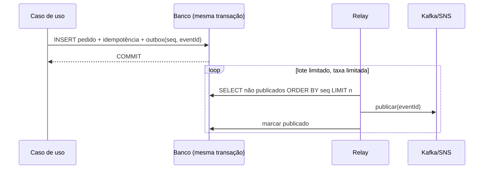

# Idempotência, outbox/inbox e replay em Java

## Idempotência: o que persistir

| Elemento | Por quê |
|---|---|
| Chave (`Idempotency-Key`, `eventId`) | Identifica a operação lógica |
| Escopo (tenant, cliente, operação) | Mesma chave de clientes diferentes não colide |
| Payload (campos relevantes ou hash) | Mesma chave com payload diferente é **conflito**, não repetição |
| Resultado (id gerado, status) | A repetição devolve a **mesma** resposta |
| Momento/expiração | Retenção da chave ≥ janela de repetição possível |

**Atomicidade:** registro de idempotência e efeito na **mesma transação** quando estão no mesmo banco. A restrição
única (PK `tenant + chave`) arbitra corridas entre threads, conexões e réplicas: quem perde recebe violação de
unicidade (`SQLState 23505` no PostgreSQL/H2), faz rollback e lê o resultado do vencedor.

Verificar "existe?" e depois "inserir" **sem** restrição única é corrida: duas instâncias passam pela verificação ao
mesmo tempo. Idempotência em memória (`Set`) não sobrevive a reinício nem a várias instâncias.

Implementação: [ProcessadorIdempotente](../../../examples/java/integracao/src/main/java/br/com/srportto/exemplos/ProcessadorIdempotente.java).
Provas: [ProcessadorIdempotenteTest](../../../examples/java/integracao/src/test/java/br/com/srportto/exemplos/ProcessadorIdempotenteTest.java)
(8 threads, reinício, payload divergente, escopo por tenant) e
[ProcessadorIdempotenteExternoIT](../../../examples/java/integracao/src/test/java/br/com/srportto/exemplos/ProcessadorIdempotenteExternoIT.java)
(16 conexões concorrentes em PostgreSQL real).

Com JPA: a mesma ideia com entidade de idempotência de PK composta, `saveAndFlush` dentro da transação do caso de
uso e tradução de `DataIntegrityViolationException` (ver `persistencia-jpa`).

### Efeito externo com resultado desconhecido

Chamar um provedor (pagamento) e perder a resposta deixa o efeito **desconhecido**. Repetir às cegas pode cobrar
duas vezes. Sequência segura: gravar a intenção com chave idempotente (`PENDENTE`) → chamar o provedor **com a mesma
chave** → gravar o resultado. Em timeout: manter `PENDENTE` e **reconciliar** (consultar o provedor pela chave) antes
de qualquer nova tentativa. Sem suporte a chave no provedor, a reconciliação por consulta é obrigatória.

## Transactional outbox

- **Janela commit → publicação:** se o relay cai depois de publicar e antes de marcar, o evento sai **de novo**
  (at-least-once). Consumidores deduplicam por `eventId`.
- **Ordem:** pela sequência de criação (coluna `seq`), nunca por UUID aleatório. Com vários relays concorrentes,
  ordem por agregado exige particionar o trabalho (ex.: `FOR UPDATE SKIP LOCKED` por agregado ou um relay por
  partição) — ou aceitar e documentar a desordem.
- **Conexão:** não segure conexão do banco durante a publicação (I/O externo); selecione, solte, publique, marque.
- **Limpeza:** apague/arquive publicados após retenção definida; a tabela não cresce sem limite.
- **CDC** (Debezium lendo o WAL) é alternativa ao relay por polling, com operação própria.

Implementação: [PublicadorOutbox](../../../examples/java/integracao/src/main/java/br/com/srportto/exemplos/PublicadorOutbox.java).
Provas: [PublicadorOutboxTest](../../../examples/java/integracao/src/test/java/br/com/srportto/exemplos/PublicadorOutboxTest.java)
(falha do destino preserva o evento; ordem de criação; falha no meio do lote não perde nem reenvia os confirmados;
quota de publicação).

## Inbox (deduplicação no consumidor)

O consumidor grava `eventId` processado **na mesma transação** do efeito (tabela inbox ou a própria tabela de
idempotência). Reentrega, rebalance e replay passam a ser seguros. Prova integrada:
[ConsumidorKafkaLimitadoExternoIT](../../../examples/java/integracao/src/test/java/br/com/srportto/exemplos/ConsumidorKafkaLimitadoExternoIT.java)
— falhas depois do efeito e antes do commit geram reprocessamento, mas o número de pedidos permanece igual ao de
eventos.

## Saga e compensação

Quando o efeito atravessa serviços, cada passo é local + evento; falhas disparam **compensações** (que também
podem falhar e precisam ser idempotentes). Compensação não é rollback ACID: estados intermediários ficam visíveis
e precisam de nome, timeout e reconciliação.

## DLQ/DLT e replay

| Decisão | Orientação |
|---|---|
| O que vai para a quarentena | Falha permanente e tentativas esgotadas — com causa, origem, horário e tentativa |
| Retenção | Maior que a da fila/tópico de origem; dono definido |
| Acesso | Dados de negócio/PII: acesso restrito e auditado |
| Quarentena indisponível | Não confirmar a mensagem original |
| Replay | Depois da correção da causa, **em taxa limitada**, com o destino saudável e idempotência garantida |
| Ordem no replay | Mensagens de um agregado podem ter sido ultrapassadas; o consumidor precisa tolerar (versão/sequência) |

Replay sem limite de taxa é um novo pico: o sistema recém-recuperado volta a cair. Implementação:
[ReplayControlado](../../../examples/java/integracao/src/main/java/br/com/srportto/exemplos/ReplayControlado.java)
com [ReplayControladoTest](../../../examples/java/integracao/src/test/java/br/com/srportto/exemplos/ReplayControladoTest.java)
(respeita a taxa do destino; falha do destino não perde o item).
