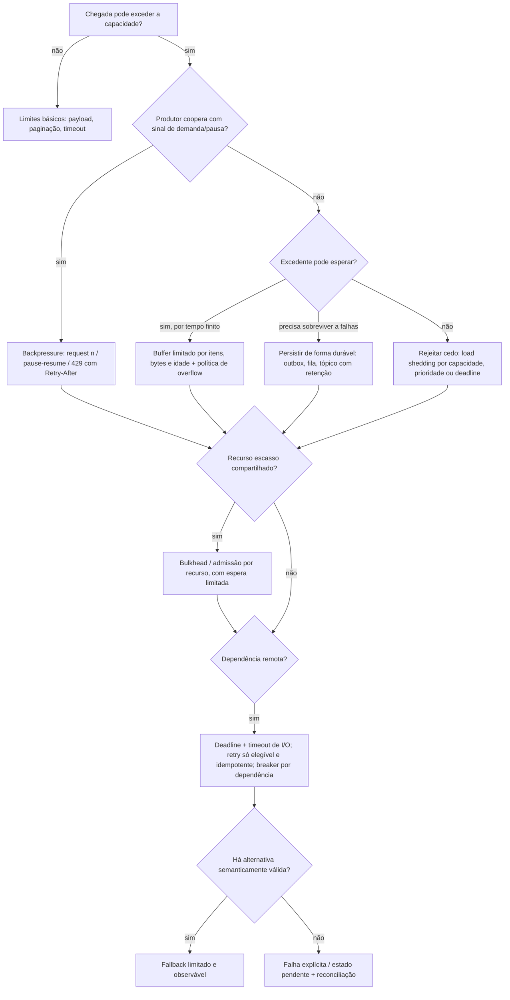

# Resiliência e controle de fluxo em Java

Torna explícito o que acontece quando a chegada excede a capacidade, a dependência fica lenta ou a execução
falha. Comece pelo fluxo concreto e pelos números; não acrescente todos os mecanismos a todo projeto.

**Quando não usar:** esqueleto de aplicação → `criar-aplicacao-java`; ack, offset, DLQ e replay →
`mensageria-sqs-kafka`; instrumentação → `monitoramento-java`; dimensionamento de sistema inteiro →
`design-system-architecture`. CRUD de baixo tráfego sem dependência remota precisa só de limite de payload,
paginação e timeout — não de breaker, broker ou WebFlux.

## Entradas

Operação, criticidade e efeito de negócio; taxa média/pico **e duração**; tamanho de item (típico e máximo);
latência medida; capacidade downstream (conexões, quotas); deadline do cliente; restrições. Derive hipóteses
quando possível e registre o que precisa ser medido.

## Árvore de decisão

Ordem prática: **controlar o produtor → regular taxa → limitar concorrência → limitar espera → rejeitar
cedo → degradar ou persistir**. Cada mecanismo responde a uma pergunta diferente e eles se combinam; nenhum
substitui o outro.

## Mecanismos

| Mecanismo | Problema que resolve | Não aplicar quando | Escopo típico | Exemplo Java | Prova mínima |
|---|---|---|---|---|---|
| Backpressure | Consumidor mais lento que produtor | Origem não coopera (use buffer/rejeição) | Cadeia ponta a ponta | [FluxoSobDemanda](../../examples/java/reativo/src/main/java/br/com/srportto/exemplos/FluxoSobDemanda.java) | Não emite além da demanda; cancelamento chega à origem |
| Admissão e buffering | Picos finitos sem estourar memória | Déficit sustentado (buffer só adia) | Por fila/instância | [FilaLimitada](../../examples/java/fundamentos/src/main/java/br/com/srportto/exemplos/FilaLimitada.java), [ControleConcorrencia](../../examples/java/fundamentos/src/main/java/br/com/srportto/exemplos/ControleConcorrencia.java) | Rejeição previsível; capacidade nunca excedida |
| Rate limiting | Taxa por identidade/escopo, burst controlado | Proteção contra DDoS de rede (é da borda) | Cliente, tenant, global | [TokenBucket](../../examples/java/fundamentos/src/main/java/br/com/srportto/exemplos/TokenBucket.java) | Burst permitido; taxa sustentada limitada; tenants isolados |
| Throttling / leaky bucket | Ritmo constante para downstream | Quando a fila de espera não tem limite | Dependência | [LeakyBucket](../../examples/java/fundamentos/src/main/java/br/com/srportto/exemplos/LeakyBucket.java) | Espaçamento observável; fila limitada |
| Load shedding | Saturação: preservar fluxo crítico | Sem sinal confiável de saturação | Instância | [AdmissaoPorPrioridade](../../examples/java/fundamentos/src/main/java/br/com/srportto/exemplos/AdmissaoPorPrioridade.java) | Crítico preservado; rejeições medidas; deadline vencido descartado cedo |
| Timeout/deadline | Espera indefinida segura recursos | — (toda espera remota tem limite) | Requisição lógica e cada I/O | [OrcamentoTempo](../../examples/java/fundamentos/src/main/java/br/com/srportto/exemplos/OrcamentoTempo.java), [ChamadaComDeadline](../../examples/java/fundamentos/src/main/java/br/com/srportto/exemplos/ChamadaComDeadline.java) | Dependência lenta não retém recursos além do deadline |
| Retry/backoff/jitter | Falha transitória | Erro permanente, efeito não idempotente, sem orçamento | Uma camada dona por chamada | [PoliticaRetry](../../examples/java/fundamentos/src/main/java/br/com/srportto/exemplos/PoliticaRetry.java) | Tentativas e duração limitadas; sem multiplicação entre camadas |
| Circuit breaker | Dependência em falha consumindo tempo/recursos | Tráfego baixo demais para amostra; erros de negócio | Dependência | [ProtecoesTest](../../examples/java/reativo/src/test/java/br/com/srportto/exemplos/ProtecoesTest.java) (Resilience4j) | Abre, rejeita, recupera; erro de negócio não abre |
| Bulkhead | Uma carga lenta esgotando recursos de outra | Recurso não compartilhado | Dependência × criticidade | [ProtecoesTest](../../examples/java/reativo/src/test/java/br/com/srportto/exemplos/ProtecoesTest.java), [ControleConcorrencia](../../examples/java/fundamentos/src/main/java/br/com/srportto/exemplos/ControleConcorrencia.java) | Relatórios saturados não consomem a reserva do checkout |
| Fallback | Dependência indisponível com alternativa válida | Não há alternativa semanticamente segura (pagamento, estoque) | Operação | [FallbackDegradado](../../examples/java/fundamentos/src/main/java/br/com/srportto/exemplos/FallbackDegradado.java) | Não inventa sucesso; frescor visível; fallback também limitado |
| Idempotência | Repetição por retry/reentrega | — (todo efeito sujeito a repetição) | Chave + escopo + payload | [ProcessadorIdempotente](../../examples/java/integracao/src/main/java/br/com/srportto/exemplos/ProcessadorIdempotente.java) | Duplicatas concorrentes e reinício não repetem efeito |
| DLQ/replay | Mensagem que não pode ser processada agora | Erro transitório (retry primeiro) | Fila/tópico | `mensageria-sqs-kafka`, [ReplayControlado](../../examples/java/integracao/src/main/java/br/com/srportto/exemplos/ReplayControlado.java) | Falha de publicação não autoriza ack; replay em taxa limitada |
| Recuperação | Retorno sem novo colapso | — | Instância e conjunto | [EncerramentoControlado](../../examples/java/fundamentos/src/main/java/br/com/srportto/exemplos/EncerramentoControlado.java), `isolamento-degradacao-java.md` | Drenagem com deadline; recusa trabalho novo; replay/sondas em rampa |

## Passo a passo

1. **Capacidade e orçamento** — concorrência, conexões somadas das réplicas, fila por itens/bytes/idade,
   espera máxima, deadline e tempo de drenagem ([capacidade e limites](references/capacidade-e-limites.md)).
2. **Produtor** — se coopera, propague demanda/pausa; se não, buffer limitado com overflow explícito ou
   persistência durável ([backpressure](references/backpressure-java.md)).
3. **Separar as dimensões** — rate limiter regula taxa; bulkhead/admissão limita recursos; breaker recusa
   dependência em falha; deadline limita espera. Circuit breaker **não** limita concorrência.
4. **Retry** — só para falha transitória e efeito seguro; conte tentativas de SDK/proxy/gateway; orçamento
   agregado; uma camada dona ([deadline e retry](references/timeouts-retries-java.md)).
5. **Degradação e recuperação** — fallback semanticamente válido, sondas limitadas, ramp-up, replay em taxa
   limitada, encerramento com drenagem ([isolamento e degradação](references/isolamento-degradacao-java.md)).
6. **Prova** — implemente em Java e execute a prova da tabela; relate resultado e limitações
   (`testes-sistemas-java`).

### Composição por requisição lógica

Admissão (uma vez, por requisição lógica) → deadline calculado → para cada tentativa elegível: breaker e
bulkhead da dependência → timeout de I/O derivado do restante → libera recursos → espera de backoff **sem**
segurar conexão/permissão → nova tentativa só se couber no deadline. Não existe ordem universal de
decorators: decida o que conta como falha para o breaker e onde a latência é medida, e teste a composição.

### Cancelamento e liberação

- Deadline usa tempo monotônico (`System.nanoTime`), nunca relógio de parede.
- Toda permissão/recurso é liberado em `finally` — ou, em código assíncrono, **na conclusão real** do
  trabalho, não quando o chamador desiste de esperar.
- Interrupção é respeitada: restaure o flag (`Thread.currentThread().interrupt()`) e não a converta em retry.
- Cancelar a resposta não prova cancelamento remoto: efeito com resultado desconhecido exige idempotência e
  reconciliação.

### Execução: MVC com virtual threads × cadeia reativa

Limites de concorrência e filas **não exigem WebFlux**. Em MVC com virtual threads, use admissão
(`Semaphore`/bulkhead), pool de conexões com espera limitada e deadline; threads virtuais tornam barata a
espera, mas não aumentam CPU, conexões nem quotas. Reatividade vale quando toda a cadeia é não bloqueante e
há streaming com demanda; nesse caso, conheça `request(n)`, prefetch e concorrência de `flatMap`.
Detalhes: [backpressure](references/backpressure-java.md) e `java-moderno` (virtual threads no Java 25).

## Critérios de revisão (reprovar no fluxo relevante)

- Fila, buffer ou espera **sem limite** (inclui `onBackpressureBuffer()` sem capacidade, executor com fila
  ilimitada, `acquire()` sem timeout).
- Retry infinito, sem jitter, sem orçamento ou multiplicado entre camadas; retry de erro permanente ou de
  efeito não idempotente.
- Ack/commit antes do efeito durável; descarte silencioso de dado de negócio.
- Permissão liberada antes de o trabalho assíncrono terminar.
- Fallback que **inventa sucesso** (pagamento aprovado, estoque reservado) ou que transfere toda a carga a
  outro recurso (cache down → banco irrestrito).
- Limite sem unidade, escopo ou motivo; rejeição sem resposta/destino/métrica.

## Saída

Tabela por fluxo: limite (unidade, escopo, motivo), erro e classificação, política de rejeição, retry e
idempotência, recuperação, métrica e prova executada. Inclua a alternativa rejeitada e o trade-off. Comandos
e versões: [exemplos Java](../../examples/java/README.md).

## Quem aplica o quê

| Papel | Uso desta skill |
|---|---|
| `arquiteto-sistemas` | Define onde há limite, orçamento e política de excesso |
| `java-construtor` | Implementa o mecanismo e a prova correspondente |
| `java-revisor` | Confere invariantes e evidências (critérios acima) |
| `especialista-monitoramento` | Mede saturação, rejeição e recuperação (`monitoramento-java`) |
| `engenheiro-chaos` | Exercita falha, sobrecarga e recuperação |

Fontes: [Reactive Streams](https://www.reactive-streams.org/),
[Resilience4j CircuitBreaker](https://resilience4j.readme.io/docs/circuitbreaker),
[retries nos SDKs AWS](https://docs.aws.amazon.com/sdkref/latest/guide/feature-retry-behavior.html).
